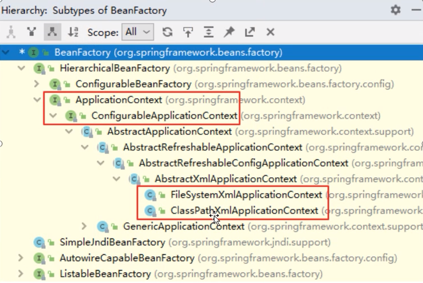

# SpringIOC

> IOC: 将对象的控制器反转给Spring

## SpringIOC低层实现

### BeanFactory

> IOC容器的基本实现，是Spring内部的使用接口，是面向Spring本身的，不是提供给开发人员使用的。

### ApplicationContext

> BeanFactory的子接口，提供了更多高级特性。面向Spring的使用者，几乎所有场合都使用ApplicationContext而不是底层的BeanFactory。

### 图解IOC类的结构



* BeanFactory：Spring底层IOC实现【面向Spring框架】
  * ...
    * ApplicationContext：面向程序员
      * ConfigurableApplicationContext：提供关闭或刷新容器对象方法
        * ...
          * ClassPathXmlApplicationContext：基于类路径检索xml文件
          * AnnotationConfigApplicationContext：基于注解创建容器对象
          * FileSystemXmlApplicationContext：基于文件系统检索xml文件

## Spring依赖注入数值问题

### 字面量数值

* 数据类型：基本数据类型及包装类、String
* 语法：value属性或value标签

### CDATA区

- 语法：\<![CDATA[]]>
- 作用：在xml中定义特殊字符时，使用CDATA区

### 3.3 外部已声明bean及级联属性赋值

- 语法：ref
- 注意：级联属性更改数值会影响外部声明bean【ref赋值的是引用】
- 示例代码

```xml
<bean id="dept1" class="com.xbzxit.spring.pojo.Dept">
    <property name="deptId" value="1"></property>
    <property name="deptName" value="研发部门"></property>
</bean>

<bean id="empChai" class="com.xbzxit.spring.pojo.Employee">
    <property name="id" value="101"></property>
    <property name="lastName" value="chai"></property>
    <property name="email" value="chai@163.com"></property>
    <property name="salary" value="50.5"></property>
    <property name="dept" ref="dept1"></property>
    <property name="dept.deptName" value="财务部门"></property>
</bean>
```

## Spring依赖注入方式【基于XML】


## Spring管理第三方bean


##  Spring中FactoryBean


##  Spring中bean的作用域


## Spring中bean的生命周期


## Spring中自动装配【基于XML】


## Spring中注解【非常重要】


## Spring中组件扫描


## Spring完全注解开发【0配置】


