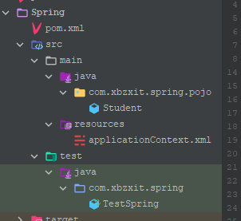

# Spring概述

## HelloWorld



### pom.xml

```xml
<dependencies>
    <dependency>
        <groupId>org.springframework</groupId>
        <artifactId>spring-context</artifactId>
        <version>5.3.20</version>
    </dependency>

    <dependency>
        <groupId>junit</groupId>
        <artifactId>junit</artifactId>
        <version>4.13.2</version>
        <scope>test</scope>
    </dependency>
</dependencies>
```

### applicationContext.xml

> 在resources目录下创建

```xml
<?xml version="1.0" encoding="UTF-8"?>
<beans xmlns="http://www.springframework.org/schema/beans"
       xmlns:xsi="http://www.w3.org/2001/XMLSchema-instance"
       xsi:schemaLocation="http://www.springframework.org/schema/beans http://www.springframework.org/schema/beans/spring-beans.xsd">

    <!-- 将对象装配到IOC容器中-->
    <bean id="student" class="com.xbzxit.spring.pojo.Student">
        <property name="stuId" value="101"></property>
        <property name="stuName" value="zhenzhong"></property>
    </bean>

</beans>
```

### 测试类

```java
public class TestSpring {


    @Test
    public void testSpring(){
        //使用Spring之前
        //        Student student = new Student();

        //使用Spring之后
        //创建容器对象
        ApplicationContext iocObj = new ClassPathXmlApplicationContext("applicationContext.xml");
        //通过容器对象，获取需要对象
        Student student = (Student)iocObj.getBean("student");
        System.out.println("==================================================  ");
        System.out.println("student = " + student);
        System.out.println("==================================================  ");

    }

}
```

### 结果


