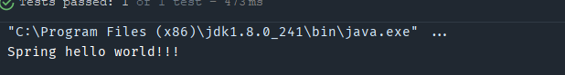

# Spring概述

> Spring是轻量级的开源的JavaEE框架
>
> Spring可以解决企业应用开发的复杂性
>
> Spring有两个核心部分 IOC AOP

## IOC概念

控制反转，把创建对象的过程交给Spring管理

## AOP概念

面向切面，修改源代码进行功能增强

## Spring特点

* 方便解耦，简化开发
* AOP编程支持
* 方便程序测试
* 方便和其他框架进行整合
* 方便进行事务操作
* 降低API开发难度

## Spring入门案例

[spring官网](https://spring.io/)

[Spring所有jar包](https://repo.spring.io/ui/native/release/org/springframework/spring/5.2.9.RELEASE/spring-5.2.9.RELEASE-dist.zip)

**创建工程**


**bean.xml**

```xml
<?xml version="1.0" encoding="UTF-8"?>
<beans xmlns="http://www.springframework.org/schema/beans"
       xmlns:xsi="http://www.w3.org/2001/XMLSchema-instance"
       xsi:schemaLocation="http://www.springframework.org/schema/beans
        https://www.springframework.org/schema/beans/spring-beans.xsd">

    <bean id="user" class="com.xbzxit.spring.User"></bean>
</beans>
```

**User.java**

```java
package com.xbzxit.spring;

/**
 * @author xbzxit
 * @version 1.0
 * @create 2021-12-08-23:09
 * @company www.xbzxit.com
 */

public class User {

   public void say() {
       System.out.println("Spring hello world!!!");
   }
}
```

**TestSpring5.java**

```java
package com.xbzxit.spring.test;

import com.xbzxit.spring.User;
import org.junit.Test;
import org.springframework.context.ApplicationContext;
import org.springframework.context.support.ClassPathXmlApplicationContext;

/**
 * @author xbzxit
 * @version 1.0
 * @create 2021-12-08-23:27
 * @company www.xbzxit.com
 */

public class TestSpring5 {

    @Test
    public void test() {
        ApplicationContext context = new ClassPathXmlApplicationContext("bean.xml");
        User user = (User) context.getBean("user");
        user.say();
    }

}
```

**结果**


