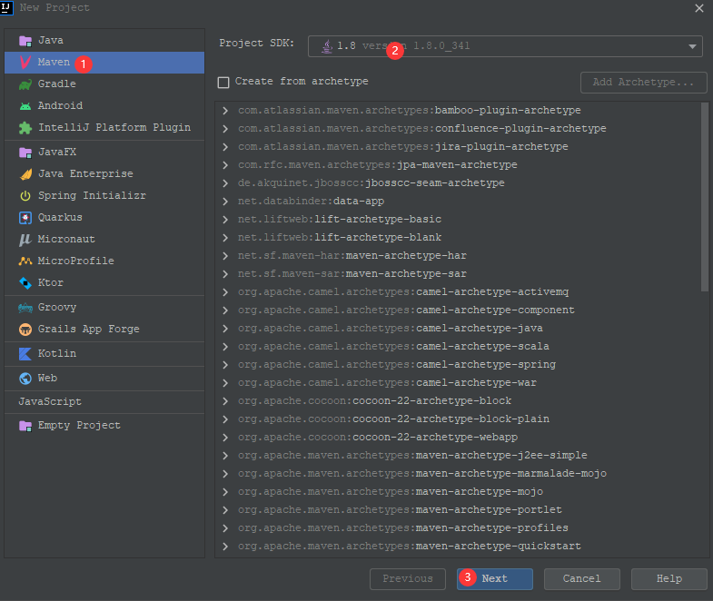
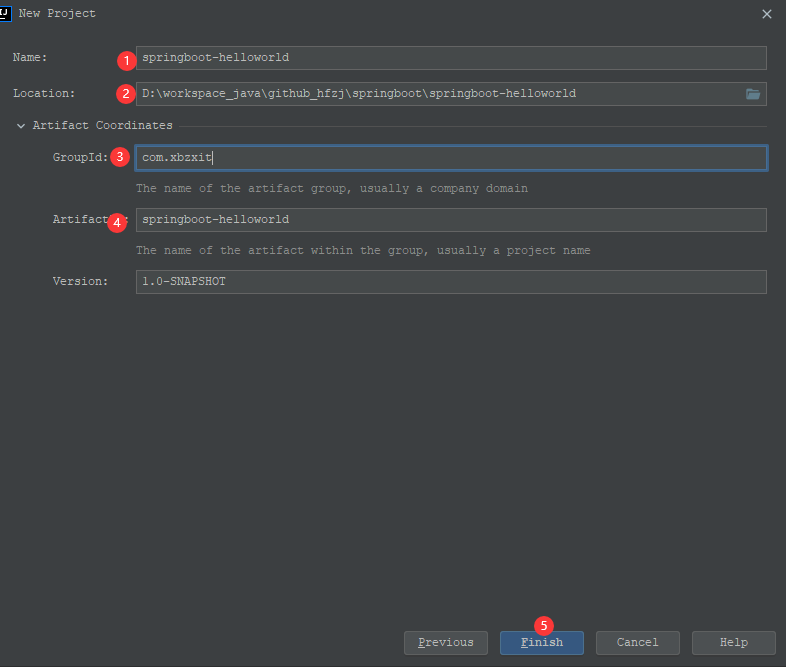
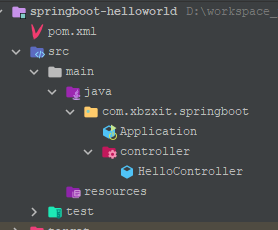
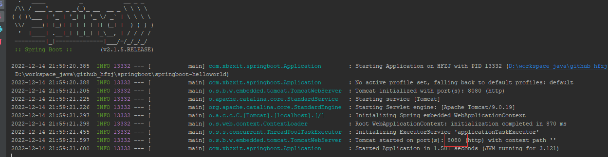

# SpringBoot简介

> Spring Boot的设计目的是让您尽可能快地启动和运行，而无需预先配置Spring。Spring Boot以一种固定的方式来构建可用于生产级别的应用程序。
>
> 为什么学习SpringBoot？
>
> 在springboot之前如果要创建一个web项目，要做一大堆的配置， 有了springboot之后几乎可以零配置做到了。


## SpringBoot特点

1. 创建独立的Spring应用，为所有 Spring 的开发者提供一个非常快速的、广泛接受的入门体验
2. 直接嵌入应用服务器，如tomcat、jetty、undertow等；不需要去部署war包
3. 提供固定的启动器依赖去简化组件配置；实现开箱即用（启动器starter-其实就是Spring Boot提供的一个jar包），通过自己设置参数（.properties或.yml的配置文件），即可快速使用。
4. 自动地配置Spring和其它有需要的第三方依赖
5. 提供了一些大型项目中常见的非功能性特性，如内嵌服务器、安全、指标，健康检测、外部化配置等
6. 绝对没有代码生成，也无需 XML 配置。


## HelloWorld

### 创建maven工程







### 目录结构




### pom.xml

```xml
<?xml version="1.0" encoding="UTF-8"?>
<project xmlns="http://maven.apache.org/POM/4.0.0"
         xmlns:xsi="http://www.w3.org/2001/XMLSchema-instance"
         xsi:schemaLocation="http://maven.apache.org/POM/4.0.0 http://maven.apache.org/xsd/maven-4.0.0.xsd">
    <modelVersion>4.0.0</modelVersion>

    <parent>
        <groupId>org.springframework.boot</groupId>
        <artifactId>spring-boot-starter-parent</artifactId>
        <version>2.1.5.RELEASE</version>
    </parent>

    <groupId>com.xbzxit</groupId>
    <artifactId>springboot-helloworld</artifactId>
    <version>1.0-SNAPSHOT</version>

    <properties>
        <maven.compiler.source>8</maven.compiler.source>
        <maven.compiler.target>8</maven.compiler.target>
    </properties>

    <dependencies>
        <dependency>
            <groupId>org.springframework.boot</groupId>
            <artifactId>spring-boot-starter-web</artifactId>
        </dependency>
    </dependencies>

</project>
```

### 启动类

```java
@SpringBootApplication
public class Application {
  public static void main(String[] args) {
    SpringApplication.run(Application.class, args);
 }
}
```


### controller

```java

@RestController
public class HelloController {

    @GetMapping
    public String hello() {
        return "hello SpringBoot!";
    }

}
```


### 启动

> http://localhost:8080/hello





