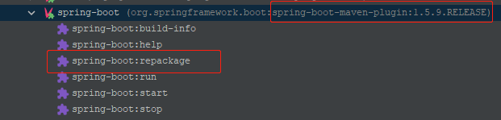
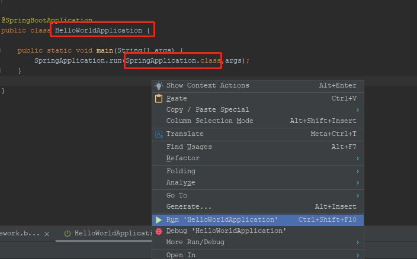

# SpringBoot错误积累

## 打包可执行的jar

> spring-boot-maven-plugin

* 场景




* 报错

```bash
Execution default-cli of goal org.springframework.boot:spring-boot-maven-plugin:2.2.5.RELEASE:repackage failed: Source file must be provided
```

* 解决方案

```bash
mvn package spring-boot:repackage
```


* 分析原因

```bash
由于spring-boot:repackage是Spring Boot Maven Plugin的默认goal，所以再次尝试mvn package，发现同样输出了可执行的jar文件。
因此，为了重新打包得到Spring Boot可执行的jar文件，要避免直接执行mvn spring-boot:repackage。执行mvn package spring-boot:repackage或者mvn package即可。
```


## 启动类报错

* 场景

  


* 报错

```bash
2022-12-13 10:27:48.497  WARN 18024 --- [           main] ationConfigEmbeddedWebApplicationContext : Exception encountered during context initialization - cancelling refresh attempt: org.springframework.context.ApplicationContextException: Unable to start embedded container; nested exception is org.springframework.context.ApplicationContextException: Unable to start EmbeddedWebApplicationContext due to missing EmbeddedServletContainerFactory bean.
2022-12-13 10:27:48.673 ERROR 18024 --- [           main] o.s.boot.SpringApplication               : Application startup failed

org.springframework.context.ApplicationContextException: Unable to start embedded container; nested exception is org.springframework.context.ApplicationContextException: Unable to start EmbeddedWebApplicationContext due to missing 
```


* 解决方案

```java

@SpringBootApplication
public class HelloWorldApplication {

    public static void main(String[] args) {
        SpringApplication.run(HelloWorldApplication.class,args);
    }

}
```


* 分析原因

```bash
找不到对应类的 main方法， 启动注解 ， 发现启动类写错了
```
