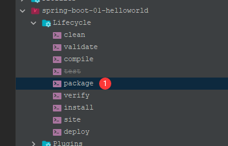
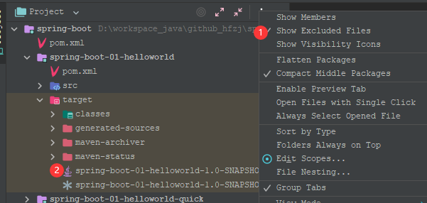
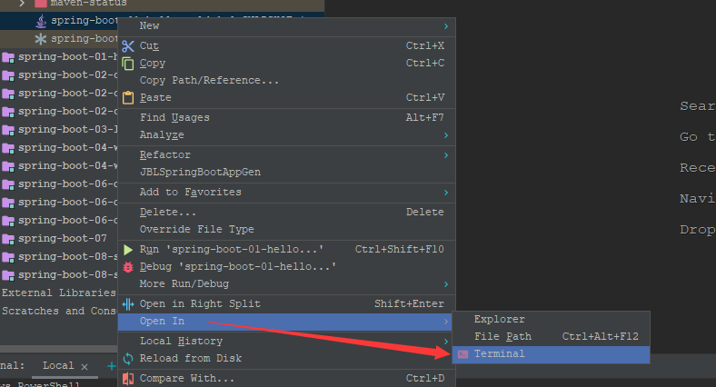
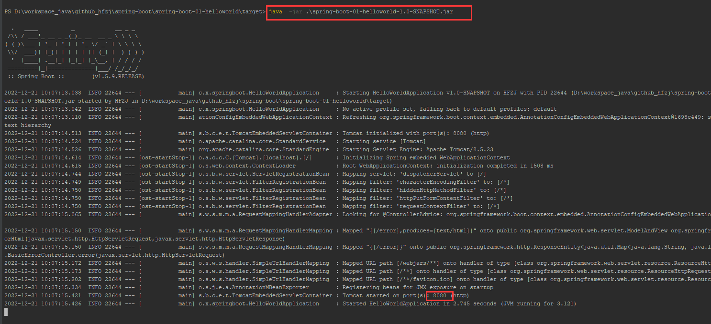

# SpringBoot项目部署


## 打包部署

### 打包插件

> 打包插件必须加入

```xml
  <build>
    <plugins>
      <!-- 打jar包时如果不配置该插件，打出来的jar包没有清单文件 -->
      <plugin>
        <groupId>org.springframework.boot</groupId>
        <artifactId>spring-boot-maven-plugin</artifactId>
      </plugin>
    </plugins>
  </build>
```


### 打包




### jar包




### 运行






### 预览效果


