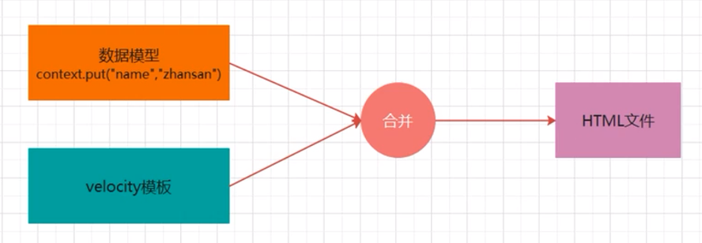
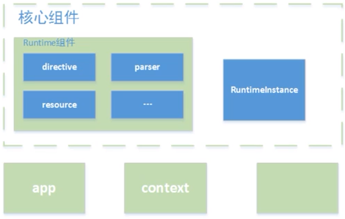

# Velocity入门

## 简介

> Velocity是一个基于java的模板引擎，可以通过特定的语法获取在java对象的数据， 填充到模板中， 从而实现界面和java代码的分离。

### 应用场景

* Web应用程序:作为为应用程序的视图,展示数据。

* 源代码生成: velocity可用于基于模板生成Java源代码

* 自动电子邮件:网站注册，认证等的电子邮件模板

* 网页静态化:基于velocity模板，生成静态网页

## Velocity组成结构

Velocity主要分为app.context、runtime和一些辅助util几个部分。
app模块:主要封装了一些接口，暴露给使用者使用。主要有两个类，分别是Velocity(单例)和VelocityEngine.. context模块:主要封装了模板渲染需要的变量
Runtme模块:整个Velocity的核心模块，Runtime模块会将加载的模板解析成语法树，Velocity调用mergeTemplate方法时会渲染整棵树，并输出最终的渲染结果。
Runtimelnstance类为整个velocity渲染提供了一个单例模式，拿到了这个实例就可以完成渲染过程了。
