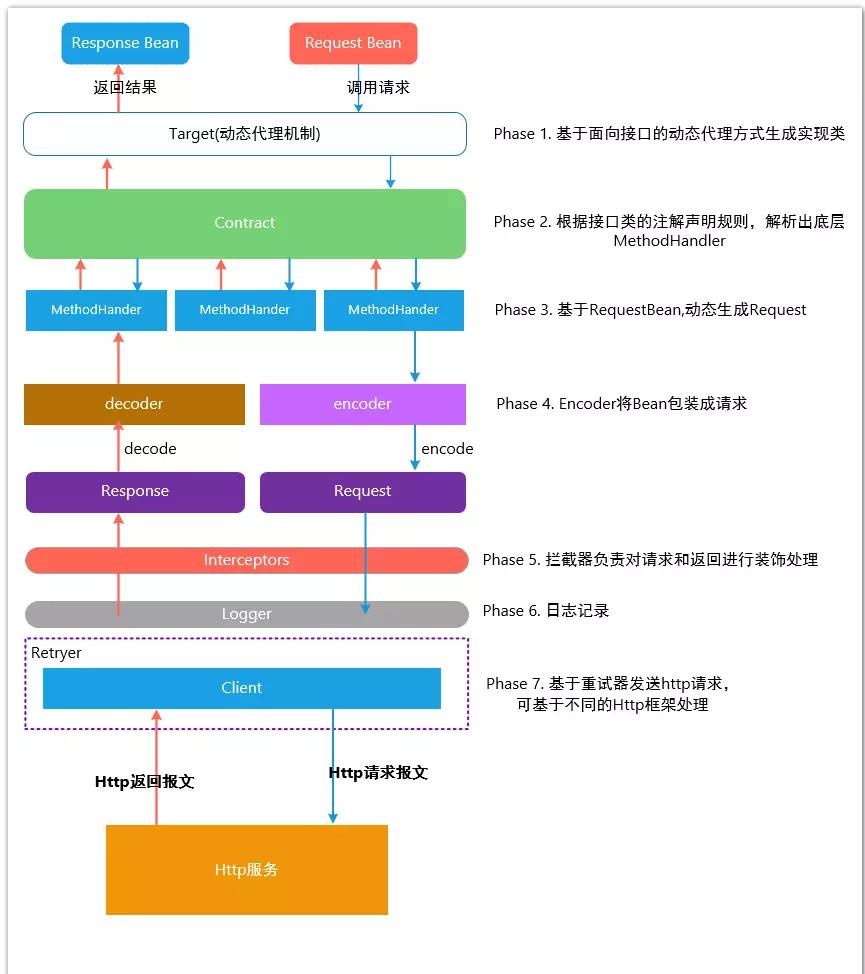

# SpringCloud

## Feign声明式远程调用

### 简介

> Feign 是一个声明式的 HTTP 客户端，它的目的就是让远程调用更加简单。Feign 提供了 HTTP请求的模板， 通过编写简单的接口和插入注解，就可以定义好 HTTP 请求的参数、格式、地址等信息。
>
> Feign 整合了 Ribbon （负载均衡）和 Hystrix( 服务熔断)，可以让我们不再需要显式地使用这两个组件。
>
> SpringCloudFeign 在 NetflixFeign 的基础上扩展了对 SpringMVC 注解的支持，在其实现下，我们只需创建一个接口并用注解的方式来配置它，即可完成对服务提供方的接口绑定。
>
> 简化了SpringCloudRibbon 自行封装服务调用客户端的开发量。

### 使用

**引入依赖**

```xml
<dependency>
    <groupId>org.springframework.cloud</groupId>
    <artifactId> </artifactId>
</dependency>
```

**开启feign功能**

```java
@EnableFeignClients(basePackages = "com.atguigu.gulimall.pms.feign")
```

**声明远程接口**

```java
@FeignClient("gulimall-ware")
public interface WareFeignService {
@PostMapping("/ware/waresku/skus")
public Resp<List<SkuStockVo>> skuWareInfos(@RequestBody List<Long> skuIds);
}
```

### 原理




## Gateway

## Sleuth+Zipkin服务链路追踪

### 为什么用

### 基础术语

### 整合Sleuth

### 整合zipkin可视化观察

### Zipkin数据持久化
