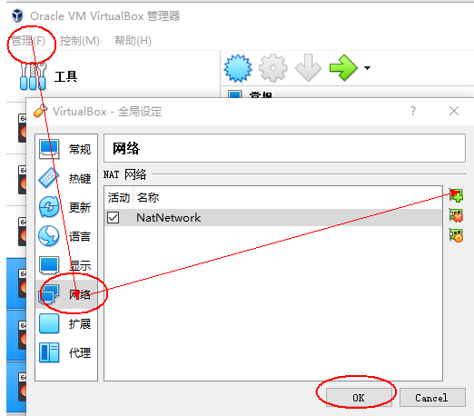
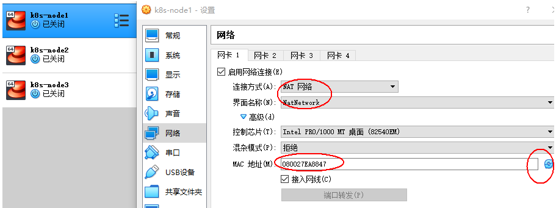

# K8S 集群安装

## 创建3台虚拟机

**使用vagrant批量创建虚拟机**

在`Vagrantfile` 配置文件所在的目录打开命令行窗口并输入 `vagrant up` 来创建3台虚拟机

**开启密码访问**

* **连接主机**

```sh
vagrant ssh k8s-node1
```

* **切换到root用户**

```sh
su root
pass: vagrant
```

* **修改配置文件**

```sh
vi /etc/ssh/sshd_config

PasswordAuthentication yes
```

```sh
service sshd restart
```

退出用户 `exit;`
退出虚拟机 `exit;`

## 使用Xshell连接虚拟机


| hostname  | ip addr     | username | password |
| ----------- | ------------- | ---------- | ---------- |
| k8s-node1 | 192.168.100 | root     | vagrant  |
| k8s-node2 | 192.168.101 | root     | vagrant  |
| k8s-node3 | 192.168.102 | root     | vagrant  |

## 配置网卡

**设置虚拟机的网卡**

* **VirtualBox->全局设定->网络->添加-确定**
* 

**每台主机设置Net网络 并刷新MAC地址**


**查看默认网卡**

```sh
ip route show
```

* **查看三台主机网络是否通**

```sh
ping 192.168.56.101 

ping www.google.com
```

## 设置环境

* **关闭防火墙**

```sh
systemctl stop firewalld

systemctl disable firewalld
```

* **关闭selinux**

```sh
sed -i 's/enforcing/disabled/' /etc/selinux/config

setenforce 0
```

* **关闭swap**

```sh
swapoff -a  临时

sed -i 's/.*swap.*/#&/' /etc/fstab  永久

free -g  验证   swap必须为0
```

* **添加主机名与IP对应关系**

```sh
vi /etc/hosts
10.0.2.5  k8s-node1
10.0.2.4  k8s-node2
10.0.2.15 k8s-node3
```

* **将桥接的IPv4流量传递到iptables的链**

```sh
cat> /etc/sysctl.d/k8s.conf << EOF
net.bridge.bridge-nf-call-ip6tables = 1
net.bridge.bridge-nf-call-iptables = 1
EOF

sysctl --system
```

* **遇见提示只读文件系统，运行如下命令**

```sh
mount -o remount rw /
```

* **date查看时间**

```sh
yum install -y ntpdate
ntpdate time.windows.com  同步最新时间
```

* **备份准备好的环境**

  
