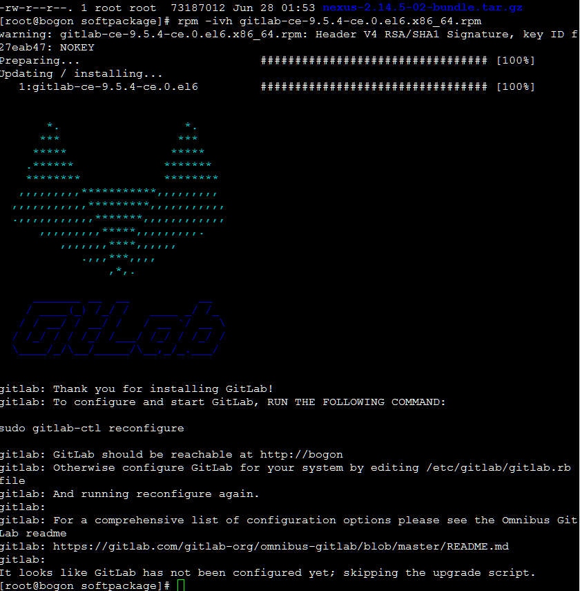
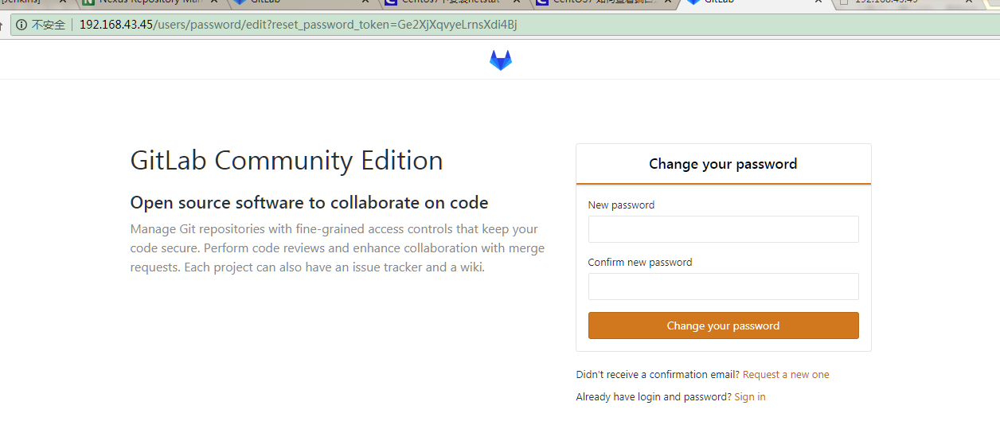
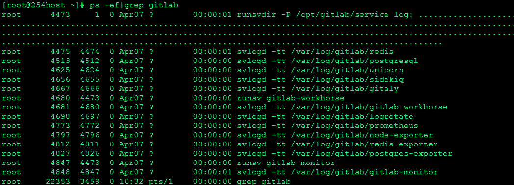

# GitLab

## 安装

### 安装所需要的依赖

```shell
sudo yum install -y curl policycoreutils-python openssh-server
sudo systemctl enable sshd
sudo systemctl start sshd
sudo firewall-cmd --permanent --add-service=http
sudo systemctl reload firewalld
```

### 安装邮件服务器

```shell
sudo yum install postfix
sudo systemctl enable postfix
sudo systemctl start postfix
```


### sudo rpm -ivh gitlab-ce-9.5.4-ce.0.el6.x86_64.rpm




## 配置

### gitlab.rb

> vim /etc/gitlab/gitlab.rb

```shell
external_url='http://192.168.43.45:8087'
unicorn['port'] = 8087
```

### 加载配置文件

```shell
sudo gitlab-ctl reconfigure
```

## 常用命令

### 启动

```shell
gitlab-ctl start
```

### 停止

```shell
gitlab-ctl stop
```


## 访问

> http://192.168.43.45




## 彻底卸载GitLab

### 停止

```shell
sudo gitlab-ctl stop
```

### 卸载

```shell
sudo rpm -e gitlab-ce
```

### 杀进程

> 杀掉第一个守护进程
> 　kill -9 4473
> 　再次查看gitlab进程是否存在




### 删除gitlab文件

```shell
find / -name gitlab|xargs rm -rf 删除所有包含gitlab的文件及目录
删除gitlab-ctl uninstall时自动在root下备份的配置文件
```


