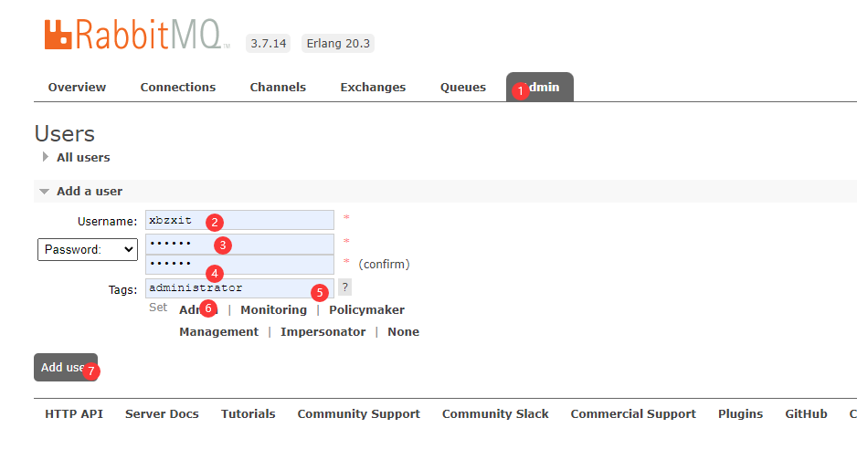

# RabbitMQ入门

## 安装

### 下载

[erlang 下载](http://erlang.org/download/otp_win64_20.3.exe)

[rabbitmq 3.7.28下载](https://github.com/rabbitmq/rabbitmq-server/releases/download/v3.7.28/rabbitmq-server-3.7.28.exe)

### 环境变量

```BA
ERLANG_HOME = E:\DevelopmentServer\erl9.3

path = %ERLANG_HOME%\bin
```

### 配置插件

> 命令行管理员下运行

```bash
 rabbitmq-plugins.bat enable rabbitmq_management
```

## 界面

> [管理页面](http://localhost:15672)
>
> 默认用户名密码 guest/guest

### 添加用户


