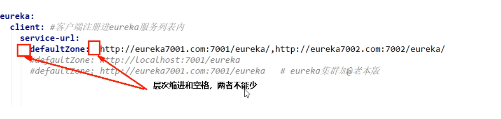
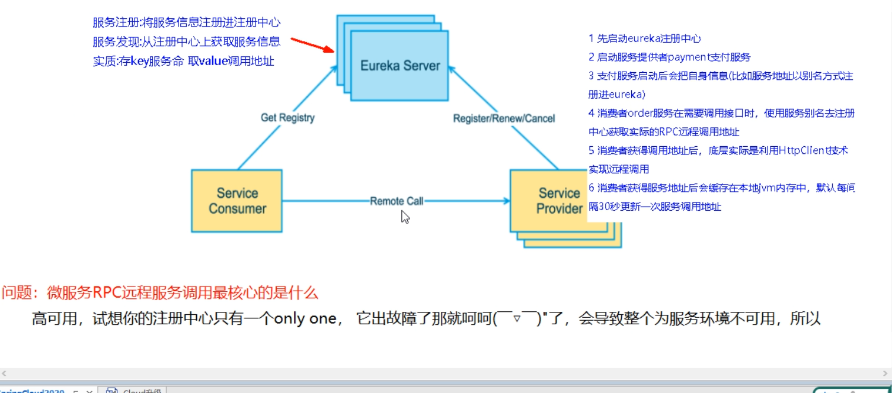
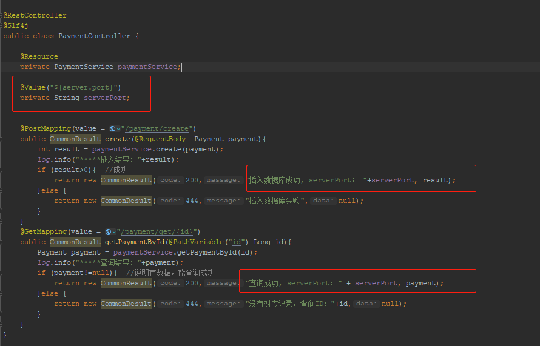
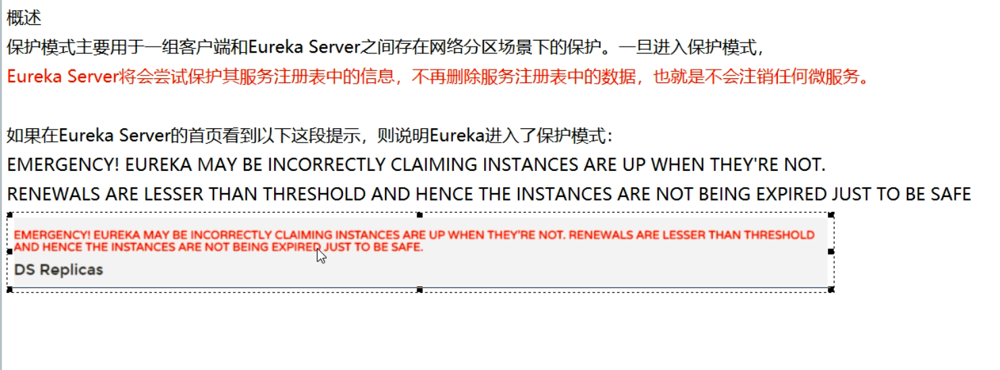
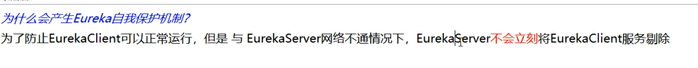
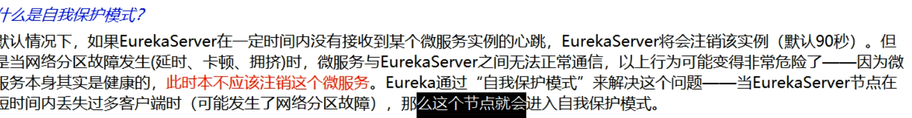
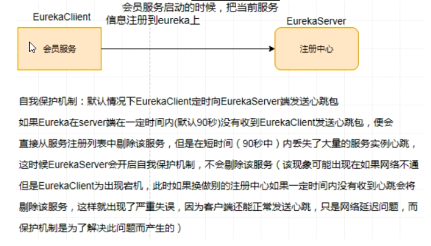
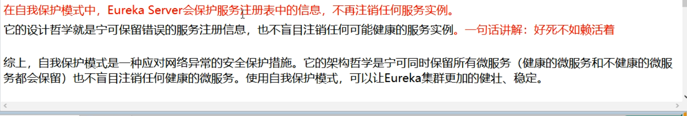

# Eureka服务注册与发现

## Eureka基础知识

## 单个注册中心

> SpringCloud-eureka-server7001

### pom.xml

```xml
<?xml version="1.0" encoding="UTF-8"?>
<project xmlns="http://maven.apache.org/POM/4.0.0"
         xmlns:xsi="http://www.w3.org/2001/XMLSchema-instance"
         xsi:schemaLocation="http://maven.apache.org/POM/4.0.0 http://maven.apache.org/xsd/maven-4.0.0.xsd">
    <parent>
        <artifactId>SpringCloud-xbzxit</artifactId>
        <groupId>com.xbzxit</groupId>
        <version>1.0-SNAPSHOT</version>
    </parent>
    <modelVersion>4.0.0</modelVersion>

    <artifactId>SpringCloud-eureka-server7001</artifactId>

    <properties>
        <maven.compiler.source>8</maven.compiler.source>
        <maven.compiler.target>8</maven.compiler.target>
    </properties>

    <dependencies>
        <!-- https://mvnrepository.com/artifact/org.springframework.cloud/spring-cloud-starter-eureka-server -->
        <dependency>
            <groupId>org.springframework.cloud</groupId>
            <artifactId>spring-cloud-starter-netflix-eureka-server</artifactId>
        </dependency>

        <dependency>
            <groupId>com.xbzxit</groupId>
            <artifactId>SpringCloud-api-commons</artifactId>
            <version>1.0-SNAPSHOT</version>
        </dependency>

        <!-- https://mvnrepository.com/artifact/org.springframework.boot/spring-boot-starter-web -->
        <dependency>
            <groupId>org.springframework.boot</groupId>
            <artifactId>spring-boot-starter-web</artifactId>
        </dependency>

        <!-- https://mvnrepository.com/artifact/org.springframework.boot/spring-boot-starter-web  -->
        <dependency>
            <groupId>org.springframework.boot</groupId>
            <artifactId>spring-boot-starter-actuator</artifactId>
        </dependency>

        <!-- https://mvnrepository.com/artifact/org.springframework.boot/spring-boot-devtools -->
        <dependency>
            <groupId>org.springframework.boot</groupId>
            <artifactId>spring-boot-devtools</artifactId>
            <scope>runtime</scope>
            <optional>true</optional>
        </dependency>

        <!-- https://mvnrepository.com/artifact/org.projectlombok/lombok -->
        <dependency>
            <groupId>org.projectlombok</groupId>
            <artifactId>lombok</artifactId>
        </dependency>

        <!-- https://mvnrepository.com/artifact/org.springframework.boot/spring-boot-starter-test -->
        <dependency>
            <groupId>org.springframework.boot</groupId>
            <artifactId>spring-boot-starter-test</artifactId>
            <scope>test</scope>
        </dependency>

        <dependency>
            <groupId>junit</groupId>
            <artifactId>junit</artifactId>
        </dependency>

    </dependencies>


</project>
```

### yml

```yaml
server:
  port: 7001

eureka:
  client:
    register-with-eureka: false
    fetchRegistry: true
    service-url:
      defaultZone: http://eureka7001.com:7001/eureka

```

### 启动类

```java
@EnableEurekaServer
@SpringBootApplication
public class EurekaMain7001 {
    public static void main(String[] args) {
        SpringApplication.run(EurekaMain7001.class,args);
    }
}

```

### 测试

> http://localhost:7001/

## 生产者加入注册中心

> SpringCloud-provider-payment8001

### 生产者的pom

```xml
 <!-- https://mvnrepository.com/artifact/org.springframework.cloud/spring-cloud-starter-eureka-server -->
        <dependency>
            <groupId>org.springframework.cloud</groupId>
            <artifactId>spring-cloud-starter-netflix-eureka-client</artifactId>
        </dependency>
```

### yml

```yaml
eureka:
  client:
    register-with-eureka: true
    fetchRegistry: true
    service-url:
      defaultZone: http://localhost:7001/eureka

```

### 主启动类加注解

> @EnableEurekaClient
>
> http://localhost:7001/

### 测试

> 先启动注册中心----再启动生产服务

## 消费者加入注册中心

> SpringCloud-consumer-order80

### 消费者pom

```xml
<!-- https://mvnrepository.com/artifact/org.springframework.cloud/spring-cloud-starter-eureka-server -->
<dependency>
    <groupId>org.springframework.cloud</groupId>
    <artifactId>spring-cloud-starter-netflix-eureka-client</artifactId>
</dependency>
```

### yml

```yaml
spring:
  application:
    name: springcloud-order-service

eureka:
  client:
    register-with-eureka: true
    fetchRegistry: true
    service-url:
      defaultZone: http://localhost:7001/eureka
 
```

### 主启动类加注解

> @EnableEurekaClient
>
> http://localhost:7001/

### 测试

> 启动注册中心 再启动生产者
>
> http://localhost/consumer/payment/get/31

### bug



## 集群注册中心

### 集群原理



## 新建eureka7002

> 参考 SpringCloud-eureka-server7002

### 修改映射地址

```properties
127.0.0.1  eureka7001.com
```

### 配置集群地址

```properties
7001 配置

      defaultZone: http://eureka7002.com:7002/eureka/   


7002 配置
     defaultZone: http://eureka7001.com:7001/eureka/   
```

## 将服务注册到集群

### 8001发布到注册中心

```yaml
service-url:
  defaultZone: http://eureka7001.com:7001/eureka,http://eureka7002.com:7002/eureka 
```

### 80发布到注册中心

```yaml
service-url:
  defaultZone: http://eureka7001.com:7001/eureka,http://eureka7002.com:7002/eureka 
```

### 测试

> 启动注册中心 7001  7002    再启动生产者   最后启动消费者
>
> http://localhost/consumer/payment/get/1

## 新建8002

> SpringCloud-provider-payment8002

### 修改controller



```java
@RestController
@Slf4j
public class PaymentController {

    @Resource
    private PaymentService paymentService;

    @Value("${server.port}")
    private String serverPort;


    @PostMapping(value = "/payment/create")
    public CommonResult create(@RequestBody  Payment payment){
        int result = paymentService.create(payment);
        log.info("*****插入结果："+result);
        if (result>0){  //成功
            return new CommonResult(200,"插入数据库成功, serverPort； "+serverPort, result);
        }else {
            return new CommonResult(444,"插入数据库失败",null);
        }
    }
    @GetMapping(value = "/payment/get/{id}")
    public CommonResult getPaymentById(@PathVariable("id") Long id){
        Payment payment = paymentService.getPaymentById(id);
        log.info("*****查询结果："+payment);
        if (payment!=null){  //说明有数据，能查询成功
            return new CommonResult(200,"查询成功, serverPort: " + serverPort, payment);
        }else {
            return new CommonResult(444,"没有对应记录，查询ID："+id,null);
        }
    }
}
```

## 负载均衡


## actuator微服务信息完整

### 主机服务名称修改

```yaml
# 修改8001的yml

instance:
    instance-id: payment8001
```

### 访问信息有ip信息提示

> 当前问题没有ip提示

```yaml
# 修改8001的yml

  instance:
    prefer-ip-address: true
```

## 服务发现Disconvery

> 对于注册进eureka里面的微服务，可以通过服务发现来获得该服务的信息

### 修改controller

```java
    @Resource
    private DiscoveryClient discoveryClient;


    @GetMapping(value = "/payment/discovery")
    public Object discovery(){
        List<String> services = discoveryClient.getServices();
        for (String element : services) {
            log.info("***** element:"+element);
        }
        List<ServiceInstance> instances = discoveryClient.getInstances("SPRINGCLOUD-PAYMENT-SERVICE");
        for (ServiceInstance instance : instances) {
            log.info(instance.getServiceId()+"\t"+instance.getHost()+"\t"+instance.getPort()+"\t"+instance.getUri());
        }
        return this.discoveryClient;
    }
```

### 修改主启动类

```java
@SpringBootApplication
@EnableDiscoveryClient
public class DeptProvider8001_App
{
    public static void main(String[] args)
    {
        SpringApplication.run(DeptProvider8001_App.class, args);
    }
}
```

### 测试

> 启动注册中心，  再启动生产服务8001
>
> http://localhost:8001/payment/discovery


## Eureka自我保护

### 故障现象



### 导致原因

> 一句话：某时刻某一个微服务不可用了，Eureka不会立刻清理，依旧会对该微服务的信息进行保存
>
> 属于CAP里面的AP分支














### 7001 禁止保护

> 出厂默认，自我保护机制是开启的

```yaml
# 默认
eureka.server.enable-self-preservation = true

# 使用 eureka.server.enable-self-preservation = false 可以禁用自我保护模式

server:
  enable-self-preservation: false
  eviction-interval-timer-in-ms: 2000
```


### 8001 禁止保护

```yaml
eureka.instance.lease-renewal-interval-in-seconds=30
eureka.instance.lease-expiration-duration-in-seconds=90


优化
instance:
    # eureka客户端向服务端发送心跳的事件间隔
    lease-renewal-interval-in-seconds:  1
    # eureka服务端在收到最后一次心跳后等待时间上限， 单位为妙（默认是90s） 超时将剔除服务区
    lease-expiration-duration-in-seconds:  2

```
