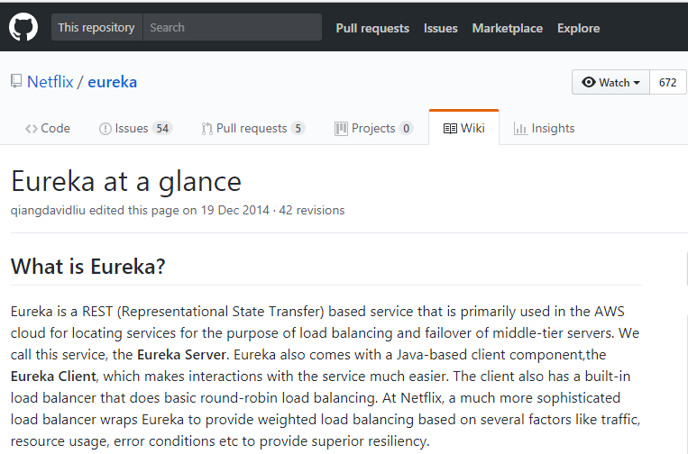
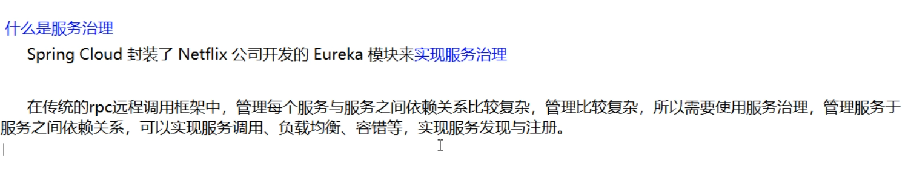
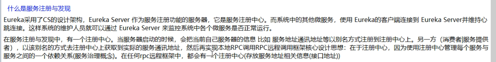
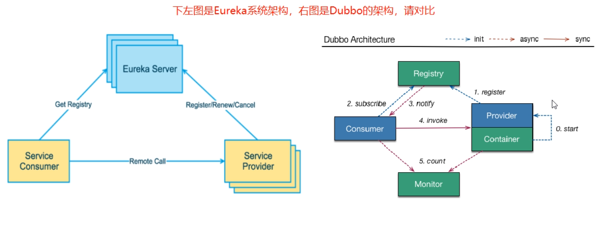
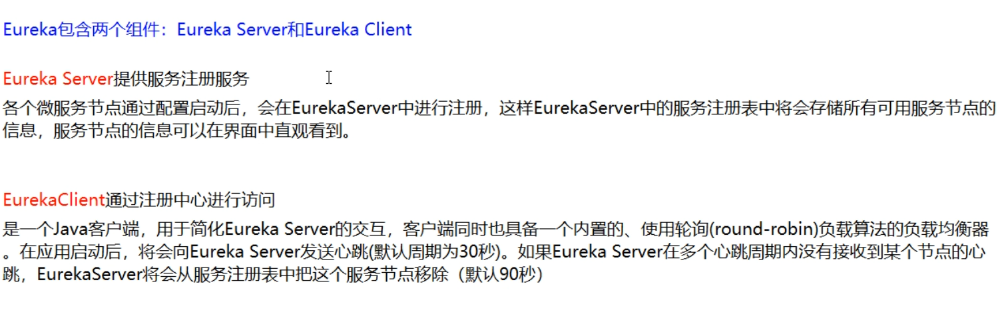
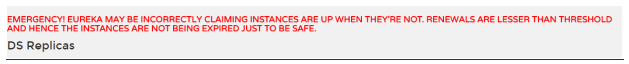
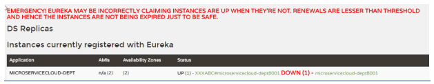
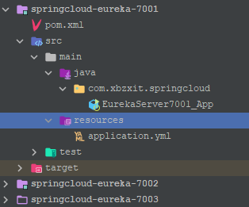
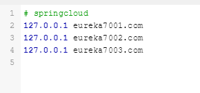

# Eureka注册中心

## 什么是Eureka

> Eureka是Netflix的一个子模块，也是核心模块之一。Eureka是一个基于REST的服务，用于定位服务，以实现云端中间层服务发现和故障转移。
>
> 服务注册与发现对于微服务架构来说是非常重要的，有了服务发现与注册，只需要使用服务的标识符，就可以访问到服务，而不需要修改服务调用的配置文件了。功能类似于dubbo的注册中心，比如Zookeeper。



### 基本架构

> Spring Cloud 封装了 Netflix 公司开发的 Eureka 模块来实现服务注册和发现(请对比Zookeeper)。

```bash
Eureka 采用了 C-S 的设计架构。Eureka Server 作为服务注册功能的服务器，它是服务注册中心。


而系统中的其他微服务，使用 Eureka 的客户端连接到 Eureka Server并维持心跳连接。这样系统的维护人员就可以通过 Eureka Server 来监控系统中各个微服务是否正常运行。
SpringCloud 的一些其他模块（比如Zuul）就可以通过 Eureka Server 来发现系统中的其他微服务，并执行相关的逻辑。


```

### 什么是服务治理



### 什么是服务注册





### Eureka两组件



### 三大角色

* Eureka Server 提供服务注册和发现
* Service Provider服务提供方将自身服务注册到Eureka，从而使服务消费方能够找到
* Service Consumer服务消费方从Eureka获取注册服务列表，从而能够消费服务

## 单机注册中心

### 服务名称修改


### 访问信息有IP信息提示


### 微服务info内容详细信息


## 注册信息完善


## Eureka自我保护

### 故障现象





### 导致原因

> 一句话：某时刻某一个微服务不可用了，eureka不会立刻清理，依旧会对该微服务的信息进行保存

```bash
什么是自我保护模式？
  
默认情况下，如果EurekaServer在一定时间内没有接收到某个微服务实例的心跳，EurekaServer将会注销该实例（默认90秒）。
但是当网络分区故障发生时，微服务与EurekaServer之间无法正常通信，以上行为可能变得非常危险了——因为微服务本身其实是健康的，此时本不应该注销这个微服务。
Eureka通过“自我保护模式”来解决这个问题——当EurekaServer节点在短时间内丢失过多客户端时（可能发生了网络分区故障），那么这个节点就会进入自我保护模式。
一旦进入该模式，EurekaServer就会保护服务注册表中的信息，不再删除服务注册表中的数据（也就是不会注销任何微服务）。当网络故障恢复后，该Eureka Server节点会自动退出自我保护模式。
 

在自我保护模式中，Eureka Server会保护服务注册表中的信息，不再注销任何服务实例。当它收到的心跳数重新恢复到阈值以上时，该Eureka Server节点就会自动退出自我保护模式。
它的设计哲学就是宁可保留错误的服务注册信息，也不盲目注销任何可能健康的服务实例。一句话讲解：好死不如赖活着
 
综上，自我保护模式是一种应对网络异常的安全保护措施。它的架构哲学是宁可同时保留所有微服务（健康的微服务和不健康的微服务都会保留），也不盲目注销任何健康的微服务。
使用自我保护模式，可以让Eureka集群更加的健壮、稳定。
 
在Spring Cloud中，可以使用eureka.server.enable-self-preservation = false 禁用自我保护模式。
 
```

## 集群配置

### 新建EurekaServer

* springcloud-eureka-7001
* springcloud-eureka-7002
* springcloud-eureka-7003




### pom.xml

```xml
<?xml version="1.0" encoding="UTF-8"?>
<project xmlns="http://maven.apache.org/POM/4.0.0"
         xmlns:xsi="http://www.w3.org/2001/XMLSchema-instance"
         xsi:schemaLocation="http://maven.apache.org/POM/4.0.0 http://maven.apache.org/xsd/maven-4.0.0.xsd">
    <parent>
        <artifactId>springcloud-xbzxit</artifactId>
        <groupId>com.xbzxit</groupId>
        <version>1.0-SNAPSHOT</version>
    </parent>
    <modelVersion>4.0.0</modelVersion>

    <artifactId>springcloud-eureka-7001</artifactId>

    <properties>
        <maven.compiler.source>8</maven.compiler.source>
        <maven.compiler.target>8</maven.compiler.target>
    </properties>


    <dependencies>
        <!--eureka-server服务端 -->
        <dependency>
            <groupId>org.springframework.cloud</groupId>
            <artifactId>spring-cloud-starter-eureka-server</artifactId>
        </dependency>
        <!-- 修改后立即生效，热部署 -->
        <dependency>
            <groupId>org.springframework</groupId>
            <artifactId>springloaded</artifactId>
        </dependency>
        <dependency>
            <groupId>org.springframework.boot</groupId>
            <artifactId>spring-boot-devtools</artifactId>
        </dependency>
        <dependency>
            <groupId>org.springframework.boot</groupId>
            <artifactId>spring-boot</artifactId>
        </dependency>
    </dependencies>
</project>
```


### 启动类

> 更改启动类名字与端口匹配

```java
@SpringBootApplication
@EnableEurekaServer
public class EurekaServer7001_App {

    public static void main(String[] args) {
        SpringApplication.run(EurekaServer7001_App.class, args);
    }

}
```


### yml

> 不通的sever 更换 port,  hostname， server-url (不包含自己)

```yaml
server:
  port: 7001

eureka:
  instance:
    hostname: eureka7001.com #eureka服务端的实例名称
  client:
    register-with-eureka: false     #false表示不向注册中心注册自己。
    fetch-registry: false     #false表示自己端就是注册中心，我的职责就是维护服务实例，并不需要去检索服务
    service-url:
      #单机 defaultZone: http://${eureka.instance.hostname}:${server.port}/eureka/       #设置与Eureka Server交互的地址查询服务和注册服务都需要依赖这个地址（单机）。
      defaultZone: http://eureka7002.com:7002/eureka/,http://eureka7003.com:7003/eureka/

```


### 修改hosts

> C:\Windows\System32\drivers\etc路径下的hosts文件



### 将服务加到注册中心

> 修改对应服务的yml

```yaml
eureka:
  client: #客户端注册进eureka服务列表内
    service-url: 
      defaultZone: http://eureka7001.com:7001/eureka/,http://eureka7002.com:7002/eureka/,http://eureka7003.com:7003/eureka/
  instance:
    instance-id: springcloud-dept8001   #自定义服务名称信息
    prefer-ip-address: true     #访问路径可以显示IP地址
```


### 启动类加注解

> @EnableEurekaClient
