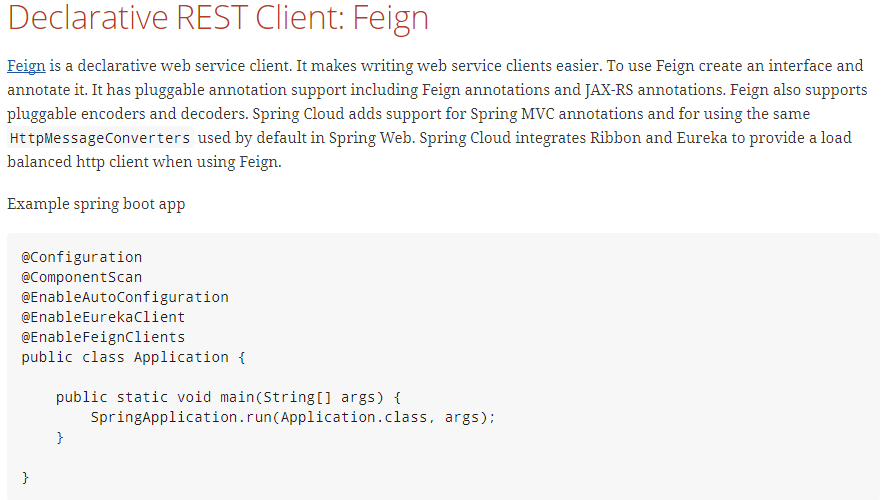

# Fegin负载均衡

## 基础概念

> [spring-cloud-feign官网](http://projects.spring.io/spring-cloud/spring-cloud.html#spring-cloud-feign)
>
> [Feign官网](https://github.com/OpenFeign/feign)
>
> Feign是一个声明式WebService客户端。使用Feign能让编写Web Service客户端更加简单, 它的使用方法是定义一个接口，然后在上面添加注解，同时也支持JAX-RS标准的注解。
>
> Feign也支持可拔插式的编码器和解码器。Spring Cloud对Feign进行了封装，使其支持了Spring MVC标准注解和HttpMessageConverters。Feign可以与Eureka和Ribbon组合使用以支持负载均衡。
>
> Feign是一个声明式的Web服务客户端，使得编写Web服务客户端变得非常容易，
> 只需要创建一个接口，然后在上面添加注解即可。



### Feign能干什么

```bash
Feign旨在使编写Java Http客户端变得更容易。
前面在使用Ribbon+RestTemplate时，利用RestTemplate对http请求的封装处理，形成了一套模版化的调用方法。
但是在实际开发中，由于对服务依赖的调用可能不止一处，往往一个接口会被多处调用，所以通常都会针对每个微服务自行封装一些客户端类来包装这些依赖服务的调用。
所以，Feign在此基础上做了进一步封装，由他来帮助我们定义和实现依赖服务接口的定义。

在Feign的实现下，我们只需创建一个接口并使用注解的方式来配置它(以前是Dao接口上面标注Mapper注解,现在是一个微服务接口上面标注一个Feign注解即可)，
即可完成对服务提供方的接口绑定，简化了使用Spring cloud Ribbon时，自动封装服务调用客户端的开发量。
```

### Feign集成Ribbon

```bash
利用Ribbon维护了MicroServiceCloud-Dept的服务列表信息，并且通过轮询实现了客户端的负载均衡。而与Ribbon不同的是，通过feign只需要定义服务绑定接口且以声明式的方法，优雅而简单的实现了服务调用

```

## Feign的使用

### 新建module

> springcloud--consumer-dept-feign

### pom.xml

```xml
    <dependencies>
        <dependency><!-- 自己定义的api -->
            <groupId>com.xbzxit</groupId>
            <artifactId>springcloud-api</artifactId>
            <version>1.0-SNAPSHOT</version>
        </dependency>
        <dependency>
            <groupId>org.springframework.boot</groupId>
            <artifactId>spring-boot-starter-web</artifactId>
        </dependency>
        <!-- 修改后立即生效，热部署 -->
        <dependency>
            <groupId>org.springframework</groupId>
            <artifactId>springloaded</artifactId>
        </dependency>
        <dependency>
            <groupId>org.springframework.boot</groupId>
            <artifactId>spring-boot-devtools</artifactId>
        </dependency>
        <!-- Ribbon相关 -->
        <dependency>
            <groupId>org.springframework.cloud</groupId>
            <artifactId>spring-cloud-starter-eureka</artifactId>
        </dependency>
        <dependency>
            <groupId>org.springframework.cloud</groupId>
            <artifactId>spring-cloud-starter-ribbon</artifactId>
        </dependency>
        <dependency>
            <groupId>org.springframework.cloud</groupId>
            <artifactId>spring-cloud-starter-config</artifactId>
        </dependency>
        <dependency>
            <groupId>org.springframework.cloud</groupId>
            <artifactId>spring-cloud-starter-feign</artifactId>
        </dependency>
    </dependencies>
```


### 启动类

```java
@SpringBootApplication
@EnableEurekaClient
@EnableFeignClients(basePackages= {"com.xbzxit.springcloud"})
@ComponentScan("com.xbzxit.springcloud")
public class DeptConsumer80_Feign_App
{
    public static void main(String[] args)
    {
        SpringApplication.run(DeptConsumer80_Feign_App.class, args);
    }
}
```


## 使用feign调用rest接口

> springcloud-api

### pom.xml

```xml
    <dependencies><!-- 当前Module需要用到的jar包，按自己需求添加，如果父类已经包含了，可以不用写版本号 -->
        <dependency>
            <groupId>org.projectlombok</groupId>
            <artifactId>lombok</artifactId>
        </dependency>
        <dependency>
            <groupId>org.projectlombok</groupId>
            <artifactId>lombok</artifactId>
        </dependency>
        <dependency>
            <groupId>org.springframework.cloud</groupId>
            <artifactId>spring-cloud-starter-feign</artifactId>
        </dependency>

    </dependencies>
```


### feign接口

```java

@FeignClient(value = "SPRINGCLOUD-DEPT")
public interface DeptClientService
{
    @RequestMapping(value = "/dept/get/{id}",method = RequestMethod.GET)
    public Dept get(@PathVariable("id") long id);

    @RequestMapping(value = "/dept/list",method = RequestMethod.GET)
    public List<Dept> list();

    @RequestMapping(value = "/dept/add",method = RequestMethod.POST)
    public boolean add(Dept dept);
}

```


## 总结

```bash
Feign通过接口的方法调用Rest服务（之前是Ribbon+RestTemplate），
该请求发送给Eureka服务器（http://SPRINGCLOUD-DEPT/dept/list）,
通过Feign直接找到服务接口，由于在进行服务调用的时候融合了Ribbon技术，所以也支持负载均衡作用。
```
