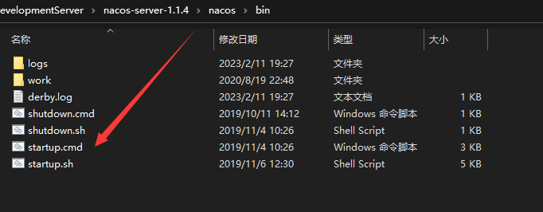
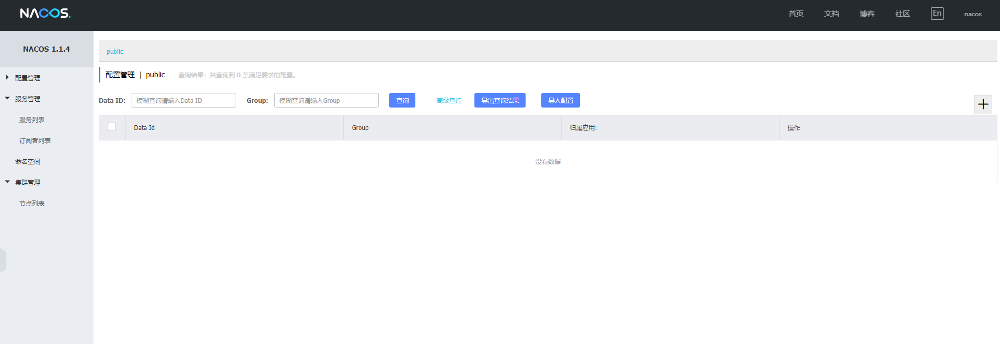
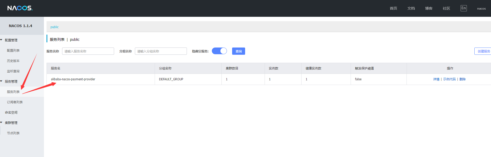
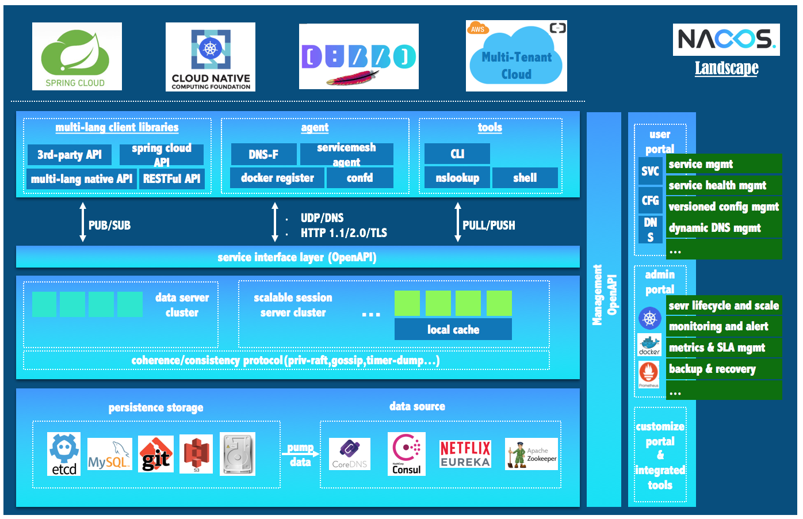
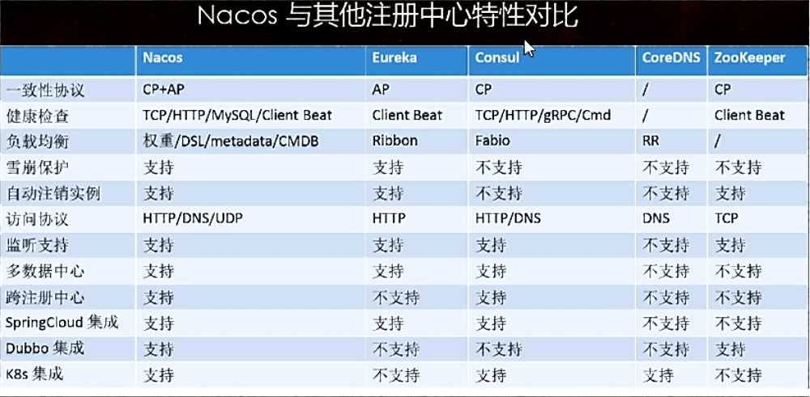
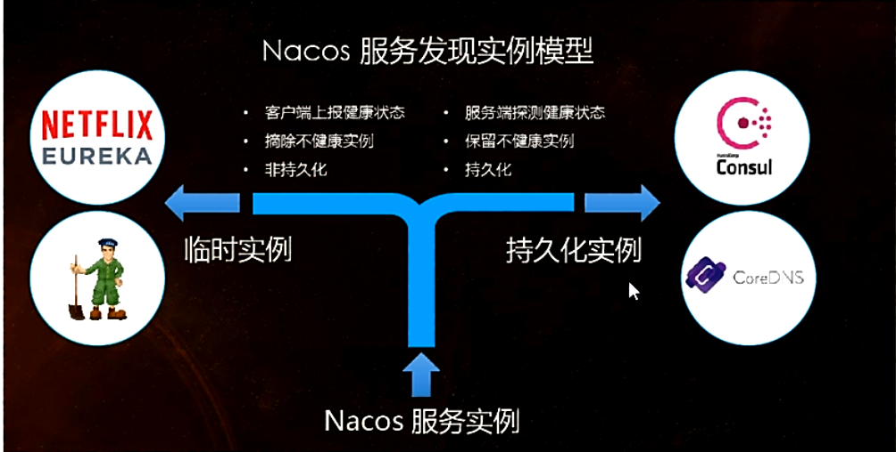
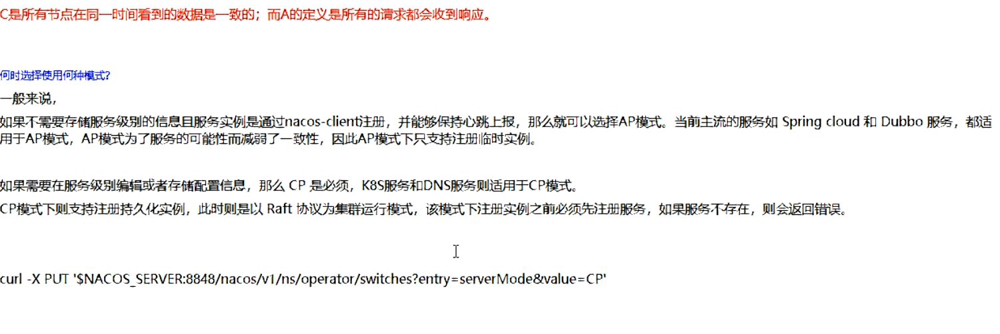

# Nacos服务注册与配置中心

> 替代Eureka做注册中心， 替代Config做配置中心
>
> [官方文档](https://spring-cloud-alibaba-group.github.io/github-pages/2021/en-us/index.html)

## 下载安装

### 下载

[Win_Nacos下载](https://github.com/alibaba/nacos/releases/download/1.1.4/nacos-server-1.1.4.zip)

### 安裝

> 解压即可， 使用startup.cmd运行

### 访问

> [Nacos](http://localhost:8848/nacos/index.html)
>
> nacos/nacos

## 服务提供者

> springcloudalibaba-provider-payment9001
>
> springcloudalibaba-provider-payment9002

### pom.xml

### yml

### 启动类

### 业务类

### 测试

> [测试](http://localhost:9001/payment/nacos/1)

## 服务注册对比

### Nacos全景图所示

### 注册中心特性对比

### Nacos服务器发现实例模型

### Nacos支持AP和CP模式的切换

