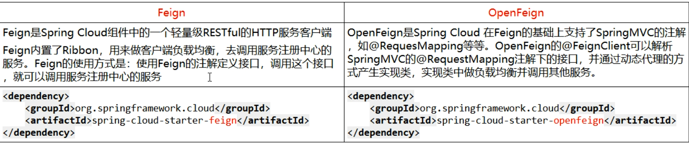

# OpenFeign服务器接口调用

## 介绍

> [官网](https://cloud.spring.io/spring-cloud-static/Hoxton.SR1/reference/htmlsingle/#spring-cloud-openfeign)
>
> Feign是一个声明式WebService客户端。使用Feign能让编写Web Service客户端更加简单。
>
> 它的使用方法是定义一个服务接口然后在上面添加注解。Feign也支持可拔插式的编码器和解码器。Spring Cloud对Feign进行了封装. 使其支持.了Spring MVC标准注解和!ittpMessageConverters..E[eign可以YEureka和Ribbon组合使用以支持负载均衡

### 能做什么

> Feign旨在使编写Java Http客户端变得更容易。
>
> 前面在使用Ribbon+RestTemplate时，利用RestTemplate对http请求的封装处理，形成了一套模版化的调用方法。但是在实际开发中，由于对服务依赖的调用可能不止一处，往往一个接口会被多处调用，
>
> 所以通常都会针对每个微服务自行封装一些客户端类来包装这些依赖服务的调用。所以，Feign在此基础上做了进一步封装，由他来帮助我们定义和实现依赖服务接口的定义。在Feign的实现下，
>
> 我们只需创建<font color = 'red'>一个接口并使用注解的方式来配置它</font>(以前是Dao接口上面标注Mapper注解,现在是一个微服务接口上面标注Feign注解即可)，即可完成对服务提供方的接口绑定，
>
> 简化了使用Spring cloud Ribbon时，自动封装服务调用客户端的开发量。

### Feign集成了Ribbon

> 利用Ribbon维护了Payment的服务列表信息，并且通过轮询实现了客户端的负载均衡。而与Ribbon不同的是，通过feign只需要定义服务绑定接口且以声明式的方法，优雅而简单的实现了服务调用

## Feign与OpenFeign的区别



## 简单使用

> SpringCloud-consumer-feign-order80

### pom.xml

```xml
<!--openfeign-->
<dependencies>
    <dependency>
        <groupId>org.springframework.cloud</groupId>
        <artifactId>spring-cloud-starter-openfeign</artifactId>
    </dependency>
    <dependency>
        <groupId>org.springframework.cloud</groupId>
        <artifactId>spring-cloud-starter-netflix-eureka-client</artifactId>
    </dependency>
    <dependency>
        <groupId>com.xbzxit</groupId>
        <artifactId>SpringCloud-api-commons</artifactId>
        <version>1.0-SNAPSHOT</version>
    </dependency>
    <dependency>
        <groupId>org.springframework.boot</groupId>
        <artifactId>spring-boot-starter-web</artifactId>
    </dependency>

    <dependency>
        <groupId>org.springframework.boot</groupId>
        <artifactId>spring-boot-starter-actuator</artifactId>
    </dependency>

    <dependency>
        <groupId>org.springframework.boot</groupId>
        <artifactId>spring-boot-devtools</artifactId>
        <scope>runtime</scope>
        <optional>true</optional>
    </dependency>

    <dependency>
        <groupId>org.projectlombok</groupId>
        <artifactId>lombok</artifactId>
        <optional>true</optional>
    </dependency>
    <dependency>
        <groupId>org.springframework.boot</groupId>
        <artifactId>spring-boot-starter-test</artifactId>
        <scope>test</scope>
    </dependency>
</dependencies>
```

### yml

```yaml
server:
  port: 80
eureka:
  client:
    register-with-eureka: false
    service-url:
      defaultZone: http://eureka7001.com:7001/eureka, http://eureka7002.com:7002/eureka, http://eureka7003.com:7003/eureka
```

### 主启动类

```java
@SpringBootApplication
@EnableFeignClients
public class OrderFeignMain80 {
    public static void main(String[] args) {
        SpringApplication.run(OrderFeignMain80.class,args);
    }
}
```

### 业务类

```java
@Component
@FeignClient(value = "SPRINGCLOUD-PAYMENT-SERVICE")
public interface PaymentFeignService {

    @GetMapping(value = "/payment/get/{id}")
    public CommonResult getPaymentById(@PathVariable("id") Long id);
}

```

### 控制器

```java
@RestController
public class OrderFeignController {

    @Resource
    private PaymentFeignService paymentFeignService;

    @GetMapping(value = "/consumer/payment/get/{id}")
    public CommonResult<Payment> getPaymentById(@PathVariable("id") Long id){
        return paymentFeignService.getPaymentById(id);
    }
}
```

### 测试

> 启动 集群注册中心   ------   再启动微服务8001  8002 -----  最后启动openfeign
>
> http://localhost/consumer/payment/get/31

## OpenFeign超时控制

### s1


### 8


### 33


## OpenFeign日志打印
