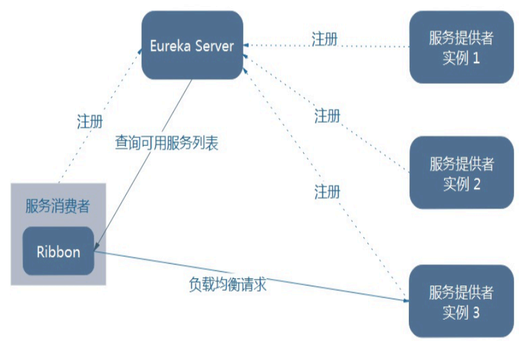

# Ribbon负载均衡

> Spring Cloud Ribbon是基于Netflix Ribbon实现的一套客户端 负载均衡的工具。
>
> [Ribbon官网](https://github.com/Netflix/ribbon/wiki/Getting-Started)

```bash
简单的说，Ribbon是Netflix发布的开源项目，主要功能是提供客户端的软件负载均衡算法，将Netflix的中间层服务连接在一起。Ribbon客户端组件提供一系列完善的配置项如连接超时，重试等。
简单的说，就是在配置文件中列出Load Balancer（简称LB）后面所有的机器，Ribbon会自动的帮助你基于某种规则（如简单轮询，随机连接等）去连接这些机器。我们也很容易使用Ribbon实现自定义的负载均衡算法。
```

## 负载均衡

> LB，即负载均衡(Load Balance)，在微服务或分布式集群中经常用的一种应用。
> 负载均衡简单的说就是将用户的请求平摊的分配到多个服务上，从而达到系统的HA。
> 常见的负载均衡有软件Nginx，LVS，硬件 F5等。
> 相应的在中间件，例如：dubbo和SpringCloud中均给我们提供了负载均衡，SpringCloud的负载均衡算法可以自定义。

### 集中式

```bash
即在服务的消费方和提供方之间使用独立的LB设施(可以是硬件，如F5, 也可以是软件，如nginx), 由该设施负责把访问请求通过某种策略转发至服务的提供方；
```

### 进程内

```bash
将LB逻辑集成到消费方，消费方从服务注册中心获知有哪些地址可用，然后自己再从这些地址中选择出一个合适的服务器。
 
Ribbon就属于进程内LB，它只是一个类库，集成于消费方进程，消费方通过它来获取到服务提供方的地址。
 

```

## Ribbon配置初步

> springcloud-consumer-dept-80

### pom.xml

```xml
 <dependencies>
   <dependency><!-- 自己定义的api -->
     <groupId>com.atguigu.springcloud</groupId>
     <artifactId>microservicecloud-api</artifactId>
     <version>${project.version}</version>
   </dependency>
   <dependency>
     <groupId>org.springframework.boot</groupId>
     <artifactId>spring-boot-starter-web</artifactId>
   </dependency>
   <!-- 修改后立即生效，热部署 -->
   <dependency>
     <groupId>org.springframework</groupId>
     <artifactId>springloaded</artifactId>
   </dependency>
   <dependency>
     <groupId>org.springframework.boot</groupId>
     <artifactId>spring-boot-devtools</artifactId>
   </dependency>
   <!-- Ribbon相关 -->
   <dependency>
     <groupId>org.springframework.cloud</groupId>
     <artifactId>spring-cloud-starter-eureka</artifactId>
   </dependency>
   <dependency>
     <groupId>org.springframework.cloud</groupId>
     <artifactId>spring-cloud-starter-ribbon</artifactId>
   </dependency>
   <dependency>
     <groupId>org.springframework.cloud</groupId>
     <artifactId>spring-cloud-starter-config</artifactId>
   </dependency>
  </dependencies>

```

### yml

```yaml
server:
  port: 80
 
eureka:
  client:
    register-with-eureka: false
    service-url: 
      defaultZone: http://eureka7001.com:7001/eureka/,http://eureka7002.com:7002/eureka/,http://eureka7003.com:7003/eureka/
```


### 配置类

> @LoadBalanced

```java
import org.springframework.cloud.client.loadbalancer.LoadBalanced;
import org.springframework.context.annotation.Bean;
import org.springframework.context.annotation.Configuration;
import org.springframework.web.client.RestTemplate;
 
@Configuration
public class ConfigBean
{
  @Bean
  @LoadBalanced
  public RestTemplate getRestTemplate()
  {
   return new RestTemplate();
  }
}
 
```


### 启动类加注解

> @EnableEurekaClient

```java
@SpringBootApplication
@EnableEurekaClient
public class DeptConsumer80_App
{
  public static void main(String[] args)
  {
   SpringApplication.run(DeptConsumer80_App.class, args);
  }
}
 

```


### 修改调用类

```java
 
@RestController
public class DeptController_Consumer
{
  //private static final String REST_URL_PREFIX = "http://localhost:8001";
  private static final String REST_URL_PREFIX = "http://SPRINGCLOUD-DEPT";
  
  @Autowired
  private RestTemplate restTemplate;
  
  @RequestMapping(value="/consumer/dept/add")
  public boolean add(Dept dept)
  {
   return restTemplate.postForObject(REST_URL_PREFIX+"/dept/add", dept, Boolean.class);
  }
  
  @RequestMapping(value="/consumer/dept/get/{id}")
  public Dept get(@PathVariable("id") Long id)
  {
   return restTemplate.getForObject(REST_URL_PREFIX+"/dept/get/"+id, Dept.class);
  }
  
  @SuppressWarnings("unchecked")
  @RequestMapping(value="/consumer/dept/list")
  public List<Dept> list()
  {
   return restTemplate.getForObject(REST_URL_PREFIX+"/dept/list", List.class);
  } 
}
```


## Ribbon负载均衡

### 架构说明

> Ribbon在工作时分成两步
> 第一步先选择 EurekaServer ,它优先选择在同一个区域内负载较少的server.
> 第二步再根据用户指定的策略，在从server取到的服务注册列表中选择一个地址。
> 其中Ribbon提供了多种策略：比如轮询、随机和根据响应时间加权。




### 新建生产服务

> springcloud-provider-dept-8001
>
> springcloud-provider-dept-8002
>
> springcloud-provider-dept-8003


### 8002 数据库脚本

```sql
 
DROP DATABASE IF EXISTS cloudDB02;
 
CREATE DATABASE cloudDB02 CHARACTER SET UTF8;
 
USE cloudDB02;
 
CREATE TABLE dept
(
  deptno BIGINT NOT NULL PRIMARY KEY AUTO_INCREMENT,
  dname VARCHAR(60),
  db_source   VARCHAR(60)
);
 
INSERT INTO dept(dname,db_source) VALUES('开发部',DATABASE());
INSERT INTO dept(dname,db_source) VALUES('人事部',DATABASE());
INSERT INTO dept(dname,db_source) VALUES('财务部',DATABASE());
INSERT INTO dept(dname,db_source) VALUES('市场部',DATABASE());
INSERT INTO dept(dname,db_source) VALUES('运维部',DATABASE());
 
SELECT * FROM dept;
 
```


### 8003 数据库脚本

```sql
DROP DATABASE IF EXISTS cloudDB03;
 
CREATE DATABASE cloudDB03 CHARACTER SET UTF8;
 
USE cloudDB03;
 
 
CREATE TABLE dept
(
  deptno BIGINT NOT NULL PRIMARY KEY AUTO_INCREMENT,
  dname VARCHAR(60),
  db_source   VARCHAR(60)
);
 
INSERT INTO dept(dname,db_source) VALUES('开发部',DATABASE());
INSERT INTO dept(dname,db_source) VALUES('人事部',DATABASE());
INSERT INTO dept(dname,db_source) VALUES('财务部',DATABASE());
INSERT INTO dept(dname,db_source) VALUES('市场部',DATABASE());
INSERT INTO dept(dname,db_source) VALUES('运维部',DATABASE());
 
SELECT * FROM dept;
```


### 8002 yml文件

```yaml
server:
  port: 8002
  
mybatis:
  config-location: classpath:mybatis/mybatis.cfg.xml  #mybatis所在路径
  type-aliases-package: com.xbzxit.springcloud.entities #entity别名类
  mapper-locations:
  - classpath:mybatis/mapper/**/*.xml #mapper映射文件
  
spring:
   application:
    name: springcloud-dept 
   datasource:
    type: com.alibaba.druid.pool.DruidDataSource
    driver-class-name: org.gjt.mm.mysql.Driver
    url: jdbc:mysql://localhost:3306/cloudDB02
    username: root
    password: 123456
    dbcp2:
      min-idle: 5
      initial-size: 5
      max-total: 5
      max-wait-millis: 200
  
eureka:
  client: #客户端注册进eureka服务列表内
    service-url: 
      defaultZone: http://eureka7001.com:7001/eureka/,http://eureka7002.com:7002/eureka/,http://eureka7003.com:7003/eureka/
  instance:
    instance-id: springcloud-dept8002   #自定义服务名称信息
    prefer-ip-address: true     #访问路径可以显示IP地址
  
info:
  app.name: xbzxit-springcloud
  company.name: www.xbzxit.com
  build.artifactId: $project.artifactId$
  build.version: $project.version$
  
  
```


### 8003 yml文件

```yaml
server:
  port: 8003
  
mybatis:
  config-location: classpath:mybatis/mybatis.cfg.xml  #mybatis所在路径
  type-aliases-package: com.xbzxit.springcloud.entities #entity别名类
  mapper-locations:
  - classpath:mybatis/mapper/**/*.xml #mapper映射文件
  
spring:
   application:
    name: microservicecloud-dept 
   datasource:
    type: com.alibaba.druid.pool.DruidDataSource
    driver-class-name: org.gjt.mm.mysql.Driver
    url: jdbc:mysql://localhost:3306/cloudDB03
    username: root
    password: 123456
    dbcp2:
      min-idle: 5
      initial-size: 5
      max-total: 5
      max-wait-millis: 200
  
eureka:
  client: #客户端注册进eureka服务列表内
    service-url: 
      defaultZone: http://eureka7001.com:7001/eureka/,http://eureka7002.com:7002/eureka/,http://eureka7003.com:7003/eureka/
  instance:
    instance-id: springcloud-dept8003   #自定义服务名称信息
    prefer-ip-address: true     #访问路径可以显示IP地址
  
info:
  app.name: xbzxit-springcloud
  company.name: www.xbzxit.com
  build.artifactId: $project.artifactId$
  build.version: $project.version$
  
  
  

```


## 总结

```bash
总结：Ribbon其实就是一个软负载均衡的客户端组件，
他可以和其他所需请求的客户端结合使用，和eureka结合只是其中的一个实例。
```
