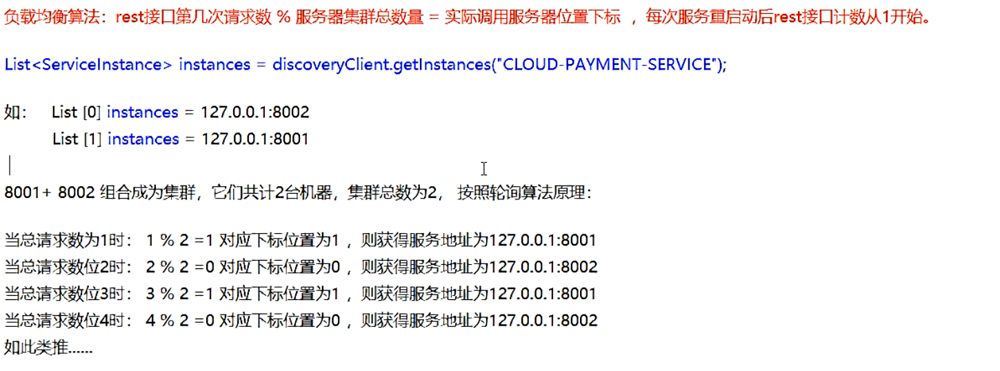

# Ribbon负载均衡服务调用


## 概述


## 负载均衡演示


## Ribbon核心组件IRule


## Ribbon负载均衡算法




### 8001/8002服务改造

> controller

```java
@GetMapping(value = "/payment/lb")
public String getPaymentLB(){
    return serverPort;
}

```


### 80服务改造

* ApplicationContextBean去掉@LoadBalanced
* LoadBalancer接口

```java
public interface LoadBalancer {
     //收集服务器总共有多少台能够提供服务的机器，并放到list里面
    ServiceInstance instances(List<ServiceInstance> serviceInstances);

}
```

* MyLB

```java
@Component
public class MyLB implements LoadBalancer {

    private AtomicInteger atomicInteger = new AtomicInteger(0);

    //坐标
    private final int getAndIncrement(){
        int current;
        int next;
        do {
            current = this.atomicInteger.get();
            next = current >= 2147483647 ? 0 : current + 1;
        }while (!this.atomicInteger.compareAndSet(current,next));  //第一个参数是期望值，第二个参数是修改值是
        System.out.println("*******第几次访问，次数next: "+next);
        return next;
    }

    @Override
    public ServiceInstance instances(List<ServiceInstance> serviceInstances) {  //得到机器的列表
       int index = getAndIncrement() % serviceInstances.size(); //得到服务器的下标位置
        return serviceInstances.get(index);
    }
}
 

```


* OrderController

```java
@RestController
@Slf4j
public class OrderController {

   // public static final String PAYMENT_URL = "http://localhost:8001";
    public static final String PAYMENT_URL = "http://CLOUD-PAYMENT-SERVICE";

    @Resource
    private RestTemplate restTemplate;

    @Resource
    private LoadBalancer loadBalancer;

    @Resource
    private DiscoveryClient discoveryClient;

    @GetMapping("/consumer/payment/create")
    public CommonResult<Payment>   create( Payment payment){
        return restTemplate.postForObject(PAYMENT_URL+"/payment/create",payment,CommonResult.class);  //写操作
    }

    @GetMapping("/consumer/payment/get/{id}")
    public CommonResult<Payment> getPayment(@PathVariable("id") Long id){
        return restTemplate.getForObject(PAYMENT_URL+"/payment/get/"+id,CommonResult.class);
    }

    @GetMapping("/consumer/payment/getForEntity/{id}")
     public CommonResult<Payment> getPayment2(@PathVariable("id") Long id){
        ResponseEntity<CommonResult> entity = restTemplate.getForEntity(PAYMENT_URL+"/payment/get/"+id,CommonResult.class);
        if (entity.getStatusCode().is2xxSuccessful()){
          //  log.info(entity.getStatusCode()+"\t"+entity.getHeaders());
            return entity.getBody();
        }else {
            return new CommonResult<>(444,"操作失败");
        }
     }

    @GetMapping(value = "/consumer/payment/lb")
     public String getPaymentLB(){
        List<ServiceInstance> instances = discoveryClient.getInstances("CLOUD-PAYMENT-SERVICE");
        if (instances == null || instances.size() <= 0){
            return null;
        }
        ServiceInstance serviceInstance = loadBalancer.instances(instances);
        URI uri = serviceInstance.getUri();
        return restTemplate.getForObject(uri+"/payment/lb",String.class);
    }
}
```


* 测试
  > http://localhost/consumer/payment/lb
  >
