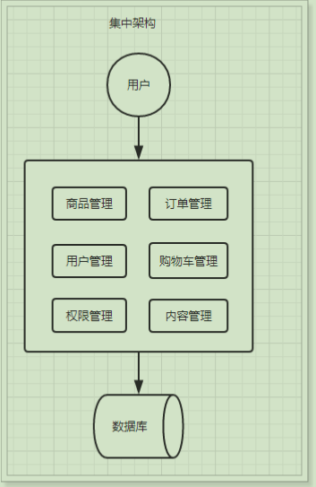
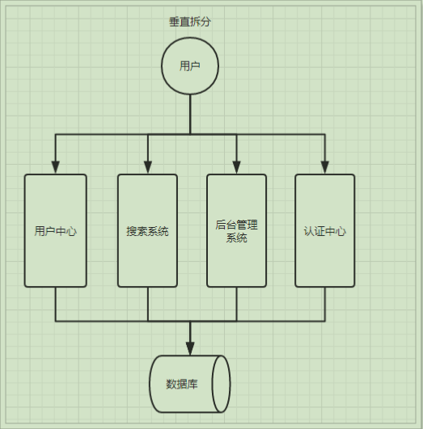
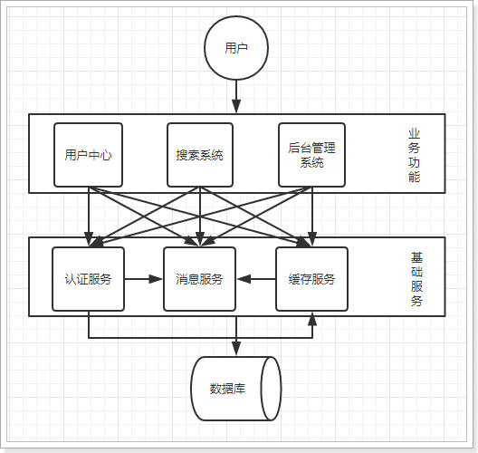
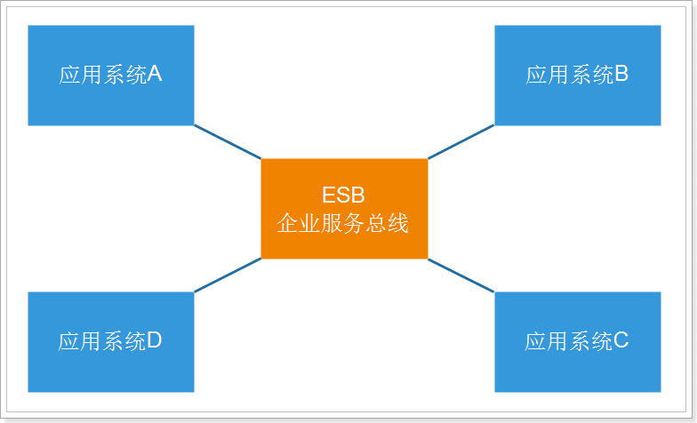
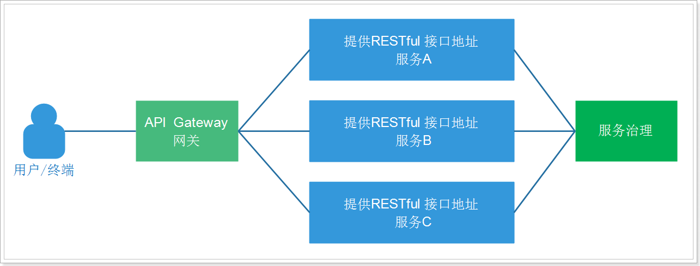
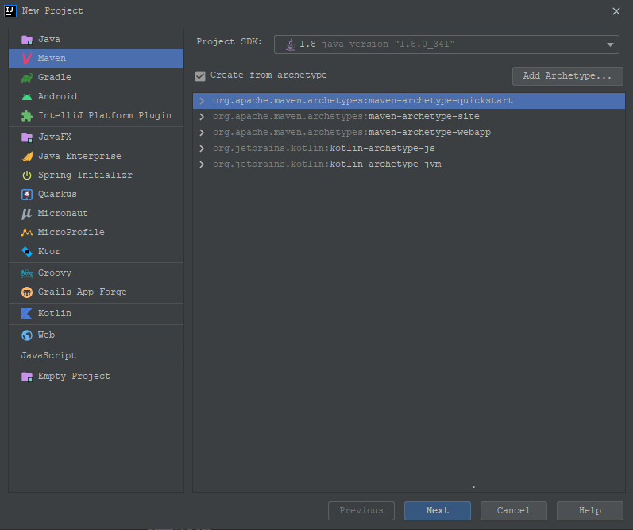

# SpringCloud入门

## 系统架构的演变

### 集中式架构

> 当网站流量很小时，只需一个应用，将所有功能都部署在一起，以减少部署节点和成本

👍   **优点**

* 系统开发速度快
* 维护成本低
* 适用于并发要求较低的系统

👎  **缺点**

* 代码耦合度高，后期维护困难
* 无法针对不同模块进行针对性优化
* 无法水平扩展
* 单点容错率低，并发能力差

### 垂直拆分

> 当访问量逐渐增大，单一应用无法满足需求，此时为了应对更高的并发和业务需求，我们根据业务功能对系统进行拆分：

👍   **优点**

* 系统拆分实现了流量分担，解决了并发问题
* 可以针对不同模块进行优化
* 方便水平扩展，负载均衡，容错率提高

👎  **缺点**

* 系统间相互独立，会有很多重复开发工作，影响开发效率

### 分布式服务

> 当垂直应用越来越多，应用之间交互不可避免，将核心业务抽取出来，作为独立的服务，逐渐形成稳定的服务中心，使前端应用能更快速的响应多变的市场需求。

👍   **优点**

* 将基础服务进行了抽取，系统间相互调用，提高了代码复用和开发效率

👎  **缺点**

* 系统间耦合度变高，调用关系错综复杂，难以维护

### 面向服务架构（SOA)

> SOA（Service Oriented Architecture）面向服务的架构：它是一种设计方法，其中包含多个服务， 服务之间通过相互依赖最终提供一系列的功能。一个服务 通常以独立的形式存在与操作系统进程中。各个服务之间 通过网络调用。

ESB（企业服务总线），简单 来说 ESB 就是一根管道，用来连接各个服务节点。为了集 成不同系统，不同协议的服务，ESB 做了消息的转化解释和路由工作，让不同的服务互联互通。

**SOA缺点：**  每个供应商提供的ESB产品有偏差，自身实现较为复杂；应用服务粒度较大，ESB集成整合所有服务和协议、数据转换使得运维、测试部署困难。所有服务都通过一个通路通信，直接降低了通信速度。

### 微服务架构

> 微服务架构是使用一套小服务来开发单个应用的方式或途径，每个服务基于单一业务能力构建，运行在自己的进程中，并使用轻量级机制通信，通常是HTTP API，并能够通过自动化部署机制来独立部署。
>
> 这些服务可以使用不同的编程语言实现，以及不同数据存储技术，并保持最低限度的集中式管理。

API Gateway网关是一个服务器，是系统的唯一入口。为每个客户端提供一个定制的API。API网关核心是，所有的客户端和消费端都通过统一的网关接入微服务，在网关层处理所有的非业务功能。

如它还可以具有其它职责，如身份验证、监控、负载均衡、缓存、请求分片与管理、静态响应处理。通常，网关提供RESTful/HTTP的方式访问服务。而服务端通过服务注册中心进行服务注册和管理。

微服务的特点：

* 单一职责：微服务中每一个服务都对应唯一的业务能力，做到单一职责
* 微：微服务的服务拆分粒度很小，例如一个用户管理就可以作为一个服务。每个服务虽小，但“五脏俱全”。
* 面向服务：面向服务是说每个服务都要对外暴露Rest风格服务接口API。并不关心服务的技术实现，做到与平台和语言无关，也不限定用什么技术实现，只要供Rest的接口即可。
* 自治：自治是说服务间互相独立，互不干扰
  * 团队独立：每个服务都是一个独立的开发团队，人数不能过多。
  * 技术独立：因为是面向服务，提供Rest接口，使用什么技术没有别人干涉
  * 前后端分离：采用前后端分离开发，提供统一Rest接口，后端不用再为PC、移动端开发不同接口
  * 数据库分离：每个服务都使用自己的数据源
  * 部署独立，服务间虽然有调用，但要做到服务重启不影响其它服务。有利于持续集成和持续交付。每个服务都是独立的组件，可复用，可替换，降低耦合，易维护

**微服务架构与SOA都是对系统进行拆分；微服务架构基于SOA思想，可以把微服务当做去除了ESB的SOA。ESB是SOA架构中的中心总线，设计图形应该是星形的，而微服务是去中心化的分布式软件架构。两者比较类似，但其实也有一些差别：**

| 功能     | SOA                  | 微服务                         |
| ---------- | ---------------------- | -------------------------------- |
| 组件大小 | 大块业务逻辑         | 单独任务或小块业务逻辑         |
| 耦合     | 通常松耦合           | 总是松耦合                     |
| 管理     | 着重中央管理         | 着重分散管理                   |
| 目标     | 确保应用能够交互操作 | 易维护、易扩展、更轻量级的交互 |

## 服务调用方式

### RPC和HTTP

### Http客户端工具

> 既然微服务选择了Http，那么我们就需要考虑自己来实现对请求和响应的处理。不过开源世界已经有很多的http客户端工具，能够帮助我们做这些事情，例如：

* HttpClient
* OKHttp
* URLConnection

### Spring的RestTemplate

> Spring提供了一个RestTemplate模板工具类，对基于Http的客户端进行了封装，并且实现了对象与json的序列化和反序列化，非常方便。RestTemplate并没有限定Http的客户端类型，而是进行了抽象，目前常用的3种都有支持：

* HttpClient
* OkHttp
* JDK原生的URLConnection（默认的）

## SpringCloud简介

> Spring Cloud是Spring旗下的项目之一，官网地址：http://projects.spring.io/spring-cloud/
> Spring最擅长的就是集成，把世界上最好的框架拿过来，集成到自己的项目中。
> Spring Cloud也是一样，它将现在非常流行的一些技术整合到一起，实现了诸如：配置管理，服务发现，智能路由，
> 负载均衡，熔断器，控制总线，集群状态等功能；协调分布式环境中各个系统，为各类服务提供模板性配置。其主要涉及的组件包括：
>
> * Eureka：注册中心
> * Zuul、Gateway：服务网关
> * Ribbon：负载均衡
> * Feign：服务调用
> * Hystrix或Resilience4j：熔断器
> *

