# SpringCloud概述

## 系统架构的演变

### 集中式架构

> 当网站流量很小时，只需一个应用，将所有功能都部署在一起，以减少部署节点和成本


👍   **优点**

* 系统开发速度快
* 维护成本低
* 适用于并发要求较低的系统

👎  **缺点**

* 代码耦合度高，后期维护困难
* 无法针对不同模块进行针对性优化
* 无法水平扩展
* 单点容错率低，并发能力差

### 垂直拆分

> 当访问量逐渐增大，单一应用无法满足需求，此时为了应对更高的并发和业务需求，我们根据业务功能对系统进行拆分：


👍   **优点**

* 系统拆分实现了流量分担，解决了并发问题
* 可以针对不同模块进行优化
* 方便水平扩展，负载均衡，容错率提高

👎  **缺点**

* 系统间相互独立，会有很多重复开发工作，影响开发效率

### 分布式服务

> 当垂直应用越来越多，应用之间交互不可避免，将核心业务抽取出来，作为独立的服务，逐渐形成稳定的服务中心，使前端应用能更快速的响应多变的市场需求。


👍   **优点**

* 将基础服务进行了抽取，系统间相互调用，提高了代码复用和开发效率

👎  **缺点**

* 系统间耦合度变高，调用关系错综复杂，难以维护

### 面向服务架构（SOA)

> SOA（Service Oriented Architecture）面向服务的架构：它是一种设计方法，其中包含多个服务， 服务之间通过相互依赖最终提供一系列的功能。一个服务 通常以独立的形式存在与操作系统进程中。各个服务之间 通过网络调用。

ESB（企业服务总线），简单 来说 ESB 就是一根管道，用来连接各个服务节点。为了集 成不同系统，不同协议的服务，ESB 做了消息的转化解释和路由工作，让不同的服务互联互通。


**SOA缺点：**  每个供应商提供的ESB产品有偏差，自身实现较为复杂；应用服务粒度较大，ESB集成整合所有服务和协议、数据转换使得运维、测试部署困难。所有服务都通过一个通路通信，直接降低了通信速度。

### 微服务架构

> 微服务架构是使用一套小服务来开发单个应用的方式或途径，每个服务基于单一业务能力构建，运行在自己的进程中，并使用轻量级机制通信，通常是HTTP API，并能够通过自动化部署机制来独立部署。
>
> 这些服务可以使用不同的编程语言实现，以及不同数据存储技术，并保持最低限度的集中式管理。


API Gateway网关是一个服务器，是系统的唯一入口。为每个客户端提供一个定制的API。API网关核心是，所有的客户端和消费端都通过统一的网关接入微服务，在网关层处理所有的非业务功能。

如它还可以具有其它职责，如身份验证、监控、负载均衡、缓存、请求分片与管理、静态响应处理。通常，网关提供RESTful/HTTP的方式访问服务。而服务端通过服务注册中心进行服务注册和管理。

微服务的特点：

* 单一职责：微服务中每一个服务都对应唯一的业务能力，做到单一职责
* 微：微服务的服务拆分粒度很小，例如一个用户管理就可以作为一个服务。每个服务虽小，但“五脏俱全”。
* 面向服务：面向服务是说每个服务都要对外暴露Rest风格服务接口API。并不关心服务的技术实现，做到与平台和语言无关，也不限定用什么技术实现，只要供Rest的接口即可。
* 自治：自治是说服务间互相独立，互不干扰
  * 团队独立：每个服务都是一个独立的开发团队，人数不能过多。
  * 技术独立：因为是面向服务，提供Rest接口，使用什么技术没有别人干涉
  * 前后端分离：采用前后端分离开发，提供统一Rest接口，后端不用再为PC、移动端开发不同接口
  * 数据库分离：每个服务都使用自己的数据源
  * 部署独立，服务间虽然有调用，但要做到服务重启不影响其它服务。有利于持续集成和持续交付。每个服务都是独立的组件，可复用，可替换，降低耦合，易维护

**微服务架构与SOA都是对系统进行拆分；微服务架构基于SOA思想，可以把微服务当做去除了ESB的SOA。ESB是SOA架构中的中心总线，设计图形应该是星形的，而微服务是去中心化的分布式软件架构。两者比较类似，但其实也有一些差别：**


| 功能     | SOA                  | 微服务                         |
| ---------- | ---------------------- | -------------------------------- |
| 组件大小 | 大块业务逻辑         | 单独任务或小块业务逻辑         |
| 耦合     | 通常松耦合           | 总是松耦合                     |
| 管理     | 着重中央管理         | 着重分散管理                   |
| 目标     | 确保应用能够交互操作 | 易维护、易扩展、更轻量级的交互 |

## 服务调用方式

### RPC和HTTP

### Http客户端工具

> 既然微服务选择了Http，那么我们就需要考虑自己来实现对请求和响应的处理。不过开源世界已经有很多的http客户端工具，能够帮助我们做这些事情，例如：

* HttpClient
* OKHttp
* URLConnection

### Spring的RestTemplate

> Spring提供了一个RestTemplate模板工具类，对基于Http的客户端进行了封装，并且实现了对象与json的序列化和反序列化，非常方便。RestTemplate并没有限定Http的客户端类型，而是进行了抽象，目前常用的3种都有支持：

* HttpClient
* OkHttp
* JDK原生的URLConnection（默认的）

## 微服务与微服务架构

> 微服务
> 强调的是服务的大小，它关注的是某一个点，是具体解决某一个问题/提供落地对应服务的一个服务应用,
> 狭意的看,可以看作IDEA里面的一个个微服务工程/或者Module

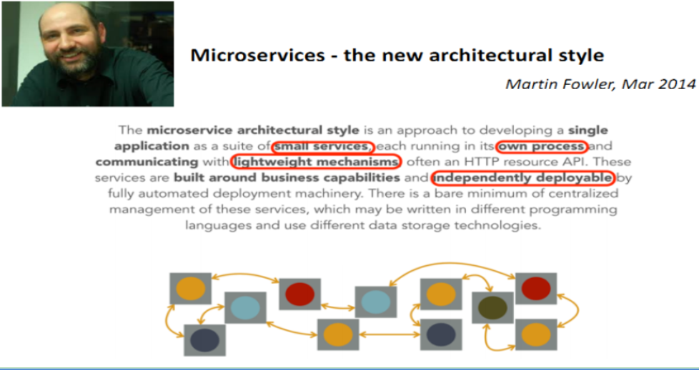

**微服务架构是⼀种架构模式，它提倡将单⼀应⽤程序划分成⼀组⼩的服务，服务之间互相协调、互相配合，为⽤户提供最终价值。
每个服务运⾏在其独⽴的进程中，服务与服务间采⽤轻量级的通信机制互相协作（通常是基于HTTP协议的RESTful API）。
每个服务都围绕着具体业务进⾏构建，并且能够被独⽴的部署到⽣产环境、类⽣产环境等。另外，应当尽量避免统⼀的、集中式的服务管理机制，对具体的⼀个服务⽽⾔，应根据业务上下⽂，选择合适的语⾔、⼯具对其进⾏构建。**

业界大牛马丁.福勒（Martin Fowler） 这样描述微服务：[论文网址](https://martinfowler.com/articles/microservices.html)

## 微服务的技术栈

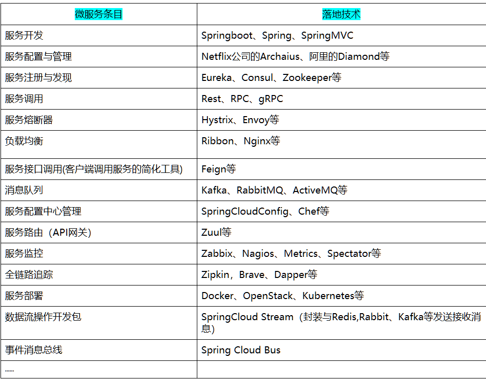

## SpringCloud是什么

### SpringCloud全家桶

> SpringCloud = 分布式微服务架构下的一站式解决方案，是各个微服务架构落地技术的集合体，俗称微服务全家桶

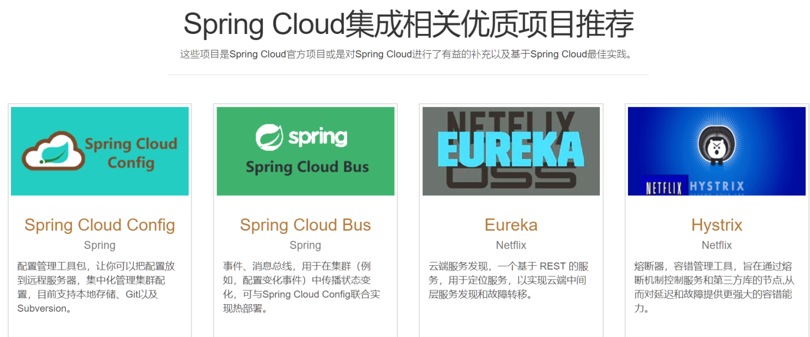

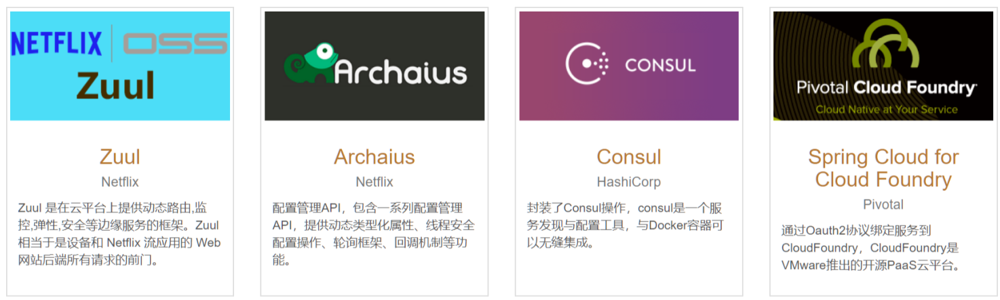

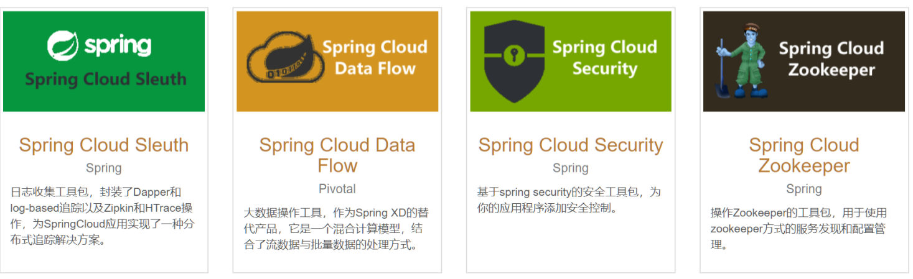

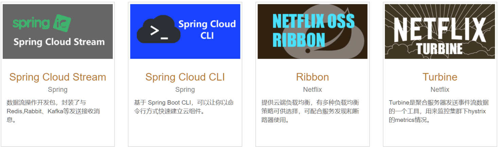

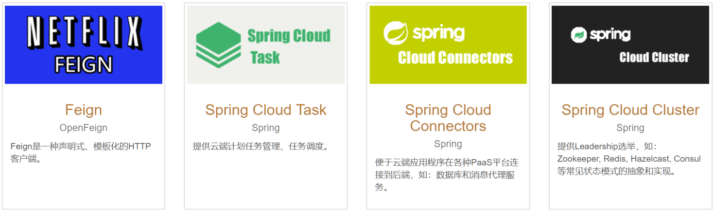

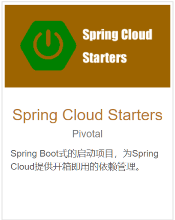

### SpringCloud与SpringBoot是什么关系

**SpringBoot专注于快速方便的开发单个 个体微服务。**

**SpringCloud是关注全局的微服务协调整理治理框架，它将SpringBoot开发的一个个单体微服务整合并管理起来，
为各个微服务之间提供，配置管理、服务发现、断路器、路由、微代理、事件总线、全局锁、决策竞选、分布式会话等等集成服务**

**SpringBoot可以离开SpringCloud独立使用开发项目，但是SpringCloud离不开SpringBoot，属于依赖的关系.**

**SpringBoot专注于快速、方便的开发单个微服务个体，SpringCloud关注全局的服务治理框架。**

## Dubbo与Cloud

### 分布式+服务器指令Dubbo

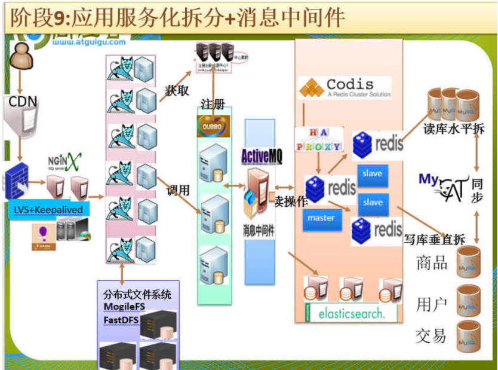


### Dubbo对比SpringCloud

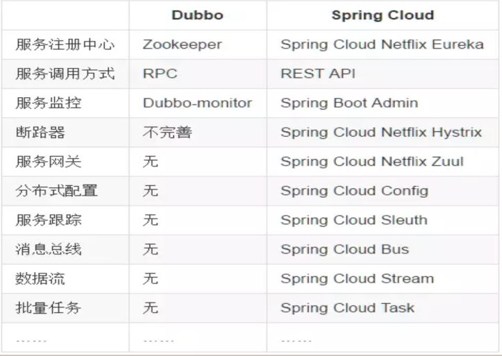


* 最大区别

```bash
SpringCloud抛弃了Dubbo的RPC通信，采用的是基于HTTP的REST方式。
严格来说，这两种方式各有优劣。虽然从一定程度上来说，后者牺牲了服务调用的性能，但也避免了上面提到的原生RPC带来的问题。而且REST相比RPC更为灵活，服务提供方和调用方的依赖只依靠一纸契约，不存在代码级别的强依赖，这在强调快速演化的微服务环境下，显得更加合适。

```


* 品牌机与组装机的区别

```bash
很明显，Spring Cloud的功能比DUBBO更加强大，涵盖面更广，而且作为Spring的拳头项目，它也能够与Spring Framework、Spring Boot、Spring Data、Spring Batch等其他Spring项目完美融合，这些对于微服务而言是至关重要的。
使用Dubbo构建的微服务架构就像组装电脑，各环节我们的选择自由度很高，但是最终结果很有可能因为一条内存质量不行就点不亮了，总是让人不怎么放心，但是如果你是一名高手，那这些都不是问题；
而Spring Cloud就像品牌机，在Spring Source的整合下，做了大量的兼容性测试，保证了机器拥有更高的稳定性，但是如果要在使用非原装组件外的东西，就需要对其基础有足够的了解。
```


* 社区支持与更新力度

```bash
最为重要的是，DUBBO停止了5年左右的更新，虽然2017.7重启了。
对于技术发展的新需求，需要由开发者自行拓展升级（比如当当网弄出了DubboX），这对于很多想要采用微服务架构的中小软件组织，显然是不太合适的，中小公司没有这么强大的技术能力去修改Dubbo源码+周边的一整套解决方案，并不是每一个公司都有阿里的大牛+真实的线上生产环境测试过。
```


### 总结Cloud与Dubbo

* 问题

```bash
曾风靡国内的开源 RPC 服务框架 Dubbo 在重启维护后，令许多用户为之雀跃，但同时，也迎来了一些质疑的声音。互联网技术发展迅速，Dubbo 是否还能跟上时代？Dubbo 与 Spring Cloud 相比又有何优势和差异？是否会有相关举措保证 Dubbo 的后续更新频率？
```

```bash
刘军，阿里巴巴中间件高级研发工程师，主导了 Dubbo 重启维护以后的几个发版计划，专注于高性能 RPC 框架和微服务相关领域。曾负责网易考拉 RPC 框架的研发及指导在内部使用，参与了服务治理平台、分布式跟踪系统、分布式一致性框架等从无到有的设计与开发过程。
```

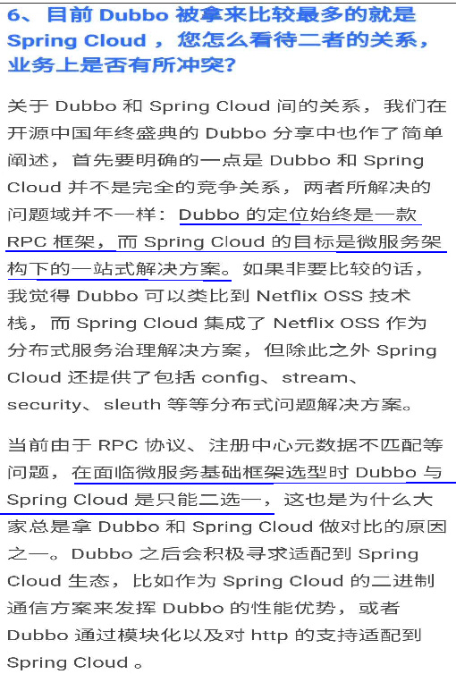

## 参考资料

> [官网](http://projects.spring.io/spring-cloud)

### 参考书

[netflix](https://springcloud.cc/spring-cloud-netflix.html)

[本次开发API 说明](http://cloud.spring.io/spring-cloud-static/Dalston.SR1)

[本次开发API 说明](https://springcloud.cc/spring-cloud-dalston.html)

[中国社区](http://springcloud.cn)

[SpringCloud中文网](https://springcloud.cc)

## 国内使用情况

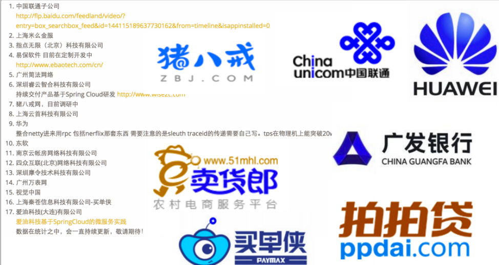

### 阿里云

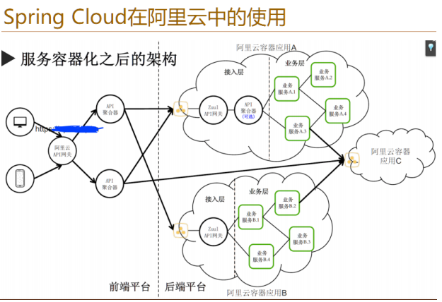
