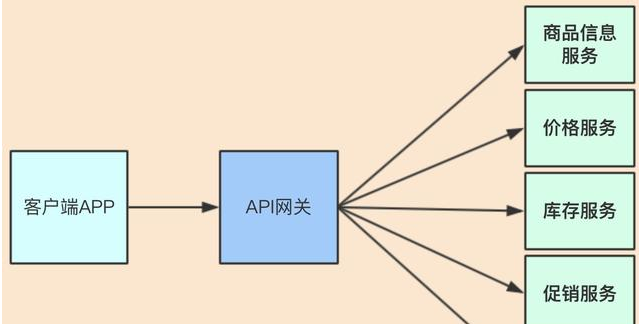
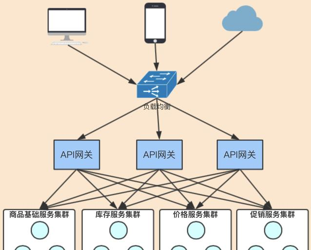
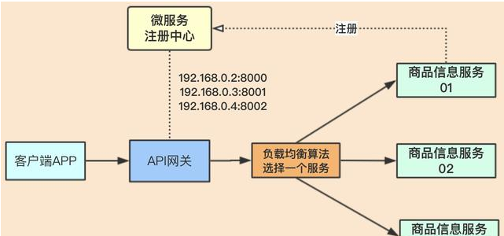
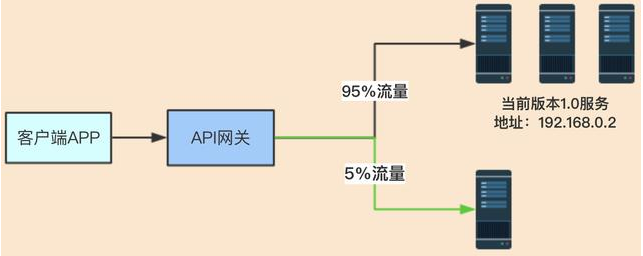
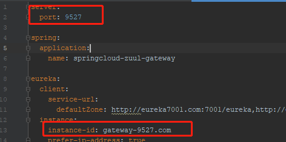
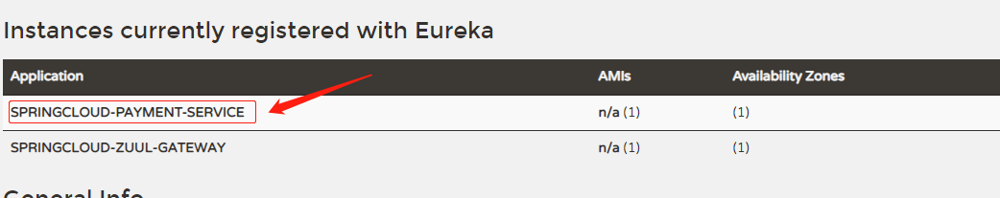
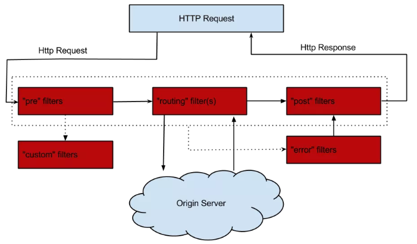

# Zuul路由网关

## 介绍

> Zuul是一种提供动态路由、监视、弹性、安全性等功能的边缘服务。
>
> Zuul是Netflix出品的一个基于JVM路由和服务端的负载均衡器。
>
> Zuul包含了如下最主要的功能：代理+路由+过滤三大功能

### 官方资料

> [GitHub学习文档](https://github.com/Netflix/zuul/wiki/Getting-Started)
>
> [Spring官网学习手册](https://cloud.spring.io/spring-cloud-static/spring-cloud-netflix/2.2.1.RELEASE/reference/html/#router-and-filter-zuul)

```bash
API网关为微服务架构中的服务提供了统一的访问入口，客户端通过API网关访问相关服务。

API网关的定义类似于设计模式中的门面模式，它相当于整个微服务架构中的门面，所有客户端的访问都通过它来进行路由及过滤。

它实现了请求路由、负载均衡、校验过滤、服务容错、服务聚合等功能。
```




### Zuul有什么用

* 路由
* 过滤
* 负载均衡

> 网关为入口，由网关与微服务进行交互，所以网关必须要实现负载均衡的功能；
>
> 网关会获取微服务注册中心里面的服务连接地址，再配合一些算法选择其中一个服务地址，进行处理业务。
>
> 这个属于客户端侧的负载均衡，由调用方去实现负载均衡逻辑。



* 灰度发布（又称金丝雀发布）

> 起源是，矿井工人发现，金丝雀对瓦斯气体很敏感，矿工会在下井之前，先放一只金丝雀到井中，如果金丝雀不叫了，就代表瓦斯浓度高。



在灰度发布开始后，先启动一个新版本应用，但是并不直接将流量切过来，而是测试人员对新版本进行线上测试，启动的这个新版本应用，就是我们的金丝雀。

如果没有问题，那么可以将少量的用户流量导入到新版本上，然后再对新版本做运行状态观察，收集各种运行时数据，如果此时对新旧版本做各种数据对比，就是所谓的A/B测试。

新版本没什么问题，那么逐步扩大范围、流量，把所有用户都迁移到新版本上面来。

## 路由基本配置

> SpringCloud-zuul-gateway-9527

### pom.xml

```xml
<dependencies>
    <dependency>
        <groupId>org.springframework.cloud</groupId>
        <artifactId>spring-cloud-starter-netflix-eureka-client</artifactId>
    </dependency>
    <dependency>
        <groupId>org.springframework.cloud</groupId>
        <artifactId>spring-cloud-starter-netflix-zuul</artifactId>
    </dependency>

    <dependency>
        <groupId>org.springframework.boot</groupId>
        <artifactId>spring-boot-starter-actuator</artifactId>
    </dependency>
    <dependency>
        <groupId>org.springframework.boot</groupId>
        <artifactId>spring-boot-devtools</artifactId>
        <scope>runtime</scope>
        <optional>true</optional>
    </dependency>
    <dependency>
        <groupId>org.projectlombok</groupId>
        <artifactId>lombok</artifactId>
        <optional>true</optional>
    </dependency>
    <dependency>
        <groupId>org.springframework.boot</groupId>
        <artifactId>spring-boot-starter-test</artifactId>
        <scope>test</scope>
    </dependency>
</dependencies>

```

### yml

```yaml
server:
  port: 9527

spring:
  application:
    name: springcloud-zuul-gateway

eureka:
  client:
    service-url:
      defaultZone: http://eureka7001.com:7001/eureka,http://eureka7002.com:7002/eureka,http://eureka7003.com:7003/eureka
  instance:
    instance-id: gateway-9527.com
    prefer-ip-address: true


info:
  app.name: xbzxit-springcloud
  company.name: www.xbzxit.com
  build.artifactId: $project.artifactId$
  build.version: $project.version$
```

### 主启动

```java
@SpringBootApplication
@EnableZuulProxy
public class Zuul_9527_StartSpringCloudApp
{
    public static void main(String[] args)
    {
        SpringApplication.run(Zuul_9527_StartSpringCloudApp.class, args);
    }
}
```

### 测试不用路由

> 启动 注册中心集群   启动生产者8001 8002   启动路由zuul
>
> 修改hosts 127.0.0.1  myzuul.com
>
> [无路由访问](http://localhost:8001/paymentInfo)

### 测试使用路由

> zuul映射配置+注册中心注册后对外暴露的服务名称+rest调用地址
>
> [有路由访问](http://myzuul.com:9527/springcloud-payment-service/paymentInfo)

* zuul映射配置



* 注册中心服务名称



* rest地址


## 查看路由信息

### pom.xml

```java
<dependency>
    <groupId>org.springframework.boot</groupId>
    <artifactId>spring-boot-starter-actuator</artifactId>
</dependency>
```

### yml

```java
 
# 开启查看路由的端点
management:
  endpoints:
    web:
      exposure:
        include: 'routes' 
 
```

### 查看路由详情

> [路由详情](http://localhost:9527/actuator/routes)

```json
{
"/mypayment/**": "springcloud-payment-service",
"/springcloud-payment-service/**": "springcloud-payment-service"
}
```

## 过滤器

> 过滤功能负责对请求过程进行额外的处理，是请求校验过滤及服务聚合的基础。

### 生命周期



### ZuulFilter

* 过滤类型


| code    | desc                                                                             |
| --------- | ---------------------------------------------------------------------------------- |
| pre     | 在请求被路由到目标服务前执行，比如权限校验、打印日志等功能                       |
| routing | 在请求被路由到目标服务时执行                                                     |
| post    | 在请求被路由到目标服务后执行，比如给目标服务的响应添加头信息，收集统计数据等功能 |
| error   | 请求在其他阶段发生错误时执行                                                     |

### 案例Case

> 前置过滤器，用于在请求路由到目标服务前打印请求日志


* 过滤器

> zuul工程下

```java
package com.xbzxit.springcloud.filter;

import com.netflix.zuul.ZuulFilter;
import com.netflix.zuul.context.RequestContext;
import com.netflix.zuul.exception.ZuulException;
import lombok.extern.slf4j.Slf4j;
import org.springframework.stereotype.Component;

import javax.servlet.http.HttpServletRequest;
import java.time.LocalDateTime;
import java.util.Date;
import java.util.Locale;

/**
 * @author xbzxit
 * @version 1.0
 * @create 2023-02-15-15:33
 * @company www.xbzxit.com
 */

@Component
@Slf4j
public class PreLogFilter extends ZuulFilter
{
    @Override
    public String filterType()
    {
        return "pre";
    }

    @Override
    public int filterOrder()
    {
        return 1;
    }

    @Override
    public boolean shouldFilter()
    {
        return true;
    }

    @Override
    public Object run() throws ZuulException
    {
        RequestContext requestContext = RequestContext.getCurrentContext();
        HttpServletRequest request = requestContext.getRequest();
        String host = request.getRemoteHost();
        String method = request.getMethod();
        String uri = request.getRequestURI();
        String param = request.getParameterNames().toString();

        //log.info("=====> Remote host:{},method:{},uri:{}", host, method, uri);
        System.out.println("主机："+host +"方法："+method + "地址"+uri + "参数"+ param);
        System.out.println("********"+new Date().toString()+"*************");
        System.out.println("********PreLogFilter********");
        System.out.println("********"+ LocalDateTime.now().toLocalDate() +"********");
        System.out.println("********"+ LocalDateTime.now().toLocalTime() +"********");
        System.out.println("********"+new Date().getTime()+"*************");
        return null;
    }
}

```


* 测试

> [发送请求前有日志](http://myzuul.com:9527/springcloud-payment-service/payment/discovery)

```log
主机：127.0.0.1方法：GET地址/springcloud-payment-service/payment/discovery参数com.netflix.zuul.http.HttpServletRequestWrapper$1@5816202e
********Wed Feb 15 15:58:27 CST 2023*************
********PreLogFilter********
********2023-02-15********
********15:58:27.072********
********1676447907072*************
```


* 开关
