# 微服务架构编码架构

## 创建聚合工程

### 创建父工程


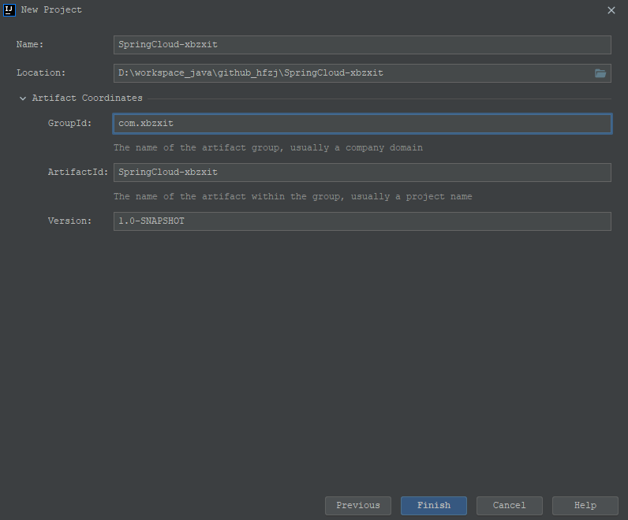

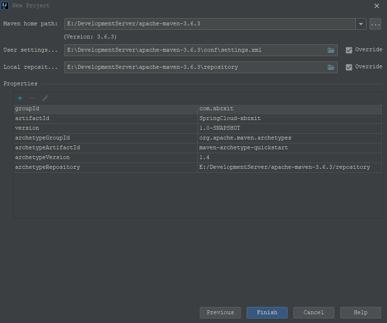

### 项目环境设置

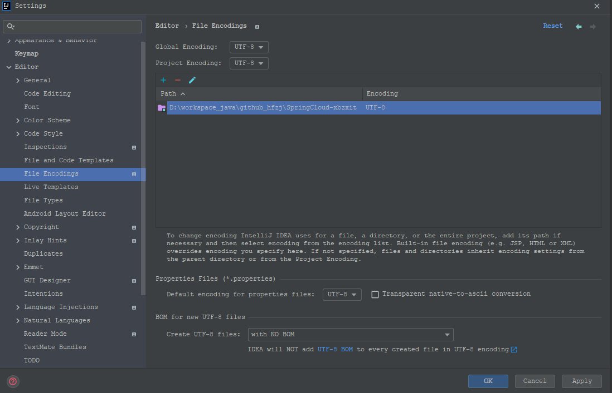

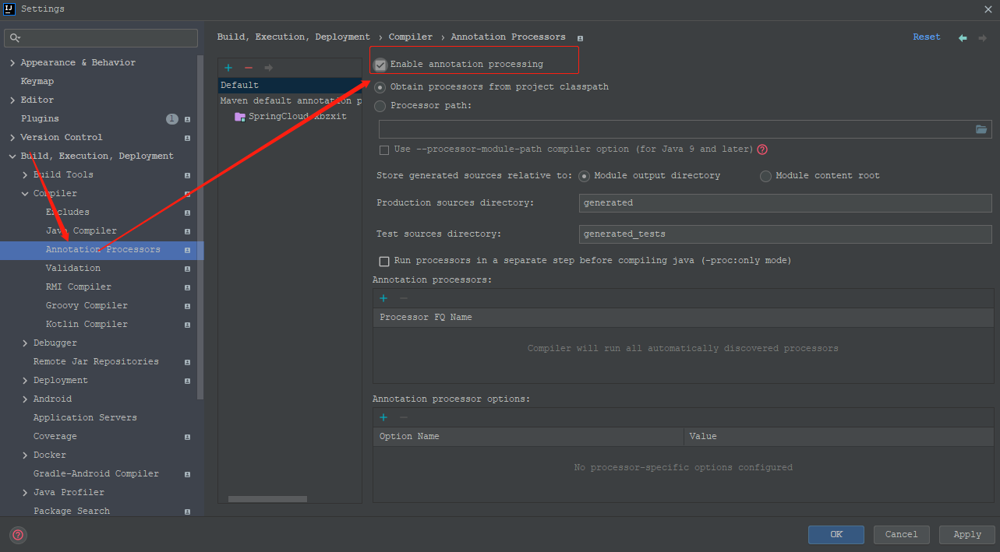

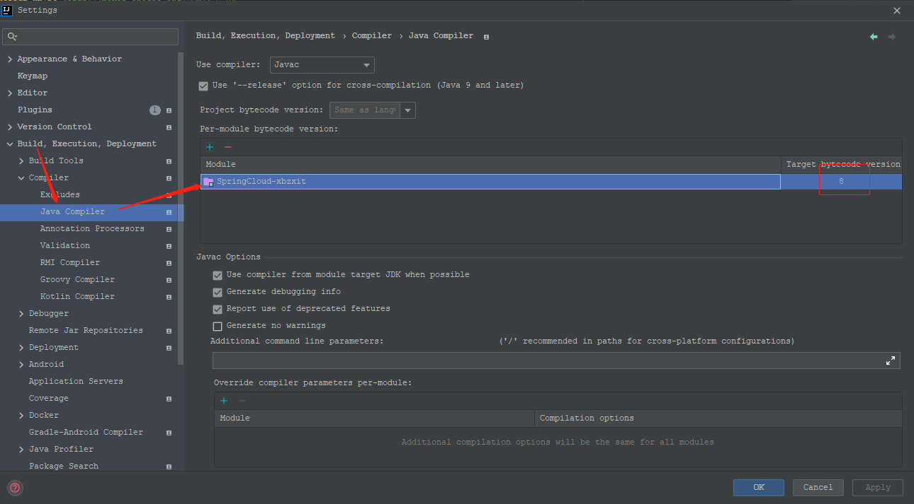


### pom.xml

> [解决maven下载不了jar的问题请复制这个链接到浏览器自行解决：](https://blog.csdn.net/HeyWeCome/article/details/104543411)

```xml
<?xml version="1.0" encoding="UTF-8"?>
<project xmlns="http://maven.apache.org/POM/4.0.0" xmlns:xsi="http://www.w3.org/2001/XMLSchema-instance"
         xsi:schemaLocation="http://maven.apache.org/POM/4.0.0 https://maven.apache.org/xsd/maven-4.0.0.xsd">

    <modelVersion>4.0.0</modelVersion>

    <groupId>com.xbzxit</groupId>
    <artifactId>SpringCloud-xbzxit</artifactId>
    <version>1.0-SNAPSHOT</version>
  
    <packaging>pom</packaging>


    <!-- 统一管理jar包版本 -->
    <properties>
        <project.build.sourceEncoding>UTF-8</project.build.sourceEncoding>
        <maven.compiler.source>1.8</maven.compiler.source>
        <maven.compiler.target>1.8</maven.compiler.target>
        <junit.version>4.12</junit.version>
        <log4j.version>1.2.17</log4j.version>
        <lombok.version>1.16.18</lombok.version>
        <mysql.version>5.1.47</mysql.version>
        <druid.version>1.1.16</druid.version>
        <mybatis.spring.boot.version>1.3.0</mybatis.spring.boot.version>
    </properties>

    <!-- 子模块继承之后，提供作用：锁定版本+子modlue不用写groupId和version  -->
    <dependencyManagement>
        <dependencies>
            <!--spring boot 2.2.2-->
            <dependency>
                <groupId>org.springframework.boot</groupId>
                <artifactId>spring-boot-dependencies</artifactId>
                <version>2.2.2.RELEASE</version>
                <type>pom</type>
                <scope>import</scope>
            </dependency>
            <!--spring cloud Hoxton.SR1-->
            <dependency>
                <groupId>org.springframework.cloud</groupId>
                <artifactId>spring-cloud-dependencies</artifactId>
                <version>Hoxton.SR1</version>
                <type>pom</type>
                <scope>import</scope>
            </dependency>
            <!--spring cloud alibaba 2.1.0.RELEASE-->
            <dependency>
                <groupId>com.alibaba.cloud</groupId>
                <artifactId>spring-cloud-alibaba-dependencies</artifactId>
                <version>2.1.0.RELEASE</version>
                <type>pom</type>
                <scope>import</scope>
            </dependency>

            <dependency>
                <groupId>mysql</groupId>
                <artifactId>mysql-connector-java</artifactId>
                <version>${mysql.version}</version>
            </dependency>
            <dependency>
                <groupId>com.alibaba</groupId>
                <artifactId>druid</artifactId>
                <version>${druid.version}</version>
            </dependency>
            <dependency>
                <groupId>org.mybatis.spring.boot</groupId>
                <artifactId>mybatis-spring-boot-starter</artifactId>
                <version>${mybatis.spring.boot.version}</version>
            </dependency>
            <dependency>
                <groupId>junit</groupId>
                <artifactId>junit</artifactId>
                <version>${junit.version}</version>
            </dependency>
            <dependency>
                <groupId>log4j</groupId>
                <artifactId>log4j</artifactId>
                <version>${log4j.version}</version>
            </dependency>
            <dependency>
                <groupId>org.projectlombok</groupId>
                <artifactId>lombok</artifactId>
                <version>${lombok.version}</version>
                <optional>true</optional>
            </dependency>
        </dependencies>
    </dependencyManagement>

    <build>
        <plugins>
            <plugin>
                <groupId>org.springframework.boot</groupId>
                <artifactId>spring-boot-maven-plugin</artifactId>
                <configuration>
<!--                    <fork>true</fork>-->
                    <addResources>true</addResources>
                </configuration>
            </plugin>
        </plugins>
    </build>

</project>


```


* dependencyManagement

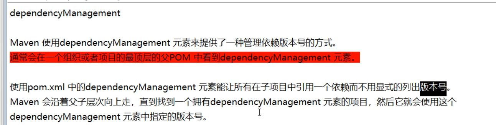


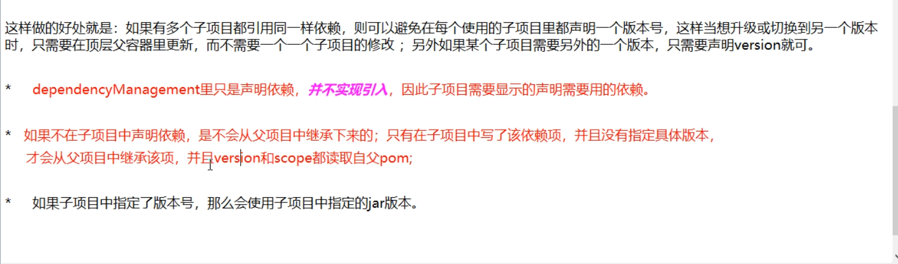


* maven跳过单元测试


### 发布到本地仓库

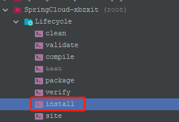


## 创建生产者

> SpringCloud-provider-payment8001

### pom.xml

```xml
<?xml version="1.0" encoding="UTF-8"?>
<project xmlns="http://maven.apache.org/POM/4.0.0"
         xmlns:xsi="http://www.w3.org/2001/XMLSchema-instance"
         xsi:schemaLocation="http://maven.apache.org/POM/4.0.0 http://maven.apache.org/xsd/maven-4.0.0.xsd">
    <parent>
        <artifactId>SpringCloud-xbzxit</artifactId>
        <groupId>com.xbzxit</groupId>
        <version>1.0-SNAPSHOT</version>
    </parent>
    <modelVersion>4.0.0</modelVersion>

    <artifactId>SpringCloud-provider-payment8001</artifactId>

    <properties>
        <maven.compiler.source>8</maven.compiler.source>
        <maven.compiler.target>8</maven.compiler.target>
    </properties>

    <dependencies>

        <!-- https://mvnrepository.com/artifact/org.springframework.boot/spring-boot-starter-web -->
        <dependency>
            <groupId>org.springframework.boot</groupId>
            <artifactId>spring-boot-starter-web</artifactId>
        </dependency>

        <!-- https://mvnrepository.com/artifact/org.springframework.boot/spring-boot-starter-web -->
        <dependency>
            <groupId>org.springframework.boot</groupId>
            <artifactId>spring-boot-starter-actuator</artifactId>
        </dependency>

        <!-- https://mvnrepository.com/artifact/org.springframework.boot/spring-boot-starter-web -->
        <dependency>
            <groupId>org.mybatis.spring.boot</groupId>
            <artifactId>mybatis-spring-boot-starter</artifactId>
        </dependency>

        <!-- https://mvnrepository.com/artifact/com.alibaba/druid -->
        <dependency>
            <groupId>com.alibaba</groupId>
            <artifactId>druid-spring-boot-starter</artifactId>
            <version>1.1.10</version>
        </dependency>
        <!-- https://mvnrepository.com/artifact/mysql/mysql-connector-java -->
        <dependency>
            <groupId>mysql</groupId>
            <artifactId>mysql-connector-java</artifactId>
        </dependency>

        <!-- https://mvnrepository.com/artifact/org.springframework.boot/spring-boot-starter-jdbc -->
        <dependency>
            <groupId>org.springframework.boot</groupId>
            <artifactId>spring-boot-starter-jdbc</artifactId>
        </dependency>

        <!-- https://mvnrepository.com/artifact/org.springframework.boot/spring-boot-devtools -->
        <dependency>
            <groupId>org.springframework.boot</groupId>
            <artifactId>spring-boot-devtools</artifactId>
            <scope>runtime</scope>
            <optional>true</optional>
        </dependency>

        <!-- https://mvnrepository.com/artifact/org.projectlombok/lombok -->
        <dependency>
            <groupId>org.projectlombok</groupId>
            <artifactId>lombok</artifactId>
            <optional>true</optional>
        </dependency>

        <!-- https://mvnrepository.com/artifact/org.springframework.boot/spring-boot-starter-test -->
        <dependency>
            <groupId>org.springframework.boot</groupId>
            <artifactId>spring-boot-starter-test</artifactId>
            <scope>test</scope>
        </dependency>


    </dependencies>

</project>
```

### yml

```yaml
server:
  port: 8001

spring:
  application:
    name: cloud-payment-service
  datasource:
    type: com.alibaba.druid.pool.DruidDataSource
    driver-class-name: org.gjt.mm.mysql.Driver
    url: jdbc:mysql://192.168.2.235:3306/springcloud?useUnicode=true&characterEncoding=utf-8&useSSL=false
    username: root
    password:

mybatis:
  mapperLocations: classpath:mapper/*.xml
  type-aliases-package: com.xbzxit.springcloud.entities


```

### 启动类

```java
package com.xbzxit.springcloud;

import org.springframework.boot.SpringApplication;
import org.springframework.boot.autoconfigure.SpringBootApplication;

/**
 * @author xbzxit
 * @version 1.0
 * @create 2023-01-17-9:32
 * @company www.xbzxit.com
 */

@SpringBootApplication
public class DeptProvider8001_App
{
    public static void main(String[] args)
    {
        SpringApplication.run(DeptProvider8001_App.class, args);
    }
}

```

### 实体类

> com.xbzxit.springcloud.entities

* CommonResult

```java
@Data
@AllArgsConstructor
@NoArgsConstructor
public class CommonResult <T>{

    private Integer code;
    private String message;
    private T data;

    public CommonResult(Integer code,String message){
        this(code,message,null);
    }
}
```

* Payment

```java
@Data
@AllArgsConstructor
@NoArgsConstructor
public class Payment implements Serializable {
    private Long id;
    private String serial;
}

```

### 数据层

> com.xbzxit.springcloud.dao

* 接口

```java
@Mapper
public interface PaymentDao {

    int create(Payment payment);

    Payment getPaymentById(Long id);

}
```


* 接口映射
  > resources/mapper/PaymentMapper.xml
  >

```xml
<?xml version="1.0" encoding="UTF-8"?>
<!DOCTYPE mapper PUBLIC "-//mybatis.org//DTD Mapper 3.0//EN" "http://mybatis.org/dtd/mybatis-3-mapper.dtd">

<mapper namespace="com.xbzxit.springcloud.dao.PaymentDao">

    <resultMap id="BaseResultMap" type="com.xbzxit.springcloud.entities.Payment">
        <id column="id" property="id" jdbcType="BIGINT"></id>
        <id column="serial" property="serial" jdbcType="VARCHAR"></id>
    </resultMap>

    <insert id="create" parameterType="Payment" useGeneratedKeys="true" keyProperty="id">
        insert into payment(serial) values(${serial});

    </insert>

    <select id="getPaymentById"  parameterType="Long" resultMap="BaseResultMap">
        select * from payment where id=#{id}
    </select>

</mapper>
```


### 业务层

* 接口

```java
public interface PaymentService {

    public int create(Payment payment); //写

    public Payment getPaymentById(@Param("id") Long id);  //读取

}
```

* 实现类

```java
@Service
public class PaymentServiceImpl implements PaymentService {

    @Resource
    private PaymentDao paymentDao;

    public int create(Payment payment){
        return paymentDao.create(payment);
    }

    public Payment getPaymentById( Long id){

        return paymentDao.getPaymentById(id);

    }
}
```

### 控制器

```java
@RestController
@Slf4j
public class PaymentController {

    @Resource
    private PaymentService paymentService;

    @PostMapping(value = "/payment/create")
    public CommonResult create(@RequestBody  Payment payment){
        int result = paymentService.create(payment);
        log.info("*****插入结果："+result);
        if (result>0){  //成功
            return new CommonResult(200,"插入数据库成功",result);
        }else {
            return new CommonResult(444,"插入数据库失败",null);
        }
    }
    @GetMapping(value = "/payment/get/{id}")
    public CommonResult getPaymentById(@PathVariable("id") Long id){
        Payment payment = paymentService.getPaymentById(id);
        log.info("*****查询结果："+payment);
        if (payment!=null){  //说明有数据，能查询成功
            return new CommonResult(200,"查询成功",payment);
        }else {
            return new CommonResult(444,"没有对应记录，查询ID："+id,null);
        }
    }
}
```


### 测试

> http://localhost:8001/payment/get/31


### 创建数据库表

```sql
CREATE TABLE payment (
 id BIGINT(20) NOT NULL AUTO_INCREMENT COMMENT ID,
 'serial' VARCHAR(200) DEFAULT,
 PRIMARY KEY(id)
) ENGINE=INNODB AUTO_INCREMENT=1 DEFAULT CHARSET=utf8
```


## 热部署

### 新增依赖

> 当前项目的pom中添加devtools依赖

```xml
<!-- https://mvnrepository.com/artifact/org.springframework.boot/spring-boot-devtools -->
<dependency>
    <groupId>org.springframework.boot</groupId>
    <artifactId>spring-boot-devtools</artifactId>
   <scope>runtime</scope>
    <optional>true</optional>
</dependency>

```

### 父pom中添加插件

```xml
 <build>
  <plugins>
    <plugin>
      <groupId>org.springframework.boot</groupId>
      <artifactId>spring-boot-maven-plugin</artifactId>
      <configuration>
        <fork>true</fork>
        <addResources>true</addResources>
      </configuration>
    </plugin>
  </plugins>
```


### 开启自动编译

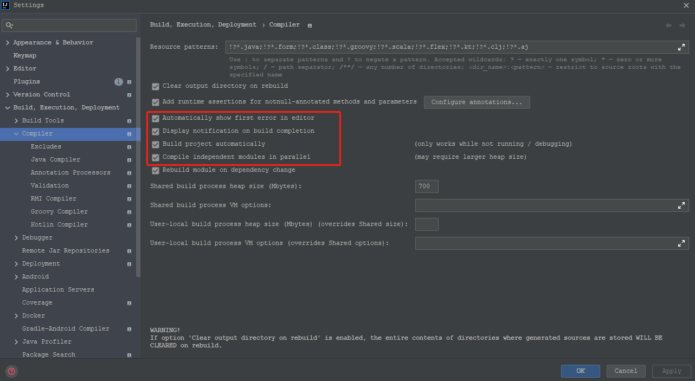

### Update the value of

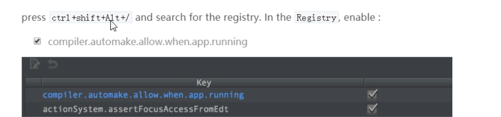


## 创建消费者

> SpringCloud-consumer-order80

### pom.xml

```xml
<?xml version="1.0" encoding="UTF-8"?>
<project xmlns="http://maven.apache.org/POM/4.0.0"
         xmlns:xsi="http://www.w3.org/2001/XMLSchema-instance"
         xsi:schemaLocation="http://maven.apache.org/POM/4.0.0 http://maven.apache.org/xsd/maven-4.0.0.xsd">
    <parent>
        <artifactId>SpringCloud-xbzxit</artifactId>
        <groupId>com.xbzxit</groupId>
        <version>1.0-SNAPSHOT</version>
    </parent>
    <modelVersion>4.0.0</modelVersion>

    <artifactId>SpringCloud-consumer-order80</artifactId>

    <properties>
        <maven.compiler.source>8</maven.compiler.source>
        <maven.compiler.target>8</maven.compiler.target>
    </properties>

    <dependencies>

        <!-- https://mvnrepository.com/artifact/org.springframework.boot/spring-boot-starter-web -->
        <dependency>
            <groupId>org.springframework.boot</groupId>
            <artifactId>spring-boot-starter-web</artifactId>
        </dependency>

        <!-- https://mvnrepository.com/artifact/org.springframework.boot/spring-boot-starter-web  -->
        <dependency>
            <groupId>org.springframework.boot</groupId>
            <artifactId>spring-boot-starter-actuator</artifactId>
        </dependency>

        <!-- https://mvnrepository.com/artifact/org.springframework.boot/spring-boot-devtools -->
        <dependency>
            <groupId>org.springframework.boot</groupId>
            <artifactId>spring-boot-devtools</artifactId>
            <scope>runtime</scope>
            <optional>true</optional>
        </dependency>

        <!-- https://mvnrepository.com/artifact/org.projectlombok/lombok -->
        <dependency>
            <groupId>org.projectlombok</groupId>
            <artifactId>lombok</artifactId>
            <optional>true</optional>
        </dependency>

        <!-- https://mvnrepository.com/artifact/org.springframework.boot/spring-boot-starter-test -->
        <dependency>
            <groupId>org.springframework.boot</groupId>
            <artifactId>spring-boot-starter-test</artifactId>
            <scope>test</scope>
        </dependency>
    </dependencies>

</project>
```


### yml

```yaml
server:
  port: 80

```

### 启动类

```java
@SpringBootApplication
public class OrderMain80 {
    public static void main(String[] args) {
        SpringApplication.run(OrderMain80.class,args);
    }

}
```


### 配置类

> comg.xbzxit.springcloud.config

```java
@Configuration
public class ApplicationContextConfig {

    @Bean
    public RestTemplate getRestTemplate(){
        return new RestTemplate();
    }

}
```

### 实体类

> com.xbzxit.springcloud.entities

* CommonResult

```java
@Data
@AllArgsConstructor
@NoArgsConstructor
public class CommonResult <T>{

    private Integer code;
    private String message;
    private T data;

    public CommonResult(Integer code,String message){
        this(code,message,null);
    }
}
```

* Payment

```java
@Data
@AllArgsConstructor
@NoArgsConstructor
public class Payment implements Serializable {
    private Long id;
    private String serial;
}
```


### RestTemplate

> [官网](https://docs.spring.io/spring-framework/docs/5.2.2.RELEASE/javadoc-api/org/springframework/web/client/RestTemplate.html)

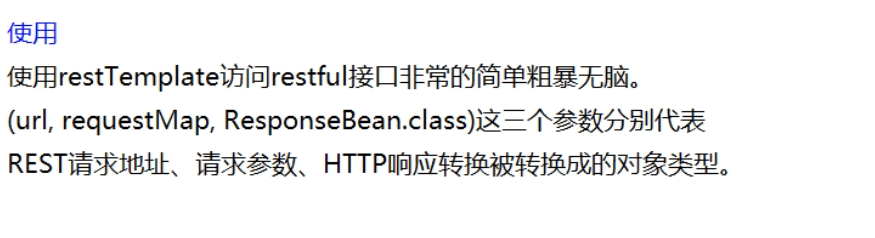

### 控制器

> com.xbzxit.springcloud.controller

```java
@RestController
@Slf4j
public class OrderController {

    public static final String PAYMENT_URL = "http://localhost:8001";

    @Resource
    private RestTemplate restTemplate;

    @GetMapping("/consumer/payment/create")
    public CommonResult<Payment> create(Payment payment){
        return restTemplate.postForObject(PAYMENT_URL+"/payment/create",payment,CommonResult.class);  //写操作
    }

    @GetMapping("/consumer/payment/get/{id}")
    public CommonResult<Payment> getPayment(@PathVariable("id") Long id){
        return restTemplate.getForObject(PAYMENT_URL+"/payment/get/"+id,CommonResult.class);
    }
}
```

### 业务层

* 接口

```java
public interface PaymentService {

    public int create(Payment payment); //写

    public Payment getPaymentById(@Param("id") Long id);  //读取

}
```

* 实现类

```java
@Service
public class PaymentServiceImpl implements PaymentService {

    @Resource
    private PaymentDao paymentDao;

    public int create(Payment payment){
        return paymentDao.create(payment);
    }

    public Payment getPaymentById( Long id){

        return paymentDao.getPaymentById(id);

    }
}
```


### 测试

> 启动生产服务  ---->  启动消费服务
>
> http://localhost/consumer/payment/get/2


## 代码重构

### 新建公共模块

> SpringCloud-api-commons

### pom.xml

```xml
<?xml version="1.0" encoding="UTF-8"?>
<project xmlns="http://maven.apache.org/POM/4.0.0"
         xmlns:xsi="http://www.w3.org/2001/XMLSchema-instance"
         xsi:schemaLocation="http://maven.apache.org/POM/4.0.0 http://maven.apache.org/xsd/maven-4.0.0.xsd">
    <parent>
        <artifactId>SpringCloud-xbzxit</artifactId>
        <groupId>com.xbzxit</groupId>
        <version>1.0-SNAPSHOT</version>
    </parent>
    <modelVersion>4.0.0</modelVersion>

    <artifactId>SpringCloud-api-commons</artifactId>

    <properties>
        <maven.compiler.source>8</maven.compiler.source>
        <maven.compiler.target>8</maven.compiler.target>
    </properties>

    <dependencies>
        <!-- https://mvnrepository.com/artifact/org.springframework.boot/spring-boot-devtools -->
        <dependency>
            <groupId>org.springframework.boot</groupId>
            <artifactId>spring-boot-devtools</artifactId>
            <scope>runtime</scope>
            <optional>true</optional>
        </dependency>

        <dependency>
            <groupId>org.projectlombok</groupId>
            <artifactId>lombok</artifactId>
            <optional>true</optional>
        </dependency>

        <!-- https://mvnrepository.com/artifact/cn.hutool/hutool-all -->
        <dependency>
            <groupId>cn.hutool</groupId>
            <artifactId>hutool-all</artifactId>
            <version>5.1.0</version>
        </dependency>
    </dependencies>

</project>
```


### 实体类，

> com.xbzxit.springcloud.entities
>
> 生产服务、消费服务里面的实体类都删除

* CommonResult

```java
@Data
@AllArgsConstructor
@NoArgsConstructor
public class CommonResult <T>{

    private Integer code;
    private String message;
    private T data;

    public CommonResult(Integer code,String message){
        this(code,message,null);
    }
}
```

* Payment

```java
@Data
@AllArgsConstructor
@NoArgsConstructor
public class Payment implements Serializable {
    private Long id;
    private String serial;
}
```


### 安装的本地仓库

> maven clean install


### 改造生产者服务者

```xml
 <dependency>
    <groupId>com.xbzxit</groupId>
    <artifactId>SpringCloud-api-commons</artifactId>
    <version>1.0-SNAPSHOT</version>
</dependency>
```
