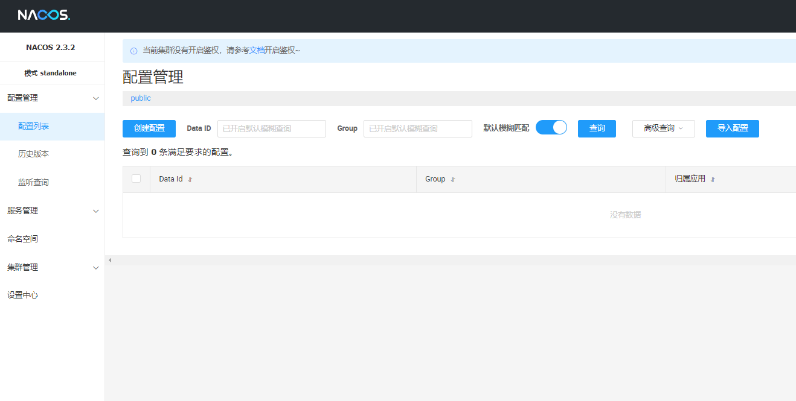

# Nacos入门介绍

> Nacos: Dynamic Naming and Configuration Service
>
> 前四个字母分别为Naming和Configuration的前两个字母，最后的s为Service。

## 简介

> 一个更易于构建云原生应用的动态服务发现、配置管理和服务管理平台。

* 是什么

```java
Nacos就是注册中心 + 配置中心的组合    等价于  Nacos = Eureka + Config + Bus
```

* 能干啥

```java
替代 Eureka 做服务注册中心
替代 Config 做配置中心
```

* 下载

> [Nacos](https://github.com/alibaba/Nacos)
>
> [官方文档](https://spring-cloud-alibaba-group.github.io/github-pages/greenwich/spring-cloud-alibaba.html#_spring_cloud_alibaba_nacos_discovery)


## 下载安装

> [](https://)

> [下载](https://github.com/alibaba/nacos/releases)


* 安装目录
  > 解压即可
  >


* 启动

> startup.cmd -m standalone


* 访问管理页面

> http://localhost:8848/nacos
>
> 会发现不用登陆了



### 开启登录

> conf/application.properties

```properties
nacos.core.auth.enabled=true

nacos.core.auth.server.identity.key=nacos
nacos.core.auth.server.identity.value=nacos

nacos.core.auth.plugin.nacos.token.secret.key=VGhpc0lzTXlDdXN0b21TZWNyZXRLZXkwMTIzNDU2Nzg=
```


## 创建服务


### 服务提供者


### 服务消费者
