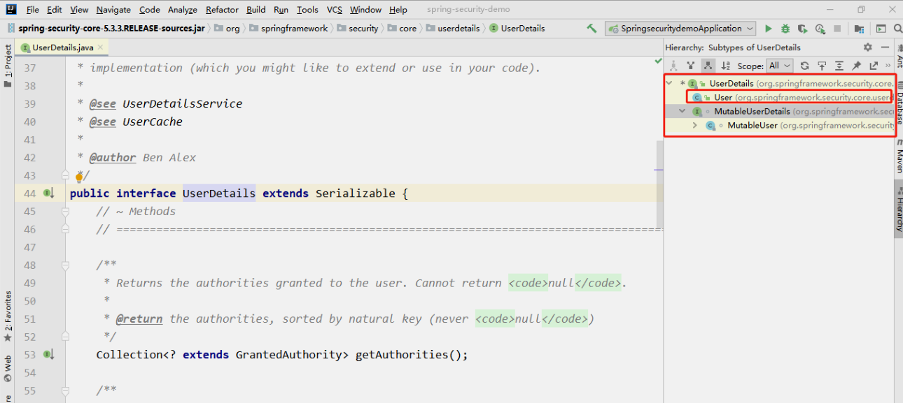

# 入门案例

## 创建项目

## 运行项目

## 相关概念

## 基本原理

## UserDetailsService

> 当什么也没有配置的时候，账号和密码是由 Spring Security 定义生成的。而在实际项目中账号和密码都是从数据库中查询出来的。 所以我们要通过自定义逻辑控制认证逻辑。

如果需要自定义逻辑时，只需要实现 UserDetailsService 接口即可。接口定义如下：


**返回值 UserDetails** 这个类是系统默认的用户“主体”

```java
// 表示获取登录用户所有权限
Collection<? extends GrantedAuthority> getAuthorities();
// 表示获取密码
String getPassword();
// 表示获取用户名
String getUsername();
// 表示判断账户是否过期
boolean isAccountNonExpired();
// 表示判断账户是否被锁定
boolean isAccountNonLocked();
// 表示凭证{密码}是否过期
boolean isCredentialsNonExpired();
// 表示当前用户是否可用
boolean isEnabled();
```



**以后我们只需要使用 User 这个实体类即可！**


**方法参数 username**

表示用户名。此值是客户端表单传递过来的数据。默认情况下必须叫 username，否则无法接收。


## PasswordEncoder

```java
// 表示把参数按照特定的解析规则进行解析
String encode(CharSequence rawPassword);
// 表示验证从存储中获取的编码密码与编码后提交的原始密码是否匹配。如果密码匹配，则返回 true；如果不匹配，则返回 false。第一个参数表示需要被解析的密码。第二个参数表示存储的密码。
boolean matches(CharSequence rawPassword, String encodedPassword);
// 表示如果解析的密码能够再次进行解析且达到更安全的结果则返回 true，否则返回false。默认返回 false。
default boolean upgradeEncoding(String encodedPassword) {
    return false;
}
```

接口实现类


BCryptPasswordEncoder 是 Spring Security 官方推荐的密码解析器，平时多使用这个解析器。

BCryptPasswordEncoder 是对 bcrypt 强散列方法的具体实现。是基于 Hash 算法实现的单向加密。可以通过 strength 控制加密强度，默认 10.

```java
@Test
public void test01(){
	//  创建密码解析器
	BCryptPasswordEncoder  bCryptPasswordEncoder  =  new
	BCryptPasswordEncoder();
	//  对密码进行加密
	String atguigu = bCryptPasswordEncoder.encode("atguigu");
	//  打印加密之后的数据
	System.out.println(" 加密之后数据：\t"+atguigu);
	// 判断原字符加密后和加密之前是否匹配
	boolean result = bCryptPasswordEncoder.matches("atguigu", atguigu);
	//  打印比较结果
	System.out.println(" 比较结果：\t"+result);
}
```


## SpringBoot+Security自动配置

[SpringBoot+Security自动配置](https://docs.spring.io/spring-security/site/docs/5.3.4.RELEASE/reference/html5/#servlet-hello)

[](https://)
