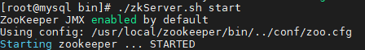

# Zookeeper入门

## 安装

### 下载

[下载ZK](http://archive.apache.org/dist/zookeeper/)


### 解压

```shell
tar -zxvf apache-zookeeper-3.5.8-bin.tar.gz


mv apache-zookeeper-3.5.8-bin zookeeper
```

### 创建数据和日志文件

> 在Zookeepr目录下

```shell
mkdir  data

mkdir  logs
```

### 拷贝配置文件

> 将zookeeper目录下的config下的`zoo_sample.cfg`拷贝一份，命名为zoo.cfg

```shell
cp zoo_sample.cfg zoo.cfg
```

* 修改配置文件

```properties
tickTime=2000
initLimit=10
syncLimit=5
# 主要是改这里变成自己的目录
dataDir=/usr/local/zookeeper/data
dataLogDir=/usr/local/zookeeper/logs
clientPort=2181
```

### 启动

```shell
# 执行zkServer.sh脚本进行启动，命令是：
./zkServer.sh start
# 停止服务命令是：
./zkServer.sh stop
```




### 查看zk状态

> standalone 是单机模式。

```shell
./zkServer.sh status
```


## zkui

> zookeeper 可视化界面

### 下载源码

[zkui](https://codeload.github.com/DeemOpen/zkui/zip/refs/heads/master)

### 打包


### jar

> zkui-2.0-SNAPSHOT-jar-with-dependencies.jar


### 配置文件

> config.cfg
>
> zkServer: 配置ZK服务器地址
>
> userSet : 配置登录用户   amdin/manager

```properties
#Server Port
serverPort=9090
#Comma seperated list of all the zookeeper servers
#zkServer=localhost:2181,localhost:2181
zkServer=10.105.0.235:2181
#Http path of the repository. Ignore if you dont intent to upload files from repository.
scmRepo=http://myserver.com/@rev1=
#Path appended to the repo url. Ignore if you dont intent to upload files from repository.
scmRepoPath=//appconfig.txt
#if set to true then userSet is used for authentication, else ldap authentication is used.
ldapAuth=false
ldapDomain=mycompany,mydomain
#ldap authentication url. Ignore if using file based authentication.
ldapUrl=ldap://<ldap_host>:<ldap_port>/dc=mycom,dc=com
#Specific roles for ldap authenticated users. Ignore if using file based authentication.
ldapRoleSet={"users": [{ "username":"domain\\user1" , "role": "ADMIN" }]}
userSet = {"users": [{ "username":"admin" , "password":"manager","role": "ADMIN" },{ "username":"appconfig" , "password":"appconfig","role": "USER" }]}
#Set to prod in production and dev in local. Setting to dev will clear history each time.
env=prod
jdbcClass=org.h2.Driver
jdbcUrl=jdbc:h2:zkui
jdbcUser=root
jdbcPwd=manager
#If you want to use mysql db to store history then comment the h2 db section.
#jdbcClass=com.mysql.jdbc.Driver
#jdbcUrl=jdbc:mysql://localhost:3306/zkui
#jdbcUser=root
#jdbcPwd=manager
loginMessage=Please login using admin/manager or appconfig/appconfig.
#session timeout 5 mins/300 secs.
sessionTimeout=300
#Default 5 seconds to keep short lived zk sessions. If you have large data then the read will take more than 30 seconds so increase this accordingly. 
#A bigger zkSessionTimeout means the connection will be held longer and resource consumption will be high.
zkSessionTimeout=5
#Block PWD exposure over rest call.
blockPwdOverRest=false
#ignore rest of the props below if https=false.
https=false
keystoreFile=/home/user/keystore.jks
keystorePwd=password
keystoreManagerPwd=password
# The default ACL to use for all creation of nodes. If left blank, then all nodes will be universally accessible
# Permissions are based on single character flags: c (Create), r (read), w (write), d (delete), a (admin), * (all)
# For example defaultAcl={"acls": [{"scheme":"ip", "id":"192.168.1.192", "perms":"*"}, {"scheme":"ip", id":"192.168.1.0/24", "perms":"r"}]
defaultAcl=
# Set X-Forwarded-For to true if zkui is behind a proxy
X-Forwarded-For=false
```

### 访问

> [zkui_home](http://localhost:9090)


### 使用


