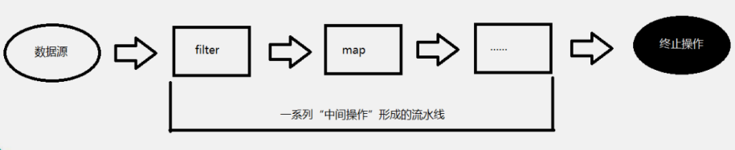

# StreamAPI

> Java8中有两大最为重要的改变。第一个是 Lambda 表达式；
>
> 另外一个则是 Stream API( java.util.stream .*) 。
>
> Stream 是 Java8 中处理集合的关键抽象概念，它可以指定你希望对集合进行的操作，可以执行非常复杂的查找、过滤和映射数据等操作。
>
> 使用Stream API 对集合数据进行操作，就类似于使用 SQL 执行的数据库查询。
>
> 也可以使用 Stream API 来并行执行操作。简而言之，Stream API 提供了一种高效且易于使用的处理数据的方式。

## 什么是Stream

> 流 (Stream)  到底是什么呢 ？
>
> 是数据渠道，用于操作数据源（集合、数组等）所生成的元素序列。
>
> “集合讲的是数据，流讲的是计算！ ”
>
> 注意：
>
> ①Stream 自己不会存储元素。
>
> ②Stream 不会改变源对象。相反，他们会返回一个持有结果的新Stream。
>
> ③Stream 操作是延迟执行的。这意味着他们会等到需要结果的时候才执行。

## Stream的操作三个步骤

>  建 创建  Stream
>
> 一个数据源（如：集合、数组），获取一个流
>
>   中间操作
>
> 一个中间操作链，对数据源的数据进行处理
>
>   终止操作( ( 终端操作) )
>
> 一个终止操作，执行中间操作链，并产生结果



## 创建Stream的方式

### Collection

> Java8 中的 Collection 接口被扩展，提供了两个获取流的方法 ：


```java
default Stream<E> stream();  返回一个顺序流

default Stream<E> parallelStream(); 返回一个并行流
```

### Arrays

> Java8 中的 Arrays 的静态方法 stream() 可以获取数组流：


```java
static <T> Stream<T> stream(T[] array);


public static IntStream stream(int[] array)
public static LongStream stream(long[] array)
public static DoubleStream stream(double[] array)
```

### Stream.of


> 可以使用静态方法 Stream.of(), 通过显示值创建一个流。它可以接收任意数量的参数

```java
public static<T> Stream<T> of(T... values);
```

### 函数创建

> 可以使用静态方法 Stream.iterate() 和Stream.generate(), 创建无限流。


```java
//迭代
public static<T> Stream<T> iterate(final T seed, final   UnaryOperator<T> f)

//生成
public static<T> Stream<T> generate(Supplier<T> s) :
```

## Stream的中间操作

> 多个 中间操作可以连接起来形成一个 流水线，除非流水线上触发终止操作，否则 中间操作不会执行任何的 处理！
> 而在 终止操作时一次性全部 处理，称为“惰性求值”。


### 筛选与切片

```java
方 法     描 述
filter(Predicate p)     接收 Lambda ， 从流中排除某些元素。
distinct()      筛选，通过流所生成元素的 hashCode() 和 equals() 去除重复元素
limit(long maxSize)     截断流，使其元素不超过给定数量。
skip(long n)    跳过元素，返回一个扔掉了前 n 个元素的流。若流中元素 不足 n 个，则返回一个空流。与 limit(n) 互补
```

### 映射

```java
方 法    描 述
map(Function f)     接收一个函数作为参数，该函数会被应用到每个元素上，并将其映射成一个新的元素。
mapToDouble(ToDoubleFunction f)     接收一个函数作为参数，该函数会被应用到每个元素上，产生一个新的 DoubleStream。
mapToInt(ToIntFunction f)       接收一个函数作为参数，该函数会被应用到每个元 素上，产生一个新的 IntStream。
mapToLong(ToLongFunction f)     接收一个函数作为参数，该函数会被应用到每个元 素上，产生一个新的 LongStream。
flatMap(Function f)     接收一个函数作为参数，将流中的每个值都换成另一个流，然后把所有流连接成一个流
```

### 排序

```java
方法         描 述
sorted()    产生一个新流，其中按自然顺序排序
sorted(Comparator  comp)    产生一个新流，其中按比较器顺序排序
```

## Stream的终止操作

> 终端操作会从流的流水线生成结果。其结果可以是任何不是流的值，例如：List、Integer，甚至是 void 。

### 查找与匹配

```java
方法      描 述

allMatch(Predicate p)   检查是否匹配所有元素

anyMatch( (Predicate p) )   检查是否至少匹配一个元素

noneMatch(Predicate p)  检查是否没有匹配所有元素

findFirst() 返回第一个元素

findAny()   返回当前流中的任意元素

count() 返回流中元素总数

max(Comparator c)  返回流中最大值

min(Comparator c)     返回流中最小值

forEach(Consumer c)     内部迭代( (用 使用  Collection  接口需要用户去做迭代，称为 外部迭代 。相反， Stream API  使用内部迭代 —— 它帮你把迭代做了) )
```

### 规约

```java
方法      描 述
reduce(T iden, BinaryOperator b)        可以将流中元素反复结合起来，得到一个值。返回 T


reduce(BinaryOperator b)        可以将流中元素反复结合起来，得到一个值。返回 Optional<T>
```

### 收集

> Collector 接口中方法的实现决定了如何对流执行收集操作(如收集到 List、Set、Map)。
>
> 但是 Collectors 实用类提供了很多静态方法，可以方便地创建常见收集器实例，具体方法与实例如下表：

```java
// stream - List<T>
List<Employee>   emps=   list.stream().collect(Collectors.toList());

// stream - Set<T>
Set<Employee>   emps=   list.stream().collect(Collectors.toSet());

// 把stream中的元素收集到新创建的集合
Collection<Employee>emps=list.stream().collect(Collectors.toCollection(ArrayList::new));

// 统计stream中的元素
long   count   =   list.stream().collect(Collectors.counting());

// 对stream中的元素属性 整数求和
inttotal=list.stream().collect(Collectors.summingInt(Employee::getSalary));

// 对stream中的元素属性 整数 计算平均值
doubleavg=   list.stream().collect(Collectors.averagingInt(Employee::getSalary));

// 收集流中Integer属性的统计值。如：平均值
IntSummaryStatisticsiss =   list.stream().collect(Collectors.summarizingInt(Employee::getSalary));

// 连接流中每个字符串
String   str=   list.stream().map(Employee::getName).collect(Collectors.joining());

// 根据比较器选择最大值
Optional<Emp>max=   list.stream().collect(Collectors.maxBy(comparingInt(Employee::getSalary)));

// 根据比较器选择最小值
Optional<Emp>   min   =   list.stream().collect(Collectors.minBy(comparingInt(Employee::getSalary)));

// 从一个作为累加器的初始值开始，利用BinaryOperator与流中元素逐个结合，从而归约成单个值
inttotal=list.stream().collect(Collectors.reducing(0,   Employee::getSalar,   Integer::sum));

// 转换函数返回的类型   包裹另一个收集器，对其结果转换函数
inthow=   list.stream().collect(Collectors.collectingAndThen(Collectors.toList(),   List::size));

// 根据某属性值对流分组，属性为K，结果为V
Map<Emp.Status,   List<Emp>>   map=   list.stream().collect(Collectors.groupingBy(Employee::getStatus));

// 根据true或false进行分区
Map<Boolean,List<Emp>>vd=   list.stream().collect(Collectors.partitioningBy(Employee::getManage));

```
