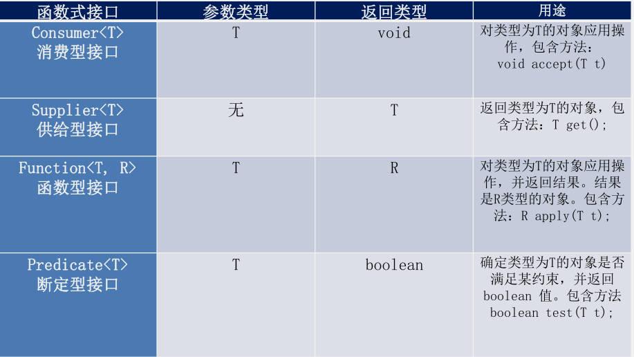
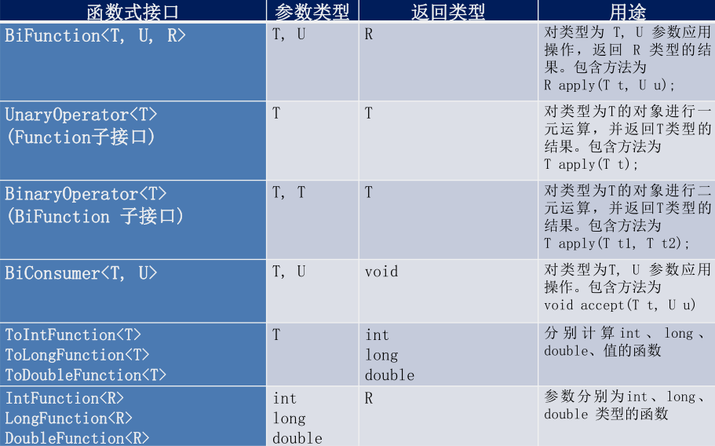

# 函数式接口

> 只包含一个抽象方法的接口，称为 函数式接口。
>
> 你可以通过 Lambda 表达式来创建该接口的对象。（若 Lambda表达式抛出一个受检异常，那么该异常需要在目标接口的抽象方法上进行声明）。
>
> 我们可以在任意函数式接口上使用 @FunctionalInterface 注解，这样做可以检查它是否是一个函数式接口，同时 javadoc 也会包含一条声明，说明这个接口是一个函数式接口。

## 自定义函数式接口

```java
@FunctionlInterface
public interface MyNumber {
    public double getValue();
}


@FunctionalInterface
public interface MyFunc<T> {
    public T getValue(T t);
}

```

## 作为参数传递Lambda表达式

> 作为参数传递  Lambda  表达式：为了将  Lambda  表达式作为参数传递，接收 Lambda 表达式的参 数类型必须是与该  Lambda  表达式兼容的函数式接口的类型。

```java
public String toUpperString(MyFunc<String> mf,  String str) {
    return mf.getValue(str);
}


String newStr = toUpperString(
        (str) -> str.toUpperCase(), "abcdef");
System.out.println(newStr);

```

## Java内置四大核心函数式接口



## 其他接口


