# 安装Linux

## 选择系统版本

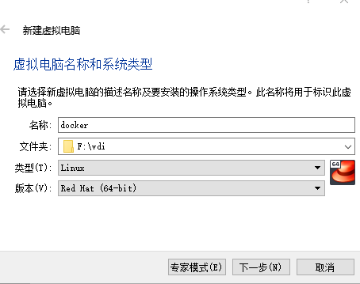、

## 设置内存

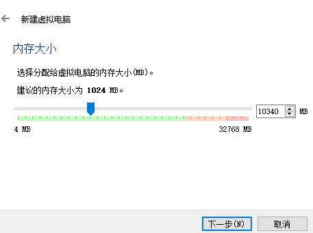

## 创建虚拟硬盘

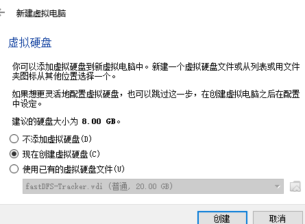

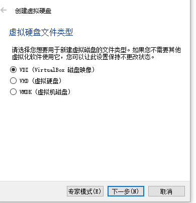

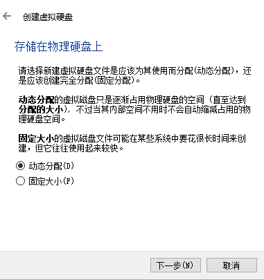

### 分配硬盘大小

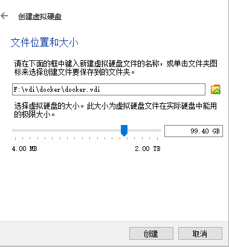

## 设置网卡

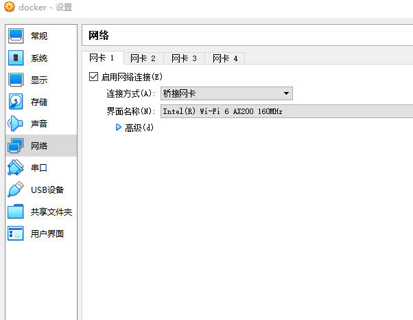

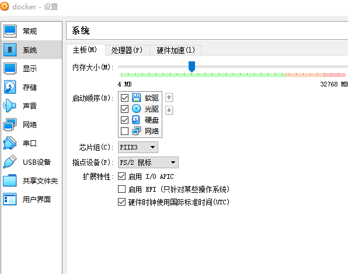

## 选择Install CentOS7

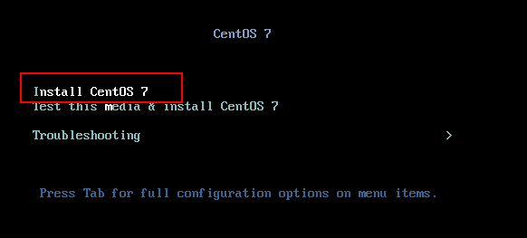

## 选择系统使用的语言（US.en）

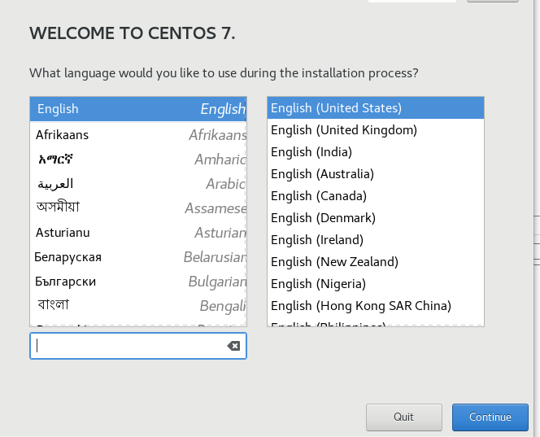

## 硬盘分区

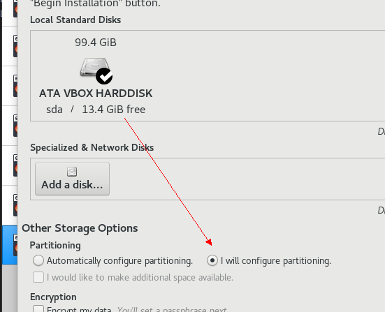

## 具体分区

> / 80G
>
> swap  5G
>
> /boot 1G

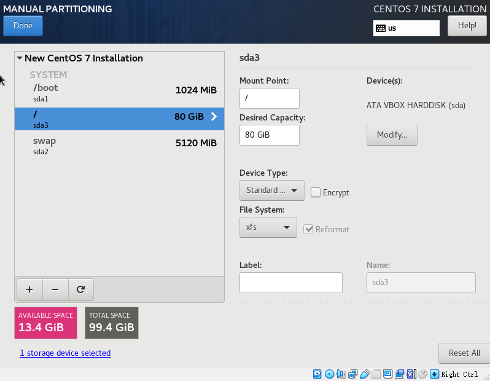

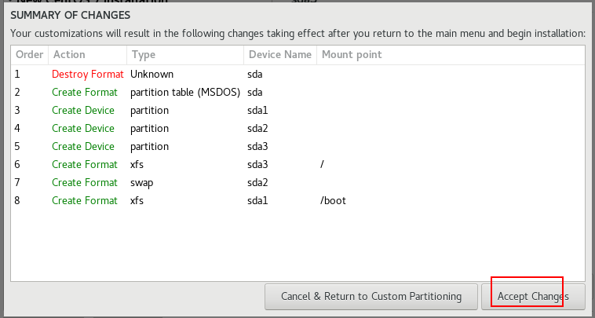

## 开始安装

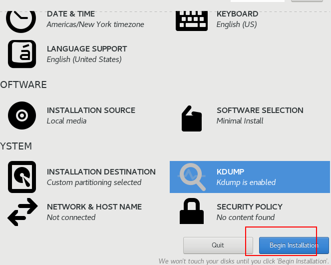

## 设置root密码

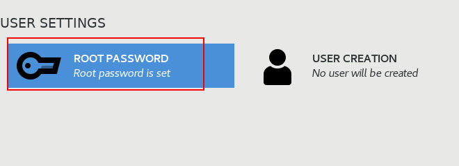

## 重启安装完成

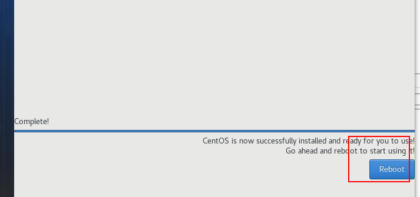
