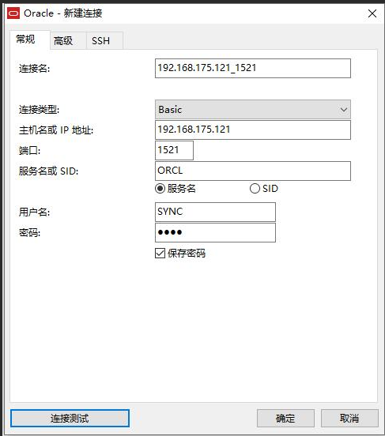
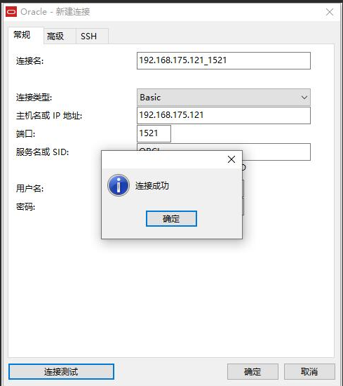

# 安装Oracle11g

## 关闭防火墙

> 操作用户：root

```shell
systemctl stop firewalld.service

systemctl disable firewalld.service
```

## 安装依赖包

> 操作用户为：root。

* 执行如下命令安装依赖包。

```shell
yum install -y automake autotools-dev binutils bzip2 elfutils expat \

gawk gcc gcc-multilib g++-multilib lib32ncurses5 lib32z1 \

ksh less lib32z1 libaio1 libaio-dev libc6-dev libc6-dev-i386 \

libc6-i386 libelf-dev libltdl-dev libodbcinstq4-1 libodbcinstq4-1:i386 \

libpth-dev libpthread-stubs0-dev libstdc++5 make openssh-server rlwrap \

rpm sysstat unixodbc unixodbc-dev unzip x11-utils zlibc unzip cifs-utils \

libXext.x86_64 glibc.i686
```

**如果上述命令报错，则使用如下命令安装**

```shell
yum -y install xz wget gcc-c++ ncurses ncurses-devel \

cmake make perl openssl openssl-devel gcc* libxml2 \

libxml2-devel curl-devel libjpeg* libpng* freetype* \

make gcc-c++ cmake bison perl perl-devel perl perl-devel \

glibc-devel.i686 glibc-devel libaio readline-devel \

zlib.x86_64 zlib-devel.x86_64 libcurl-* net-tool* \

sysstat lrzsz dos2unix telnet.x86_64 iotop unzip \

ftp.x86_64 xfs* expect vim psmisc openssh-client* \

libaio bzip2 epel-release automake binutils bzip2 \

elfutils expat gawk gcc ksh less make openssh-server \

rpm sysstat unzip unzip cifs-utils libXext.x86_64 \

glibc.i686 binutils compat-libstdc++-33 \

elfutils-libelf elfutils-libelf-devel \

expat gcc gcc-c++ glibc glibc-common \

glibc-devel glibc-headers libaio \

libaio-devel libgcc libstdc++ libstdc++-devel \

make sysstat unixODBC unixODBC-devel libnsl
```

## 创建oracle用户

> 操作用户为：root

```shell
groupadd -g 502 oinstall

groupadd -g 503 dba

groupadd -g 504 oper

groupadd -g 505 asmadmin

useradd -u 502 -g oinstall -G oinstall,dba,asmadmin,oper -s /bin/bash -m oracle

passwd oracle
```

上述命令执行完毕后，为oracle用户设置密码，例如，我这里设置的密码为oracle

## 解压Oracle数据库安装包

> 操作用户：oracle
>
> 操作目录：/home/oracle

**将Oracle 11gR2安装文件上传（可以使用sftp上传）到该操作目录下面，然后顺序解压安装文件到该目录。**

```shell
unzip linux.x64_11gR2_database_1of2.zip

unzip linux.x64_11gR2_database_2of2.zip
```

## 修改操作系统配置

> 操作用户：root

**操作文件：/etc/security/limits.conf**

```shell
vim /etc/security/limits.conf
```

**在文件的末尾添加如下配置项。**

```shell
oracle soft nproc 2047

oracle hard nproc 16384

oracle soft nofile 1024

oracle hard nofile 65536

oracle soft stack 10240
```

## 创建Oracle安装目录

> 操作用户：oracle

```shell
mkdir ~/tools/oracle11g
```

## 修改环境变量

> 操作用户：oracle
>
> 操作目录：/home/oracle

```shell
vim ~/.bash_profile
```

**在文件末尾添加如下配置项**

```shell
export ORACLE_BASE=/home/oracle/tools/oracle11g

export ORACLE_HOME=$ORACLE_BASE/product/11.2.0/dbhome_1

export ORACLE_SID=orcl

export ORACLE_UNQNAME=orcl

export NLS_LANG=.AL32UTF8

export PATH=${PATH}:${ORACLE_HOME}/bin/:$ORACLE_HOME/lib64
```

**使得环境变量生效。**

```shell
source ~/.bash_profile
```

## 修改Oracle配置文件

> 操作用户：oracle
>
> 操作目录：/home/oracle

**复制文件模板**

```shell
cp /home/oracle/database/response/db_install.rsp .
```

**注意：复制命令的最后一个 . 不能省略，表示将db_install.rsp文件从/home/oracle/database/response目录拷贝到当前目录。**

对db_install.rsp文件进行编辑。

```shell
vim db_install.rsp
```

需要修改的配置项如下所示，这里，我将修改后的配置项列举出来。

```shell
oracle.install.option=INSTALL_DB_AND_CONFIG

ORACLE_HOSTNAME=localhost #实际上可以修改成你自己的主机名或者域名(IP)

UNIX_GROUP_NAME=oinstall

INVENTORY_LOCATION=/home/oracle/tools/oraInventory

SELECTED_LANGUAGES=en,zh_CN

ORACLE_HOME=/home/oracle/tools/oracle11g/product/11.2.0/dbhome_1

ORACLE_BASE=/home/oracle/tools/oracle11g

oracle.install.db.InstallEdition=EE

oracle.install.db.DBA_GROUP=dba

oracle.install.db.OPER_GROUP=oper

oracle.install.db.config.starterdb.type=GENERAL_PURPOSE

oracle.install.db.config.starterdb.globalDBName=orcl

oracle.install.db.config.starterdb.SID=orcl

oracle.install.db.config.starterdb.characterSet=AL32UTF8

oracle.install.db.config.starterdb.memoryOption=true

oracle.install.db.config.starterdb.memoryLimit=1024

oracle.install.db.config.starterdb.installExampleSchemas=false

oracle.install.db.config.starterdb.password.ALL=Oracle#123456

oracle.install.db.config.starterdb.control=DB_CONTROL

oracle.install.db.config.starterdb.dbcontrol.enableEmailNotification=false

oracle.install.db.config.starterdb.dbcontrol.emailAddress=test@[qq.com](http://qq.com/) #可以填写你自己的邮箱地址

oracle.install.db.config.starterdb.automatedBackup.enable=false

oracle.install.db.config.starterdb.storageType=FILE_SYSTEM_STORAGE

oracle.install.db.config.starterdb.fileSystemStorage.dataLocation=/home/oracle/tools/oracle11g/oradata

oracle.install.db.config.starterdb.fileSystemStorage.recoveryLocation=/home/oracle/tools/oracle11g/fast_recovery_area

oracle.install.db.config.starterdb.automatedBackup.enable=false

DECLINE_SECURITY_UPDATES=true
```

## 静默安装Oracle 11gR2

> 操作用户：oracle
>
> 操作目录：/home/oracle/database

```shell
./runInstaller -silent -ignoreSysPrereqs -responseFile /home/oracle/db_install.rsp
```

接下来，就是默默的等待Oracle自行安装了，等待一段时间后，如果输出如下信息，则表明Oracle数据库已经安装成功。

**The following configuration scripts need to be executed as the "root" user.**

#!/bin/sh#Root scripts to run

```shell
/home/oracle/tools/oraInventory/orainstRoot.sh
```

```shell
/home/oracle/tools/oracle11g/product/11.2.0/dbhome_1/root.sh
```

```shell
To execute the configuration scripts:

1. Open a terminal window
2. Log in as "root"
3. Run the scripts
4. Return to this window and hit "Enter" key to continue

Successfully Setup Software.
```

### 10.安装完成

操作用户：root

根据上一步完成信息提示，执行以下两行命令，具体位置需要根据你的安装位置决定：

```shell
/home/oracle/tools/oraInventory/orainstRoot.sh

/home/oracle/tools/oracle11g/product/11.2.0/dbhome_1/root.sh
```

### 11.创建连接用户

操作用户：oracle

```shell
sqlplus /nolog

conn /as sysdba

startup
```

接下来，执行如下命令。

```shell
alter user system identified by system;

alter user sys identified by sys;
```

创建连接用户。

```shell
create user SYNC identified by SYNC;

grant connect,resource,dba to SYNC;
```


## 验证安装结果

### 启动数据库

启动已经安装的数据库orcl。

操作用户oracle

启动监听

```shell
lsnrctl start
```

启动数据库过程如下：

```shell
sqlplus /nolog
```

使用dba权限连接Oralce

```shell
connect / as sysdba
```

启动数据库

```shell
startup
```

确认启动结果：

```shell
ORACLE instance started.

Total System Global Area 534462464 bytes

Fixed Size 2215064 bytes

Variable Size 373293928 bytes

Database Buffers 150994944 bytes

Redo Buffers 7958528 bytes

Database mounted.

Database opened.
```

### 2.验证数据库

这里，我们使用Navicat连接Oracle数据库，如下所示。




这里，输入的用户名为SYNC，密码为SYNC。

接下来，点击“连接测试”，如下所示。



可以看到，Oracle数据库连接成功。
