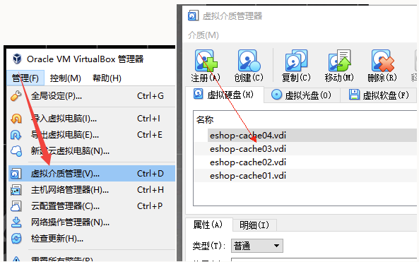

# 快速创建服务器

> 搭建集群时，服务器器的大多配置都是一样， 一台台创建太慢， 可以快速复制

## 先创建第一台服务器

## 复制多台服务器

> 必须重命名

## 更改UUID

> 找到 VirtualBox 的安装路径
>
> VBoxManage internalcommands sethduuid 修改uuid的文件路径
>
> 若提示UUID修改为xxxxxxxxxx则为成功

## 注册虚拟介质

## 新建虚拟机选择

