# 虚拟网络配置

## 桥接

### 设置虚拟机的网卡

> 网卡选择桥接方式， 网卡驱动选择连接外网的网卡

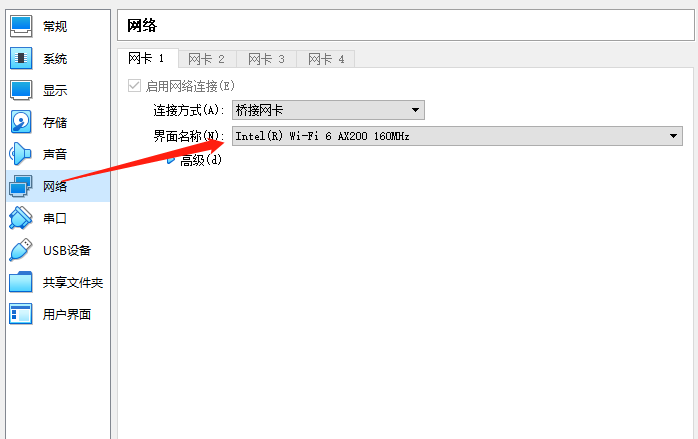

### 宿主机IP

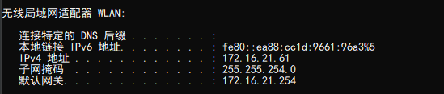

### 虚拟机IP

> 网关 子网掩码 必须和宿主机一致

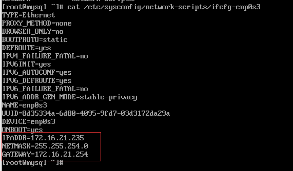

## HostOnly+网络共享

> 当我们选择HostOnly模式时，根据字面意思便知，只能主机访问虚拟机，虚拟机与虚拟机之间可以访问，因为属于同一网段。
>
> 如果虚拟机需要联外网，可以使用网络共享的方式实现虚拟机上网。

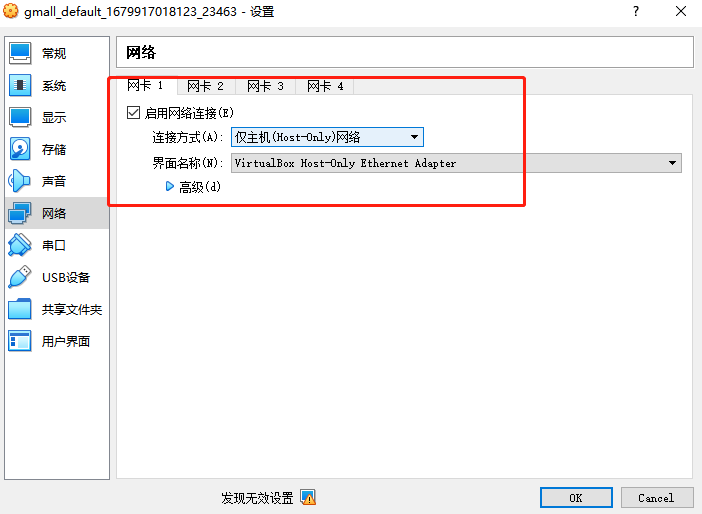

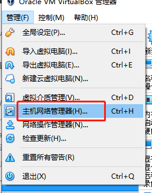

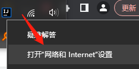

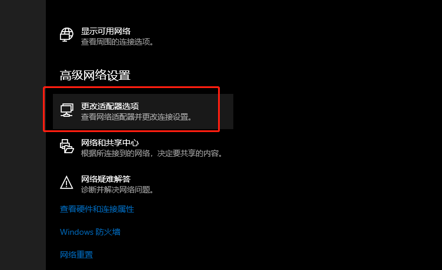

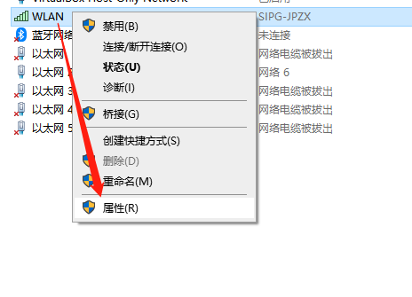

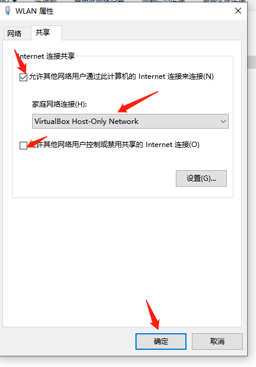

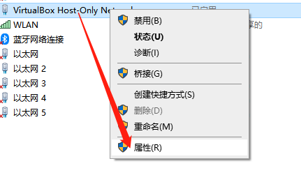

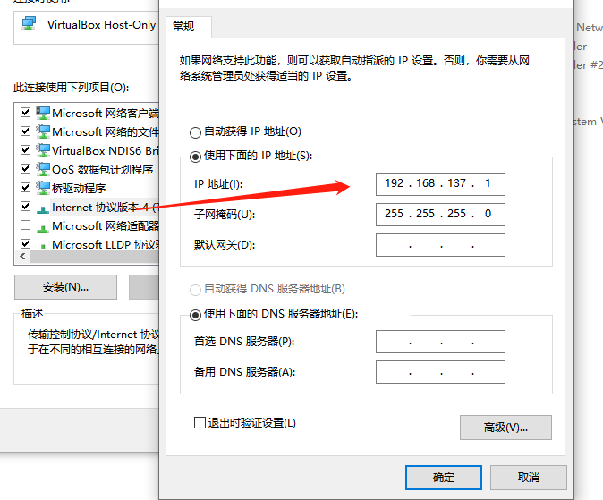

## HostOnly+NAT

> 使用HostOnly 可以宿主机访问虚拟机
>
> NAT模式 可以虚拟机 访问外网

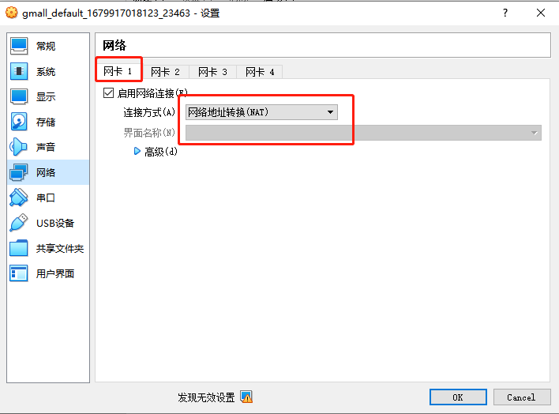

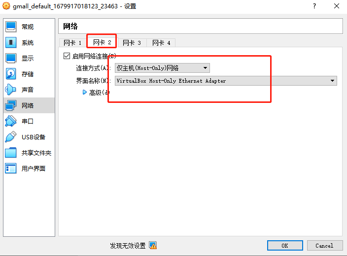
