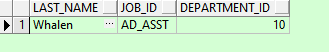

# Oracle入门

> SQL 语言大小写不敏感。
> SQL 可以写在一行或者多行
> 关键字不能被缩写也不能分行
> 各子句一般要分行写。
> 使用缩进提高语句的可读性。

## SELECT语句查询

### 查询列

* 使用* 查询所有列的数据

```sql
SELECT * FROM DEPARTMENTS;
```


* 查询特定的列

```sql
SELECT DEPARTMENT_ID, LOCATION_ID FROM DEPARTMENTS;
```


### 查询中使用数字运算符

> */+ -
>
> 乘除的优先级高于加减。
> 同一优先级运算符从左向右执行。
> 括号内的运算先执行。

* 薪资 + 300

```sql
SELECT LAST_NAME, SALARY, SALARY + 300 FROM EMPLOYEES;
```


* 12月的薪资+100

```sql
SELECT LAST_NAME, SALARY, 12*SALARY+100 FROM EMPLOYEES;
```


* 每个月涨100 一年的薪资

```sql
SELECT LAST_NAME, SALARY, 12 * (SALARY + 100) FROM EMPLOYEES;
```


* 空值的定义

```sql
SELECT last_name, job_id, salary, commission_pct FROM employees;
```


* 空值在数学运算符中的使用

```sql
SELECT last_name, 12*salary*commission_pct FROM   employees;
```


### 列的别名

* 列名后空格直接写别名

```sql
SELECT last_name AS name, commission_pct comm FROM employees;
```


* 列名后空格 写别名并用双引号括起来

```sql
SELECT last_name "Name", salary*12 "Annual Salary" FROM employees;
```


### 使用连接符

* 使用 || 连接多个列的值

```sql
SELECT	last_name||job_id AS "Employees" FROM 	employees;
```


### 字符串

> 日期和字符串只能在单引号中出现

```sql
SELECT last_name ||' is a '||job_id AS "Employee Details" FROM employees;
```


### 去重

* 使用 DISTINCT 去重

```sql
SELECT DISTINCT department_id FROM employees;
```


## 过滤

### where子句

* 根据数字查询

```sql
SELECT employee_id, last_name, job_id, department_id
FROM   employees
WHERE  department_id = 90 ;
```


### 字符和日期

> 字符和日期要包含在单引号中。
> 字符大小写敏感，日期格式敏感。
> 默认的日期格式是 DD-MON月-RR。

* 根据字符串查询

```sql
SELECT last_name, job_id, department_id
FROM   employees
WHERE  last_name = 'Whalen';
```



* 根据日期查询

```sql
SELECT last_name, hire_date, department_id
FROM   employees
WHERE  hire_date = '7-6月-1994'
```


### 比较运算符

> =   等于
>
> &gt;  大于
>
> &gt;=  大于等于
>
> &lt;    小于
>
> &lt;=   小于等于
>
> &lt; &gt;  不等于也可以使用 !=

* 查询薪资小于等于3000的

```sql
SELECT last_name, salary FROM employees WHERE salary <= 3000;
```


### 其他比较运算

> BETWEEN ... AND ...   两个值之间包含边界，小在前 大在后
>
> INT (set)   等于列表中的一个
>
> LIKE    模糊查询
>
> IS NULL   空值


* Between

```sql
SELECT last_name, salary
FROM   employees
WHERE  salary BETWEEN 2500 AND 3500;
```


* in

```sql
SELECT employee_id, last_name, salary, manager_id
FROM   employees
WHERE  manager_id IN (100, 101, 201);
```


* like

```sql
SELECT last_name
FROM   employees
WHERE  last_name LIKE '_o%';
```


* escape

```sql
SELECT job_id
FROM   jobs
WHERE  job_id LIKE ‘IT\_%‘ escape ‘\‘;
```


* null

```sql
SELECT last_name, manager_id
FROM   employees
WHERE  manager_id IS NULL;
```


### 逻辑运算符

> AND   并且
>
> OR     或
>
> NOT   否


* and

```sql
SELECT employee_id, last_name, job_id, salary
FROM   employees
WHERE  salary >=10000
AND    job_id LIKE '%MAN%';
```

、


* or

```sql
SELECT employee_id, last_name, job_id, salary
FROM   employees
WHERE  salary >= 10000
OR     job_id LIKE '%MAN%';
```


* not

```sql
SELECT last_name, job_id
FROM   employees
WHERE  job_id 
       NOT IN ('IT_PROG', 'ST_CLERK', 'SA_REP');
```


### 优先级


## 排序

### order by 子句

> 默认升序

```sql
SELECT   last_name, job_id, department_id, hire_date
FROM     employees
ORDER BY hire_date ;
```


* desc

```sql
SELECT   last_name, job_id, department_id, hire_date
FROM     employees
ORDER BY hire_date DESC ;
```


* 按别名排序

```sql
SELECT employee_id, last_name, salary*12 annsal
FROM   employees
ORDER BY annsal;
```


* 多个列排序

```sql
SELECT last_name, department_id, salary
FROM   employees
ORDER BY department_id, salary DESC;
```


