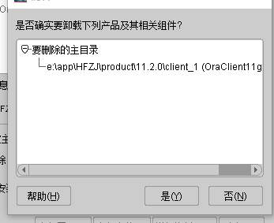

# OracleClient

## 安装

### 安装文件


### 安装基础配置


* 如果之前环境变量有配置 ORACLE_HOME 删掉，退出重新安装，这个路径会正常


### 开始安装

> 等待安装完成


### 链接串文件

> E:\app\HFZJ\product\11.2.0\client_1\network\admin
>
> tnsnames.ora

```java
# tnsnames.ora Network Configuration File: E:\app\HFZJ\product\11.2.0\client_1\network\admin\tnsnames.ora
# Generated by Oracle configuration tools.


############################################营口本地测试环境############################################
yk_asc_test =
  (DESCRIPTION =
    (ADDRESS = (PROTOCOL = TCP)(HOST = 127.0.0.1)(PORT = 1521))
    (CONNECT_DATA =
      (SERVER = DEDICATED)
      (SERVICE_NAME = orcl)
    )
  )
############################################营口本地测试环境############################################

```

## 卸载

### 停止oracle相关服务

* 使用  Win + E  打开资源管理器，   选中此电脑右击选择管理


* 打开计算机管理 选择服务器 找到右侧服务列表中oracle开头的所有服务，右击选择停止


### 卸载oracle客户端主要模块

* 按 win 键 找到 Oracle - OracleClient11g_home1


* 在产品清单窗口中，单击全部展开，除了OraDb11g_home1外，勾选其他项目，单击删除  卸载完后，再删除：OraDb11g_home




### 删除注册表

按win + R 输入 regedis  打开注册表


* 依次展开HKEY_LOCAL_MACHINE\SOFTWARE，找到oracle，删除
* 依次展开HKEY_LOCAL_MACHINE\SYSTEM\CurrentControlSet\Services中，删除所有oracle开头的项
* 依次展开HKEY_LOCAL_MACHINE\SYSTEM\CurrentControlSet\Services\Eventlog\Application，删除所有oracle开头的项；
* 在HKEY_CLASSES_ROOT，删除以ora开头的项

### 重启电脑，删除oracle目录

/app/....   删除Oracle的安装目录app等

C:/Program Files / Oracle

C:/Program Files/Oracle
