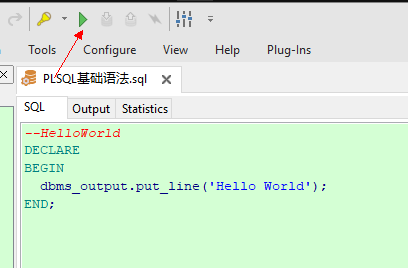
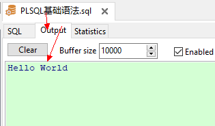

# PLSQL基础语法

## 模板

```sql
--模板
DECLARE
  --声明变量、类型、游标

BEGIN
  --程序执行部分
  dbms_output.put_line('Hello World');

EXCEPTION
  --针对begin中出现的异常，提供处理机制
  --when  .... then...
END;

```

## HelloWorld

```sql
--HelloWorld
DECLARE
BEGIN
  dbms_output.put_line('Hello World');
END;

```

* 编辑完成点击执行 通过Output查询输出结果



## 基础语法

### 声明变量

* 定义已知的变量类型

```sql
DECLARE
  --已知变量类型
  v_sal number(10,2);
  v_job varchar2(20);
  v_hire_date date;
BEGIN
  SELECT SAL, JOB, HIREDATE INTO v_sal,v_job,v_hire_date from emp WHERE EMP.EMPNO = 7369;
  
  dbms_output.put_line('SAL-' || v_sal || '-JOB-' || v_job || '-HIREDATE-' || V_HIRE_DATE);
END;
```

* 未知的变量类型使用引用数据类型

```sql
DECLARE
  --引用数据类型
  v_sal emp.sal%type;
  --初始化变量
  v_job varchar2(20) ：= '';
  v_hire_date date;
BEGIN
  SELECT SAL, JOB, HIREDATE INTO v_sal,v_job,v_hire_date from emp WHERE EMP.EMPNO = 7369;
  
  dbms_output.put_line('SAL-' || v_sal || '-JOB-' || v_job || '-HIREDATE-' || V_HIRE_DATE);
END;
```
