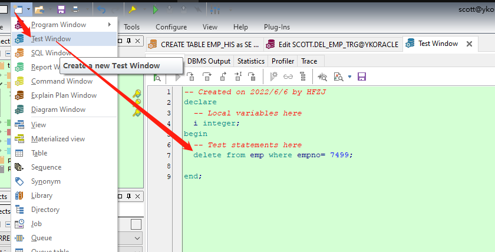
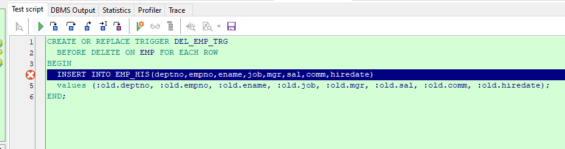

# PLSQL触发器

## 触发器类型

### DML触发器

### 替代触发器

```
由于在 ORACLE 里，不能直接对由两个以上的表建立的视图进行操作。所以给出了替代触发器。
```

### 系统触发器

```
它可以在 ORACLE 数据库系统的事件中进行触发，如 ORACLE 系统的启动与关闭等。
```

### 触发器组成

```
触发事件：即在何种情况下触发 TRIGGER; 例如：INSERT, UPDATE, DELETE。

触发时间：即该 TRIGGER 是在触发事件发生之前（BEFORE）还是之后(AFTER)触发，也就是触发事件和该 TRIGGER 的操作顺序。

触发器本身：即该 TRIGGER 被触发之后的目的和意图，正是触发器本身要做的事情。 例如：PL/SQL 块。

触发频率：说明触发器内定义的动作被执行的次数。即 语句级(STATEMENT) 触发器和行级(ROW) 触发器。

- 语句级(STATEMENT)触发器：是指当某触发事件发生时，该触发器只执行一次；

- 行级(ROW)触发器：是指当某触发事件发生时，对受到该操作影响的每一行数据，触发器都单独执行一次。
```

## 创建触发器

### 基础语法

```sql
CREATE [OR REPLACE] TRIGGER trigger_name
{BEFORE | AFTER }
{INSERT | DELETE | UPDATE [OF column [, column …]]}
ON [schema.] table_name 
[FOR EACH ROW ]
[WHEN condition]
trigger_body;
```

```sql
其中：
BEFORE 和 AFTER 指出触发器的触发时序分别为前触发和后触发方式，前触发是在执行触发事件之前触发当前所创建的触发器，后触发是在执行触发事件之后触发当前所创建的触发器。

FOR EACH ROW 选项说明触发器为行触发器。 行触发器和语句触发器的区别表现在：行触发器要求当一个 DML 语句操做影响数据库中的多行数据时，对于其中的每个数据行，只要它们符合触发约束条件，均激活一次触发器；
而语句触发器将整个语句操作作为触发事件，当它符合约束条件时，激活一次触发器。 当省略 FOR EACH ROW  选项时，BEFORE 和 AFTER 触发器为 语句触发器，而 INSTEAD OF 触发器则为行触发器。

WHEN 子句说明触发约束条件。Condition 为一个逻辑表达时，其中必须包含相关名称，而不能包含查
询语句，也不能调用 PL/SQL 函数。WHEN 子句指定的触发约束条件只能用在 BEFORE 和 AFTER 行触发器中，不能用在 INSTEAD OF 行触发器和其它类型的触发器中。

当一个基表被修改( INSERT, UPDATE, DELETE)时要执行的存储过程，执行时根据其所依附的基表改动而自动触发，因此与应用程序无关，用数据库触发器可以保证数据的一致性和完整性。
```

### 12种类型

```sql
--新增前触发
BEFORE INSERT

--监控行记录新增之前触发
BEFORE INSERT FOR EACH ROW

--新增后触发
AFTER INSERT

--监控行记录新增后触发
AFTER INSERT FOR EACH ROW

--更新前触发
BEFORE UPDATE

--监控行记录更新后触发
BEFORE UPDATE FOR EACH ROW

--更新后触发
AFTER UPDATE

--监控行记录更新后触发
AFTER UPDATE FOR EACH ROW

--删除后触发
BEFORE DELETE

--监控行记录删除前触发
BEFORE DELETE FOR EACH ROW

--删除后触发
AFTER DELETE

--监控行记录删除后触发
AFTER DELETE FOR EACH ROW
```

### 触发器触发次序

```sql
1.  执行 BEFORE  语句级触发器;
2.  对与受语句影响的每一行：

-  执行 BEFORE  行级触发器
-  执行 DML 语句
-  执行 AFTER  行级触发器

3.  执行 AFTER  语句级触发器
```

### DML触发器

```sql
触发器名可以和表或过程有相同的名字，但在一个模式中触发器名不能相同。
```

### 触发器的限制

```sql
- CREATE TRIGGER 语句文本的字符长度不能超过 32KB；

- 触发器体内的 SELECT  语句只能为 SELECT … INTO … 结构，或者为定义游标所使用的 SELECT  语句。

- 触发器中不能使用数据库事务控制语句 COMMIT; ROLLBACK, SVAEPOINT 语句；

- 由触发器所调用的过程或函数也不能使用数据库事务控制语句；
```

问题：当触发器被触发时，要使用被插入、更新或删除的记录中的列值，有时要使用操作前、 后列的值.
实现:
:NEW 修饰符访问操作完成后列的值
:OLD 修饰符访问操作完成前列的值


| 特性 | INSERT | UPDATE | DELETE |
| ------ | -------- | -------- | -------- |
| OLD  | NULL   | 有效   | 有效   |
| NEW  | 有效   | 有效   | NULL   |


## 案例

### 监控删除记录并记录日志

> 建立一个触发器, 当职工表 emp 表被删除一条记录时，把被删除记录写到职工表删除日志表中去。

```sql
--记录删除的数据
CREATE TABLE EMP_HIS as
SELECT * FROM EMP
WHERE 1 = 2;


--触发器
CREATE OR REPLACE TRIGGER DEL_EMP_TRG
  BEFORE DELETE ON EMP FOR EACH ROW
BEGIN
  INSERT INTO EMP_HIS(deptno,empno,ename,job,mgr,sal,comm,hiredate)
  values (:old.deptno, :old.empno, :old.ename, :old.job, :old.mgr, :old.sal, :old,comm, :old.hiredate);
END;

```


### 数据更新或者新增之前做监控

```sql
CREATE OR REPLACE TRIGGER EMP_INSERT_UPDATE_TRG
  BEFORE INSERT OR UPDATE 
  ON EMP 
  FOR EACH ROW
DECLARE
  -- LOCAL VARIABLES HERE
BEGIN
  If Inserting Then
    If :New.Deptno In (20,10,30) Then
      dbms_output.put_line(:New.Empno || '====' || :New.Ename);
    End If;
  End If;
  
  If Updating Then
    If :Old.Job In ('JAVA') Then
      dbms_output.put_line(:Old.Empno || '====' || :Old.Ename);
    End If;
  End If;
END EMP_INSERT_UPDATE_TRG;
```


### 指定字段值变化的监控

```sql
CREATE OR REPLACE TRIGGER EMP_JOB_DEPTNO_TRG
  BEFORE UPDATE OF
   JOB,
   DEPTNO
  ON EMP 
  FOR EACH ROW
DECLARE
  -- LOCAL VARIABLES HERE
BEGIN
  If :New.Job = 'JAVA' And :New.Deptno = 20 Then
    Raise_Application_Error(2001210,'20号部门不能有JAVA程序员'); 
  End If;
END EMP_JOB_DEPTNO_TRG;
```


## 触发器调试

新建【Test Window】- 编写触发要测试服务器的语句







## 删除和使用触发器

### 删除触发器

> 当删除表或视图时，建立在这些对象上的触发器也随之删除

```sql
DROP TRIGGER trigger_name;
```

### 触发器的状态

> ENABLE | DISABLE

* 修改某一个触发器的状态

```sql
ALTER TIGGER trigger_name [DISABLE | ENABLE ];

ALTER TRIGGER emp_view_delete DISABLE;
```

* 更改指定表所有触发器的状态

```sql
ALTER TABLE [schema.]table_name {ENABLE|DISABLE} ALL TRIGGERS;

ALTER TABLE emp DISABLE ALL TRIGGERS;
```
