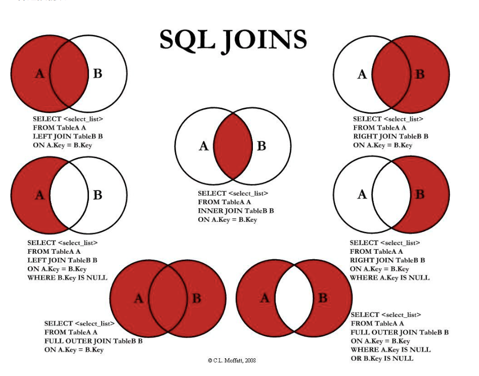
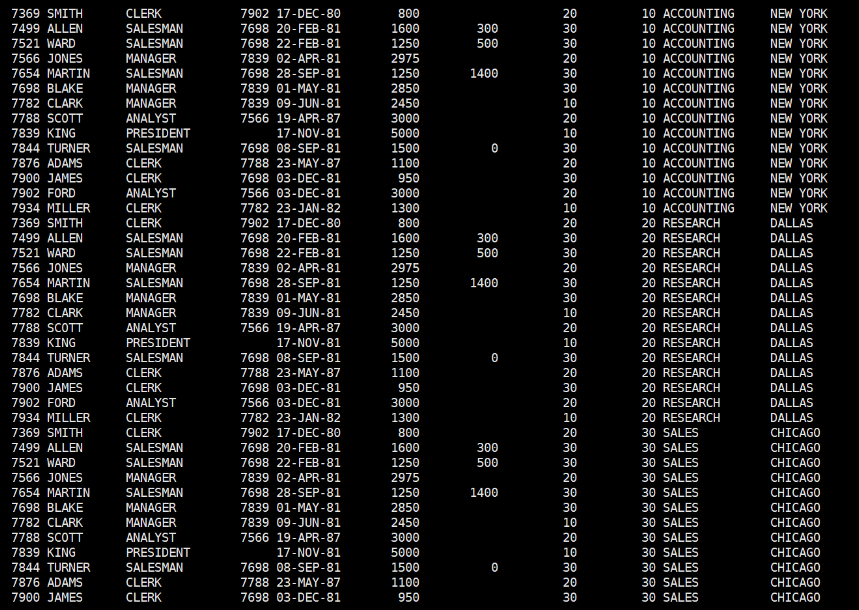

# 多表查询




## 笛卡尔积

> A表 10条数据， B表 10条数据，  A,B表的笛卡尔积就是10 * 10

```sql
SELECT * FROM emp,dept
```



## 等值连接

## 不等连接

```sql
select t1.col_name,t2.col_name
 from t1,t2
 where t1.col_name between t2.col_name
 and t2.col_name;
```

## 外连接

> 外连接分为:
> 右外连接(right join/right outer join)
> 左外连接(left join/left outer join)
> 全外连接(full join/ full outer join)

### 右外连接

> 右外连接表示右边表（=号右边的表）中的记录在左边表中不存在的时候，右边表的记录依旧显示。

```sql
select tb_name,col_name,...
 from tb_name1,tb_name2
where
 tb_name1.col_name (+)= tb_name2.col_name;

or

select tb_name,col_name,
from tb_name1 right outer join tb_name2
where .......

select c.id,c.name,e.last_name
from s_customer c,s_emp e
where c.id (+)= c.sales_rep_id;
```

### 左外连接

> 左外连接表示左边表（=号左边的表）中的记录在右边表中不存在的时候，左边表的记录依旧显示。

```sql
select tb_name,col_name,...
    from tb_name1,tb_name2
    where 
    tb_name1.col_name = tb_name2.col_name(+);
  
    or
    select tb_name,col_name,...
    from tb_name1 left outer join tb_name2
    where 
    tb_name1.col_name = tb_name2.col_name(+);
```

### 自连接

> 实质就是一张表当多张表用，即一张表中的某列的值取决于自己的某一列

语法

```sql
 select ...
     from tb_name t1,tb_name t2
 where t1.col_name = t2.ano_col_name

```

## 集合连接

> 对查询结果集的操作, 前提条件是：两个结果集中查询的列要完全一致。
>
> union:将上下结果取并集，去除掉重复的记录（重复的只显示一次）
> union all：将上下结果全部显示
>
> minus：取差集 A-B
> intersect：取交集

## 伪列

### rownum 只能等于1

> 如果让其等于其他数 则查不到数据

```sql
 select last_name
 from s_emp
 where rownum=1

```

### rownum 大于0

> 如果让其大于其他数 则查不到数据

```sql
 select last_name
 from s_emp
 where rownum>0


```

### rownum 可以小于任何数

```sql
 select last_name
 from s_emp
 where rownum<7
```
