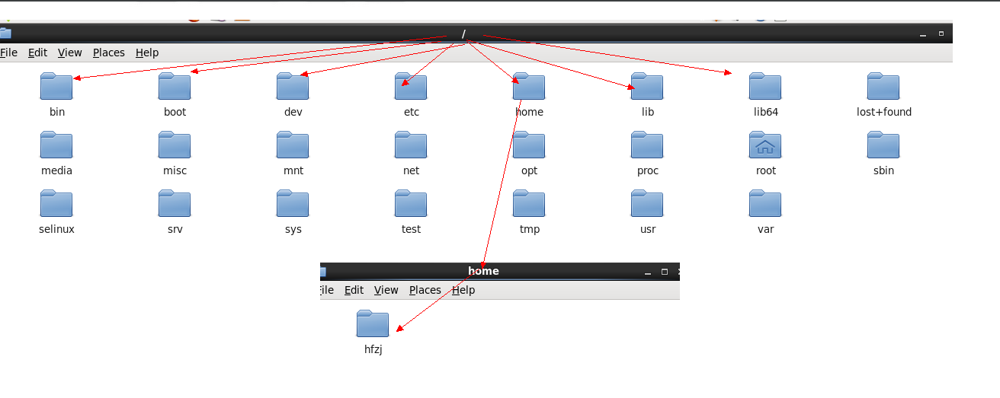

# Linux目录

## 目录布局



### 目录介绍

```json
- /   根目录
- /bin   存放二进制可执行文件（ls,cat,mkdir等），常用命令都在这里面
- /etc   存放系统管理和配置文件
- /home  存放所有用户文件的根目录，是用户主目录的基点
- /usr   用于存放系统应用程序，比较重要的目录/usr/local本地系统管理员软件安装目录（安装系统级的应用）。
    - /usr/x11r6 存放x window的目录
    - /usr/bin   众多的应用程序
    - /usr/sbin  超级用户的一些管理程序
    - /usr/doc   linux文档
    - /usr/include  linux下开发和编译应用程序所需要的头文件
    - /usr/lib   常用的动态链接库和软件包的配置文件
    - /usr/man   帮助文档
    - /usr/src   源代码，Linux内核的源代码就放在/usr/src/linux里
    - /usr/local/bin    本地增加的命令
    - /usr/local/lib    本地增加的库
- /opt   额外安装的可选应用程序包所放置的位置。一般情况下，我们可以吧tomcat等安装到这里
- /proc  虚拟文件系统目录，是系统内存的映射。可直接访问这个目录来获取系统信息。
     - /proc/uptime 
     - /proc/version 查看系统版本
- /root  超级用户（系统管理员）的主目录（特权阶级）
- /sbin  存放二进制可执行文件，只有root才能访问。这里存放的是系统管理使用的系统级别的管理命令和程序。如ifconfig
  
- /dev   用于存放设备文件 驱动
- /mnt   系统管理员安装临时文件系统的安装点，系统提供这个目录是让用户临时挂在其他的文件系统
- /boot  存放用于系统引导时使用的各种文件
- /lib   存放根文件系统中的程序运行所需要的共享库及内核模块。共享库又叫动态链接共享库，作用类似Windows里的.dll文件，存放了根文件系统程序运行所需的共享文件
- /tmp   用于存放各种临时文件，是公用的临时文件存储点
- /var   用于存放运行时需要改变数据的文件，也是某些大文件的溢出区，比方说各种服务的日志文件（系统启动日志等）
- /lost+found   这个目录平时是空的，系统非正常关机而留下“无家可归”的文件（Windows下叫什么.chk）就在这里
```

## 绝对路径

/root/home/bin/

## 相对路径

cd ../console/

## 文件的详细说明

```bash
[root@pc111 ~]# ll
total 100
-rw-------. 1 root root  1371 Nov 23 04:42 anaconda-ks.cfg

drwxr-xr-x. 2 root root  4096 Nov 22 21:18 Desktop

drwxr-xr-x. 2 root root  4096 Nov 22 21:18 Documents

drwxr-xr-x. 2 root root  4096 Nov 22 21:18 Downloads

-rw-r--r--. 1 root root 49041 Nov 23 04:42 install.log

-rw-r--r--. 1 root root 10033 Nov 23 04:40 install.log.syslog

drwxr-xr-x. 2 root root  4096 Nov 22 21:18 Music

drwxr-xr-x. 2 root root  4096 Nov 22 21:18 Pictures

drwxr-xr-x. 2 root root  4096 Nov 22 21:18 Public

drwxr-xr-x. 2 root root  4096 Nov 22 21:18 Templates

drwxr-xr-x. 2 root root  4096 Nov 22 21:18 Video
```

## Linux三种文件类型

> 普通文件：包括文本文件、数据文件、可执行的二进制程序文件等
>
> 目录文件：Linux系统把目录看成是一种特殊的文件，利用它构成文件系统的树型结构
>
> 设备文件：Linux系统把每一个设备都看成一个文件


```json
d :  开始为d, 表示是目录，文件夹

- :  开始为-，表示普通的二进制文件

l :  开始为l,表示软连接文件

c :  字符设备文件

s :  块设备文件

p :  命令管道

r: read读权限， w： write写权限 ， x： execute执行权限


```

* dr-x r-x r-x : 可以看做三个部分分别是文件的

```json
所有者r-x的权限

所属组r-x的权限

其他人r-x的权限
```

## 硬件配置

### 查看linux硬盘总空间

```bash
root@localhost ~]# fdisk -l /dev/sda


Disk /dev/sda: 26.8 GB, 26843545600 bytes, 52428800 sectors
Units = sectors of 1 * 512 = 512 bytes
Sector size (logical/physical): 512 bytes / 512 bytes
I/O size (minimum/optimal): 512 bytes / 512 bytes
Disk label type: dos
Disk identifier: 0x000a9969


   Device Boot      Start         End      Blocks   Id  System
/dev/sda1   *        2048     2099199     1048576   83  Linux
/dev/sda2         2099200    16777215     7339008   8e  Linux LVM
```

### 查看内存

```bash
cat /proc/meminfo | grep MemTotal
MemTotal:        8011104 kB
```

### 查看硬盘

```bash
fdisk -l | grep Disk
Disk /dev/sda: 236.2 GB, 2362232
```

### 查看物理CPU个数

```bash
cat /proc/cpuinfo| grep "physical id"| sort| uniq| wc -l
2
```

### 查看每个物理CPU中core的个数(即核数)

```bash
cat /proc/cpuinfo| grep "cpu cores"| uniq
cpu cores   : 4
```

### 查看处理器

```bash
cat /proc/cpuinfo | grep name | cut -f2 -d: | uniq -c
      8  Intel(R) Xeon(R) CPU E5-2609 v2 @ 2.50GHz
```
