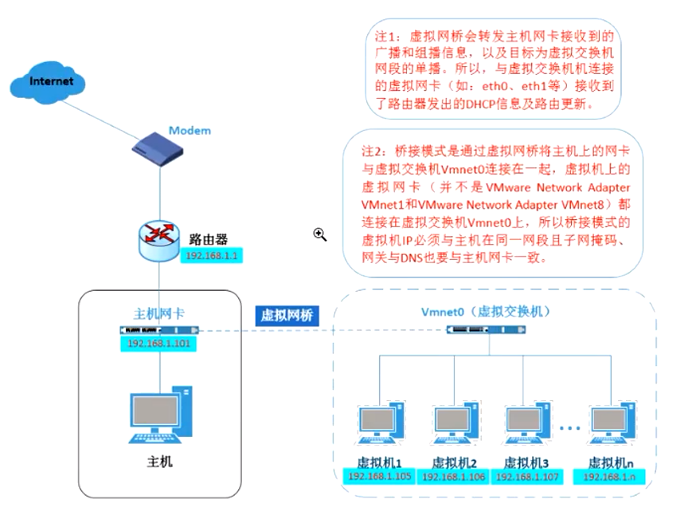
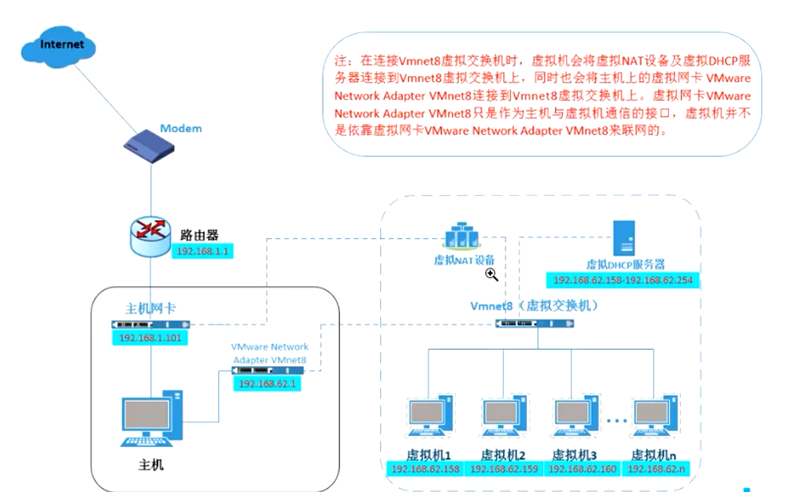
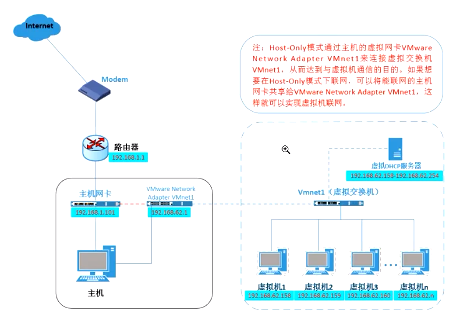

# 网络模型

> 还原默认设置 解决所有连不上网的问题

## 桥接模式

> 不同网段可以互相通

Vmnet0

桥接模式的虚拟机网卡必须和物理机的网段一致， 且网关，字掩网码一致

物理机虚拟出来个虚拟交换机，虚拟机就可以通过这个虚拟机的交换机与物理机链接



## NET模式

> net8

物理主机只有一个IP地址， 通过NET模式可以将一个主机IP对应成一个网络，那么虚拟的主机只要在这个网段就可以上网



## 仅主机模式

> Vmnet1

物理机可以自己给自己的网卡分配一个网络，然后虚拟机可以自己给自己分配该网段的地址




## 配置网卡

### 更改网卡地址

```shell
vim /etc/sysconfig/network-script/ifcfg-entho

IPADDRESS=192.168.0.102
NETMARSK=255.255.255.0
GATEWAY=192.168.0.1
```


### 更改网卡名

```shell
vim /etc/sysconfig/grub
```
