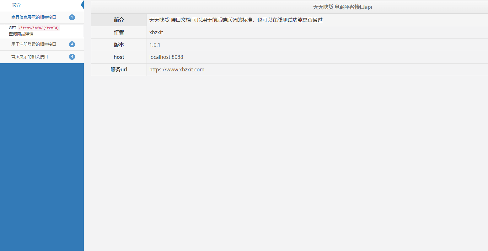
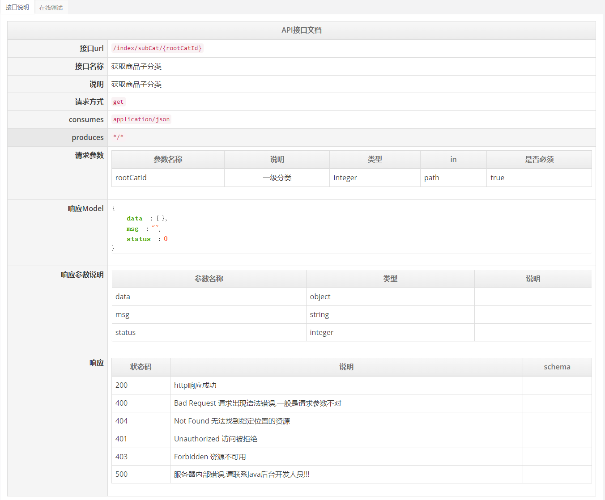

# 整合Swagger

## 添加依赖

> ./foodie/pom.xml

```xml
<!-- swagger2 配置 -->
<dependency>
    <groupId>io.springfox</groupId>
    <artifactId>springfox-swagger2</artifactId>
    <version>2.4.0</version>
</dependency>
<dependency>
    <groupId>io.springfox</groupId>
    <artifactId>springfox-swagger-ui</artifactId>
    <version>2.4.0</version>
</dependency>
<dependency>
    <groupId>com.github.xiaoymin</groupId>
    <artifactId>swagger-bootstrap-ui</artifactId>
    <version>1.6</version>
</dependency>
```

## 添加配置类

> foodie-api - com.xbzxit.foodie.config

```java
@Configuration
@EnableSwagger2
public class Swagger2 {

    @Bean
    public Docket createRestApi() {
        return new Docket(DocumentationType.SWAGGER_2)
                .apiInfo(apiInfo())
                .select()
                .apis(RequestHandlerSelectors.basePackage("com.xbzxit.foodie.controller"))
                .paths(PathSelectors.any())
                .build();
    }

    public ApiInfo apiInfo() {
        return new ApiInfoBuilder()
                // 文档页标题
                .title("天天吃货 电商平台接口api")
                // 联系人信息
                .contact(new Contact("xbzxit", "https://xbzxit.com", "xbzxit@163.com"))
                // 详细信息
                .description("天天吃货 接口文档 可以用于前后端联调的标准，也可以在线测试功能是否通过")
                // 文档版本号
                .version("1.0.1")
                // 网站地址
                .termsOfServiceUrl("https://www.xbzxit.com")
                .build();
    }
}
```

## 常用注解

> @Api
>
> @ApiOperation
>
> @ApiParam

### 用法

```java
@Api(value = "首页", tags = {"首页展示的相关接口"})
@RestController
@RequestMapping("/index")
public class IndexController {
    @ApiOperation(value = "获取商品子分类", notes = "获取商品子分类", httpMethod = "GET")
    @GetMapping("/subCat/{rootCatId}")
    public JSONResult subCat(@ApiParam(name = "rootCatId", value = "一级分类", required = true) @PathVariable Integer rootCatId) {
  
    }
}
```

## 接口文档

> http://localhost:8088




