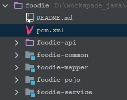

# 聚合工程



## 父工程的pom

> foodie/pom.xml

### foodie父工程

```java
<parent>
    <groupId>org.springframework.boot</groupId>
    <artifactId>spring-boot-starter-parent</artifactId>
    <version>2.1.5.RELEASE</version>
    <relativePath />
</parent>
```

* spring-boot-dependencies  管理了所有依赖的版本号

## 问题积累

### 启动日志爆红

> springboot默认的日志框架不要排除
