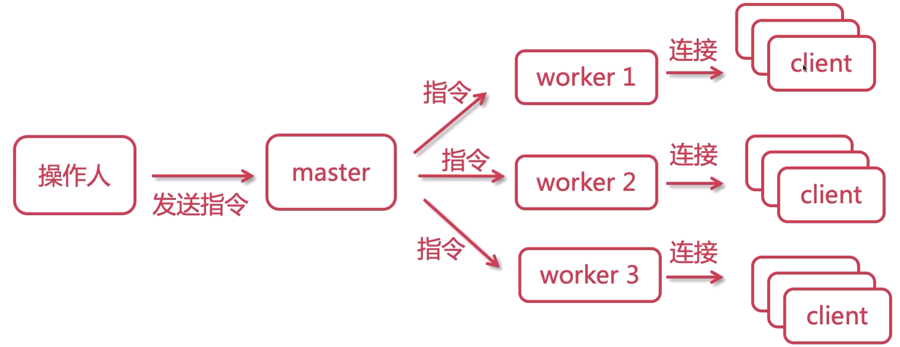
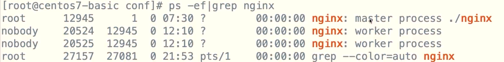

# Nginx配置

> 核心配置文件 /usr/local/nginx/conf/nginx.conf

```properties
main

event
    http
        server
            location
                upstream

```

## 频率特高的常用命令

```shell
## 编辑配置文件
vim nginx.conf


## 测试配置文件是否有错
../sbin/nginx -t

## 查看是否Nginx进程
ps -ef | grep nginx
```

## 进程模型解析

> master进程： 主进程   Boss
>
> worker进程： 工作进程 ，低层干活的

### 信号命令

```shell
./nginx -s stop

./nginx -s quit

./nginx -s reload

./nginx -t

```



## 其他配置介绍

### nobody

```properties
user nobody

user root;

worker_processes 2;
```



### error_log

> /var/log/nginx

```properties
# debug info notice warn error crit

#error_log logs/error.log;
#error_log logs/error.log notice;
#error_log logs/error.log info;
```

### pid

> /var/run/nginx

```properties
#pid  logs/nginx.pid;\
```

## types

```properties
## events

```properties
events {
    use epoll;
    worker_connections 10240;
}
```

## http

```properties
http {
    include mime.types;
  
  
  
    listen 88;
    server_name localhost;
    localtion {
  
    }
  }
```
