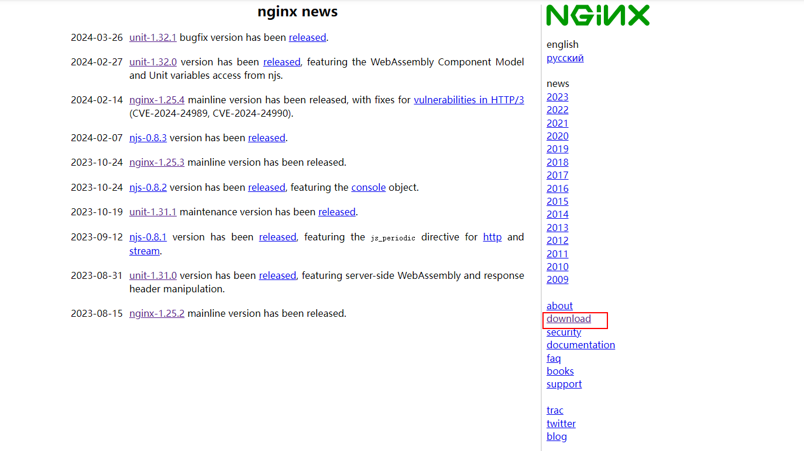
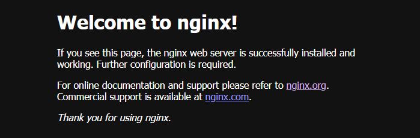
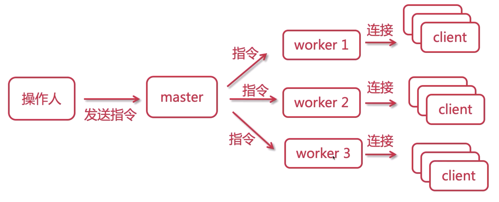

# 认识Nginx

## 什么是正向代理

## 什么是Nginx

> 一种web服务器，之前接触的有Tomcat
>
> Nginx 是 http和反向代理WEB服务器

## 正常代理


## 反向代理

> 用户 请求目标服务器， 由代理服务器决定访问哪个IP


## 反向代理至路由

> 路由  center / shop / image
>
> 根据不同的路由访问指定的服务器


## 下载

> [nginx](http://nginx.org)



```shell
#1.去官网http://nginx.org/下载对应的nginx包，推荐使用稳定版
```

## 安装

```shell
#1.去官网http://nginx.org/下载对应的nginx包，推荐使用稳定版
#2.上传nginx到linux系统

#3. 安装依赖环境
    #(1)安装gcc环境
      yum install gcc-c++
    #(2)安装PCRE库，用于解析正则表达式
      yum install -y pcre pcre-devel
    #(3)zlib压缩和解压缩依赖
      yum install -y zlib zlib-devel
    #(4)SSL安全的加密的套接字协议层，用于HTTP安全传输，也就是hitps
      yum install -y openssl openssl-devel

#4.解压,需要注意,解压后得到的是源码，源码需要编译后才能安装
  tar -zxvf nginx-1.16.1.tar.gz

#5.编译之前，先创建nginx临时目录，如果不创建，在启动nginx的过程中会报错
  mkdir /var/temp/nginx -p

#6.在nginx目录，输入如下命令进行配置，目的是为了创建makefile文件
    ./configure \
    --prefix=/usr/local/nginx \
    --pid-path=/var/run/nginx/nginx.pid \
    --lock-path=/var/lock/nginx.lock \
    --error-log-path=/var/log/nginx/error.log \
    --http-log-path=/var/log/nginx/access.log \
    --with-http_gzip_static_module \
    --http-client-body-temp-path=/var/temp/nginx/client \
    --http-proxy-temp-path=/var/temp/nginx/proxy \
    --http-fastcgi-temp-path=/var/temp/nginx/fastcgi \
    --http-uwsgi-temp-path=/var/temp/nginx/uwsgi \
    --http-scgi-temp-path=/var/temp/nginx/scgi


    -prefix #指定nginx安装目录
    -pid-path #指向nginx的pid
    -lock-path #锁定安装文件，防止被恶意篡改或误操作
    -error-log #错误日志
    -http-log-path #http日志
    -with-http_gzip static module #启用gzip模块，在线实时压缩输出数据流
    -http-client-body-temp-path #设定客户端请求的临时目录
    -http-proxy-temp-path #设定http代理临时目录
    -http-fastcgi-temp-path #设定fastcgi临时目录
    -http-uwsgi-temp-path #设定uwsgi临时目录
    -http-scgi-temp-path #设定scgi临时目录


#7.make编译
  make
#8. 安装
  make install
#9.进入sbin目录启动nginx
  /nginx
    停止:./nginx-s stop
    重新加载:./nginx-sreload
  
#10.打开浏览器，访问虚拟机所处内网ip即可打开nginx默认页面，显示如下便表示安装成功:注意事项:
    1.如果在云服务器安装，需要开启默认的nginx端口:80
    2.如果在虚拟机安装，需要关闭防火墙
    3.本地win或mac需要关闭防火墙

```

## 访问

> http://ip:80




## 进程模型解析


