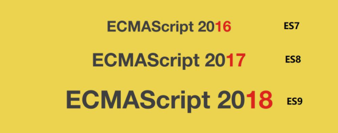

# ES6

## 简介

> ECMAScript 6.0（以下简称 ES6，ECMAScript 是一种由 Ecma 国际(前身为欧洲计算机制造商
> 协会,英文名称是European Computer Manufacturers Association)通过ECMA-262标准化的脚本
> 程序设计语言）是 是 JavaScript  语言的下一代标准，已经在 2015 年 6 月正式发布了，并且
> 从 ECMAScript 6 开始，开始采用年号来做版本。即 ECMAScript 2015，就是 ECMAScript6。
> 它的目标，是使得 JavaScript 语言可以用来编写复杂的大型应用程序，成为企业级开发语言。
> 每年一个新版本。



## 什么是ECMAScript

### web1.0 时代：

> 最初的网页以 HTML 为主，是纯静态的网页。网页是只读的，信息流只能从服务的到客户端单向流通。 开发人员也只关心页面的样式和内容即可。

### web2.0 时代：

> 1995 年，网景工程师 Brendan Eich 花了 10 天时间设计了 JavaScript 语言。
>
> 1996 年，微软发布了 JScript，其实是 JavaScript 的逆向工程实现。
>
> 1996 年 11 月，JavaScript 的创造者 Netscape 公司，决定将 JavaScript 提交给标准化组织 ECMA，希望这种语言能够成为国际标准。
>
> 1997 年，ECMA 发布 262 号标准文件（ECMA-262）的第一版，规定了浏览器脚本语言的标准，并将这种语言称为 ECMAScript，这个版本就是 1.0 版。
>
> JavaScript 和 JScript 都是`ECMAScript`的标准实现者，随后各大浏览器厂商纷纷实现了`ECMAScript`标准。

## ES6 新特性

### let声明变量

> let 声明的变量往往会越域，let只能声明一次， let 不存在变量提升（必须是 let y = 20 ;  然后再使用）

```js
// var 声明的变量往往会越域
// let 声明的变量有严格局部作用域
{
var a = 1;
let b = 2;
}
console.log(a); // 1
console.log(b); // ReferenceError: b is not defined
// var 可以声明多次
// let 只能声明一次
var m = 1
var m = 2
let n = 3
// let n = 4
console.log(m) // 2
console.log(n) // Identifier 'n' has already been declared
// var 会变量提升
// let 不存在变量提升
console.log(x); // undefined
var x = 10;
console.log(y); //ReferenceError: y is not defined
let y = 20;
```

### const声明变量

```js
// 1. 声明之后不允许改变
// 2. 一但声明必须初始化，否则会报错
const a = 1;
a = 3; //Uncaught TypeError: Assignment to constant variable.
```

### 结构表达式

**数组解构**

```js
let arr = [1,2,3];
//以前我们想获取其中的值，只能通过角标。ES6 可以这样：
const [x,y,z] = arr;// x，y，z 将与 arr 中的每个位置对应来取值
// 然后打印
console.log(x,y,z);
```

**对象解构**

```js
const person = {
    name: "jack",
    age: 21,
    language: ['java', 'js', 'css']
}
// 解构表达式获取值，将 person 里面每一个属性和左边对应赋值
const { name, age, language } = person;
// 等价于下面
// const name = person.name;
// const age = person.age;
// const language = person.language;
// 可以分别打印
console.log(name);
console.log(age);
console.log(language);
//扩展：如果想要将 name 的值赋值给其他变量，可以如下,nn 是新的变量名
const { name: nn, age, language } = person;
console.log(nn);
console.log(age);
console.log(language);
```

### 字符串扩展

**几个新的API**

> ES6 为字符串扩展了几个新的 API：
>
> `includes()`：返回布尔值，表示是否找到了参数字符串。`
>
> `startsWith()`：返回布尔值，表示参数字符串是否在原字符串的头部。
>
> `endsWith()`：返回布尔值，表示参数字符串是否在原字符串的尾部。

```js
let str = "hello.vue";
console.log(str.startsWith("hello"));//true
console.log(str.endsWith(".vue"));//true
console.log(str.includes("e"));//true
console.log(str.includes("hello"));//true
```

**字符串模板**

> 模板字符串相当于加强版的字符串，用反引号 `,除了作为普通字符串，还可以用来定义多行字符串，还可以在字符串中加入变量和表达式。

```js
// 1、多行字符串
let ss = `
<div>
<span>hello world<span>
</div>
`
console.log(ss)
// 2、字符串插入变量和表达式。变量名写在 ${} 中，${} 中可以放
入 JavaScript 表达式。
let name = "张三";
let age = 18;
let info = `我是${name}，今年${age}了`;
console.log(info)
// 3、字符串中调用函数
function fun() {
   return "这是一个函数"
}
let sss = `O(∩_∩)O 哈哈~，${fun()}`;
console.log(sss); // O(∩_∩)O 哈哈~，这是一个函数
```

### 函数优化

**函数参数默认值**

```js
//在 ES6 以前，我们无法给一个函数参数设置默认值，只能采用变通写法：
function add(a, b) {
// 判断 b 是否为空，为空就给默认值 1
b = b || 1;
return a + b;
}
// 传一个参数
console.log(add(10));
//现在可以这么写：直接给参数写上默认值，没传就会自动使用默认值
function add2(a , b = 1) {
return a + b;
}
// 传一个参数
console.log(add2(10));
```

**不定参数**

```js
function fun(...values) {
console.log(values.length)
}
fun(1, 2) //2
fun(1, 2, 3, 4) //4
```

**箭头函数**

> 一个参数

```js
//以前声明一个方法
// var print = function (obj) {
// console.log(obj);
// }
// 可以简写为：
var print = obj => console.log(obj);
// 测试调用
print(100);
```

> 多个参数

```js
// 两个参数的情况：
var sum = function (a, b) {
return a + b;
}
// 简写为：
//当只有一行语句，并且需要返回结果时，可以省略 {} , 结果会自动返回。
var sum2 = (a, b) => a + b;
//测试调用
console.log(sum2(10, 10));//20
// 代码不止一行，可以用`{}`括起来
var sum3 = (a, b) => {
c = a + b;
return c;
};
//测试调用
console.log(sum3(10, 20));//30
```


**实战：箭头函数结合解构表达式**

```js
//需求，声明一个对象，hello 方法需要对象的个别属性
//以前的方式：
const person = {
name: "jack",
age: 21,
language: ['java', 'js', 'css']
}
function hello(person) {
console.log("hello," + person.name)
}
//现在的方式
var hello2 = ({ name }) => { console.log("hello," + name) };
//测试
hello2(person);
```

### 对象优化


### map 和 reduce


### Promise


### 模块化
