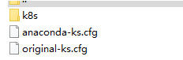
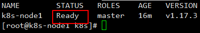
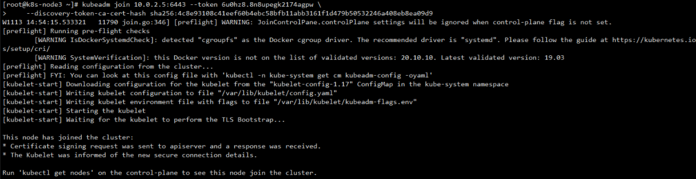
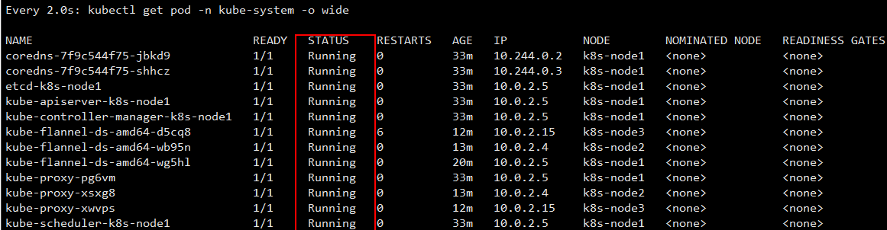
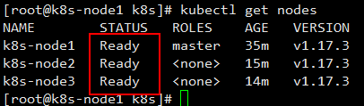

## 安装docker

* **卸载老的docker**

```
 sudo yum remove docker \
                  docker-client \
                  docker-client-latest \
                  docker-common \
                  docker-latest \
                  docker-latest-logrotate \
                  docker-logrotate \
                  docker-engine
```

* **安装依赖**

```
 sudo yum install -y yum-utils \
 device-mapper-persistent-data \
 lvm2
```

* **配置yum源**

```
sudo yum-config-manager \
    --add-repo \
    https://download.docker.com/linux/centos/docker-ce.repo
```

* **安装docker及客户端**

```
sudo yum install -y docker-ce docker-ce-cli containerd.io
```

* **配置docker加速**（带格式复制）

```
sudo mkdir -p /etc/docker
tee /etc/docker/daemon.json <<-'EOF'
{ 
    "registry-mirrors": ["https://zba51n9h.mirror.aliyuncs.com"]
}
EOF

sudo systemctl daemon-reload
sudo systemctl restart docker
```

* **设置docker开机自启动**

```
systemctl enable docker
```

## 添加阿里yum源

* **配置阿里云镜像源（带格式复制）**

```
cat > /etc/yum.repos.d/kubernetes.repo << EOF
[kubernetes]
name=Kubernetes
baseurl=https://mirrors.aliyun.com/kubernetes/yum/repos/kubernetes-el7-x86_64
enabled=1
gpgcheck=0
repo_gpgcheck=0
gpgkey=https://mirrors.aliyun.com/kubernetes/yum/doc/yum-key.gpg
https://mirrors.aliyun.com/kubernetes/yum/doc/rpm-package-key.gpg
EOF
```

## 安装Kube

```
yum list | grep kube

yum install -y kubelet-1.17.3 kubeadm-1.17.3 kubectl-1.17.3

systemctl enable kubelet
systemctl start kubelet
```

## 部署 k8s-master

* **设置镜像**

> 可以不用执行

```
kubeadm config images pull 
```

**上传到root目录下**



**设置权限**

```
chmod 700 master_images.sh
```

* **安装master镜像**

```
[root@k8s-node1 k8s]# pwd
/root/k8s

 ./master_images.sh
```

* **查看安装的镜像**

```
docker images
```

* **master节点初始化**

```
$ kubeadm init \
--apiserver-advertise-address=10.0.2.5 \
--image-repository registry.cn-hangzhou.aliyuncs.com/google_containers \
--kubernetes-version v1.17.3 \
--service-cidr=10.96.0.0/16 \
--pod-network-cidr=10.244.0.0/16
```

* **初始化master**

```
  mkdir -p $HOME/.kube
  
  sudo cp -i /etc/kubernetes/admin.conf $HOME/.kube/config
  
  sudo chown $(id -u):$(id -g) $HOME/.kube/config
```

[pod网络](https://kubernetes.io/docs/concepts/cluster-administration/addons/)

* **设置pod网络**

```
kubectl apply -f kube-flannel.yml 
```

* **获取所有节点里面的pod**

```
kubectl get pods

kubectl get pods --all-namespaces
```

检查主节点的状态必须是ready

```
kubectl get nodes
```



* **目前master状态为notready。 等待网络加入完成即可**

> 使用`journalctl -u kubelet` 查看kubelet日志
> 在其他节点执行这段脚本

```
kubeadm join 10.0.2.5:6443 --token 6u0hz8.8n8upegk2174agpw \
    --discovery-token-ca-cert-hash sha256:4c8e93108c41eef60b4ebc58bfb11abb3161f1d479b50532246a408eb8ea09d9
```



* **监控pod进度**

```
watch kubectl get pod -n kube-system -o wide

```

* **所有状态必须是running**



* **查看所有节点的状态**

```
kubectl get pods
```



保存备份，集群搭建完成。
