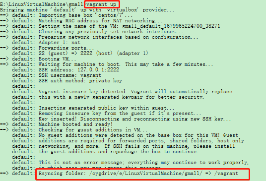
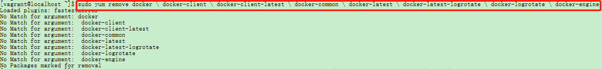
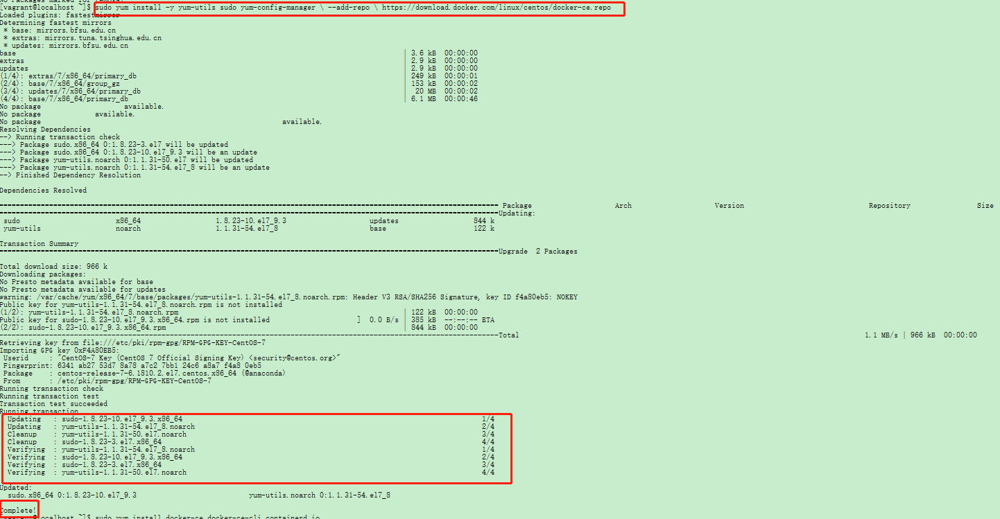

# 环境搭建

## Vagrant的基本使用

### 下载Vagrant

[Vagrant Windows64]([https://releases.hashicorp.com/vagrant/2.2.5/vagrant_2.2.5_x86_64.msi](https://releases.hashicorp.com/vagrant/2.2.5/vagrant_2.2.5_x86_64.msi))

### 配置环境变量

```bash
Path  E:\DevelopmentTool\Vagrant\bin
```

[常用命令](https://www.vagrantup.com/docs/cli/init)

### 初始化镜像文件

> 随便哪个目录下执行， 当前目录下就会产生一个Vagrantfile 文件
>
> 使用 `vagrant init centos/7`   获取系统镜像


### 手动下载box

> 可有可无

[centos7-box](https://app.vagrantup.com/centos/boxes/7/versions/1905.1/providers/virtualbox.box)

### 使用 `vagrant up` 初始化虚拟机

> 网卡为 NAT



### 修改网卡地址

> 修改`Vagrantfile`文件中的私有网卡地址

```bash
config.vm.network "private_network", ip: "192.168.56.10"
```

### 使用 `vagrant reload`  重启虚拟机

### 使用 `vagrant ssh` 连接接虚拟机


## 安装docker

[安装文档地址](https://docs.docker.com/engine/install/centos/)

1. 卸载老的docker

```bash
 sudo yum remove docker \
                  docker-client \
                  docker-client-latest \
                  docker-common \
                  docker-latest \
                  docker-latest-logrotate \
                  docker-logrotate \
                  docker-engine
```




2.安装依赖

```bash
sudo yum install -y yum-utils
sudo yum-config-manager \
    --add-repo \
    https://download.docker.com/linux/centos/docker-ce.repo
```



3.安装docker及客户端

```bash
sudo yum install docker-ce docker-ce-cli containerd.io
```

4.设置docker开机自启动

```bash
systemctl enable docker
```

## 使用docker安装mysql

```bash
docker pull mysql:5.7
```

效果图

* 初始化mysql基本配置

```bash
docker run -p 3306:3306 --name mysql \
-v /mydata/mysql/log:/var/log/mysql \
-v /mydata/mysql/data:/var/lib/mysql \
-v /mydata/mysql/conf:/etc/mysql \
-e MYSQL_ROOT_PASSWORD=root \
-d mysql:5.7
```

效果图

* 设置mysql使用字符

```bash
[root@version-control conf]# cat my.cnf 
[client]
default-character-set=utf8

[mysql]
default-character-set=utf8

[mysqld]
init_connect='SET collation_connection = utf8_unicode_ci'
init_connect='SET NAMES utf8'
character-set-server=utf8
collation-server=utf8_unicode_ci
skip-character-set-client-handshake
skip-name-resolve
```

使用配置文件生效

```bash
docker restart mysql
```

## 使用docker安装redis

* 下载redis镜像

```bash
docker pull redis
```

* 创建redis启动配置文件

```bash
mkdir -p /mydata/redis/conf
touch /mydata/redis/conf/redis.conf

docker run -p 6379:6379 -name redis \
-v /mydata/redis/data:/data \
-v /mydata/redis/conf/redis.conf:/etc/redis/redis.conf \
-d redis redis-server /etc/redis/redis.conf
```
