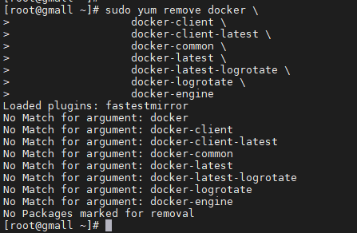

# 环境搭建

## 安装docker

[安装文档地址](https://docs.docker.com/engine/install/centos/)

### 卸载老的docker

```bash
 sudo yum remove docker \
                  docker-client \
                  docker-client-latest \
                  docker-common \
                  docker-latest \
                  docker-latest-logrotate \
                  docker-logrotate \
                  docker-engine
```



### 安装依赖

```bash
sudo yum install -y yum-utils

```


```shell
sudo yum-config-manager \
    --add-repo \
    https://download.docker.com/linux/centos/docker-ce.repo
```


### 安装docker及客户端

```bash
sudo yum install docker-ce docker-ce-cli containerd.io
```


### 设置docker开机自启动

```bash
systemctl enable docker
```


### 启动docker

```shell
systemctl start docker
```

### 镜像加速

> [阿里镜像](https://www.aliyun.com/)


```shell
sudo mkdir -p /etc/docker
sudo tee /etc/docker/daemon.json <<-'EOF'
{
  "registry-mirrors": ["https://zba51n9h.mirror.aliyuncs.com"]
}
EOF
sudo systemctl daemon-reload
sudo systemctl restart docker
```


## 使用docker安装mysql

### 拉去 mysql镜像

```bash
docker pull mysql:5.7
```


### 初始化并启动mysql

```shell
docker run -p 3306:3306 --name mysql \
-v /mydata/mysql/log:/var/log/mysql \
-v /mydata/mysql/data:/var/lib/mysql \
-v /mydata/mysql/conf:/etc/mysql \
-e MYSQL_ROOT_PASSWORD=root \
-d mysql:5.7
```


* 设置mysql使用字符


```bash
[root@version-control conf]# cat my.cnf 
[client]
default-character-set=utf8

[mysql]
default-character-set=utf8

[mysqld]
init_connect='SET collation_connection = utf8_unicode_ci'
init_connect='SET NAMES utf8'
character-set-server=utf8
collation-server=utf8_unicode_ci
skip-character-set-client-handshake
skip-name-resolve
```

### 重启mysql

> 使用配置文件生效

```bash
docker restart mysql
```

### 启动mysql

```shell
docker run -d -p 3306:3306 -e MYSQL_ROOT_PASSWORD=root mysql:5.7
```

## 使用docker安装redis

### 下载redis镜像

```bash
docker pull redis
```


### 创建redis启动配置文件

```shell
mkdir -p /mydata/redis/conf
touch /mydata/redis/conf/redis.conf
```

### 持久化

```shell
echo "appendonly yes"  >> /mydata/redis/conf/redis.conf
```

### 初始化

```bash
docker run -p 6379:6379 --name redis \
-v /mydata/redis/data:/data \
-v /mydata/redis/conf/redis.conf:/etc/redis/redis.conf \
-d redis redis-server /etc/redis/redis.conf
```


### 验证

```shell
docker exec -it redis redis-cli
```


## 开发工具

### Maven

```xml
<mirrors>
    <mirror>
        <id>nexus-aliyun</id>
        <mirrorOf>central</mirrorOf>
        <name>Nexus aliyun</name>
        <url>http://maven.aliyun.com/nexus/content/groups/public</url>
    </mirror>
</mirrors>

<profiles>
    <profile>
        <id>jdk-1.8</id>
        <activation>
            <activeByDefault>true</activeByDefault>
            <jdk>1.8</jdk>
        </activation>
        <properties>
            <maven.compiler.source>1.8</maven.compiler.source>
            <maven.compiler.target>1.8</maven.compiler.target>
            <maven.compiler.compilerVersion>1.8</maven.compiler.compilerVersion>
        </properties>
    </profile>
</profiles>
```

### IDEA


### VScode

* 下载

[VScode](http://91speed04.rbread09.cn/2023/03/21/Vscode.exe?timestamp=64244570&auth_key=cd361f59dc4f6e0ef5ab4ef6a9f7b754&sign=586a229fda9518a6799fbd1e41f977b4&t=64245380)


* 开发必备插件包

```properties

Vetur —— 语法高亮、智能感知、Emmet 等包含格式化功能， Alt+Shift+F （格式化全文），Ctrl+K Ctrl+F（格式化选中代码，两个 Ctrl需要同时按着）
EsLint —— 语法纠错
Auto Close Tag —— 自动闭合 HTML/XML 标签
Auto Rename Tag —— 自动完成另一侧标签的同步修改
JavaScript(ES6) code snippets — — ES6语法智能提示以及快速输入 ， 除js外还支持.ts，.jsx，.tsx，.html，.vue，省去了配置其支持各种包含 js 代码文件的时间
HTML CSS Support —— 让 html 标签上写 class 智能提示当前项目所支持的样式
HTML Snippets —— html 快速自动补全
Open in browser —— 浏览器快速打开
Live Server —— 以内嵌服务器方式打开
Chinese (Simplified) Language Pack for Visual Studio Code —— 中文语言包
```


### Git

* 下载

> [Git](https://git-scm.com)

* 配置

```bash
# 配置用户名
git config --global user.name "username" //（名字）
# 配置邮箱
git config --global user.email "username@email.com" //(注册账号时用的邮箱)
```

* 配置 ssh 免密登录

```bash
进入 git bash；使用：ssh-keygen -t rsa -C "xxxxx@xxxxx.com"命令。 连续三次回车。
一般用户目录下会有 或者 cat ~/.ssh/id_rsa.pub

登录进入 gitee 在设置里面找到 SSH KEY 将.pub 文件的内容粘贴进去
使用 ssh -T git@gitee.com 测试是否成功即可
```


[Git+码云教程](https://gitee.com/help/articles/4104)

## 创建数据库

> `gmall_admin` `gmall_oms` `gmall_pms` `gmall_pms` `gmall_ums` `gmall_sms` `gmall_wms`


## renren-fast

> Git地址：`https://gitee.com/renrenio/renren-fast.git`

* renren-fast是一个轻量级的，前后端分离的Java快速开发平台，能快速开发项目并交付【接私活利器】
* 支持MySQL、Oracle、SQL Server、PostgreSQL等主流数据库

### 工程结构


### 修改pom

```xml
<parent>
    <groupId>org.springframework.boot</groupId>
    <artifactId>spring-boot-starter-parent</artifactId>
    <version>2.6.6</version>
    <relativePath />
</parent>
```

### 修改数据源

```yaml
url: jdbc:mysql://172.16.21.225:3306/gmall_admin?useUnicode=true&characterEncoding=UTF-8&serverTimezone=Asia/Shanghai
username: root
password: root
```

## renren-fast-vue

> Git地址：`https://gitee.com/renrenio/renren-fast.git`

* renren-fast-vue基于vue、element-ui构建开发，实现[renren-fast](https://gitee.com/renrenio/renren-fast)后台管理前端功能，提供一套更优的前端解决方案
* 前后端分离，通过token进行数据交互，可独立部署
* 主题定制，通过scss变量统一一站式定制
* 动态菜单，通过菜单管理统一管理访问路由
* 数据切换，通过mock配置对接口数据／mock模拟数据进行切换
* 发布时，可动态配置CDN静态资源／切换新旧版本
* 演示地址：[http://demo.open.renren.io/renren-fast](https://gitee.com/link?target=http%3A%2F%2Fdemo.open.renren.io%2Frenren-fast) (账号密码：admin/admin)

### 安装运行

> npm install
>
> npm run dev

## renren-generator

> Git地址：`https://gitee.com/renrenio/renren-generator.git`

* renren-generator是人人开源项目的代码生成器，可在线生成entity、xml、dao、service、html、js、sql代码，减少70%以上的开发任务

### 修改配置项

> generator.properties


### 修改数据源

```yaml
driverClassName: com.mysql.cj.jdbc.Driver
url: jdbc:mysql://172.16.21.225:3306/gmall_pms?useUnicode=true&characterEncoding=UTF-8&useSSL=false&serverTimezone=Asia/Shanghai
username: root
password: root
```
