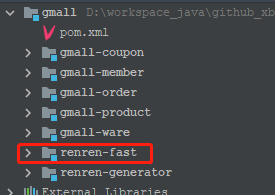
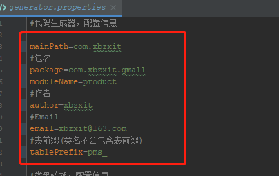

# 逆向工程CRUD

## renren-fast

> Git地址：`https://gitee.com/renrenio/renren-fast.git`

* renren-fast是一个轻量级的，前后端分离的Java快速开发平台，能快速开发项目并交付【接私活利器】
* 支持MySQL、Oracle、SQL Server、PostgreSQL等主流数据库

### 工程结构



### 修改pom

```xml
<parent>
    <groupId>org.springframework.boot</groupId>
    <artifactId>spring-boot-starter-parent</artifactId>
    <version>2.6.6</version>
    <relativePath />
</parent>
```

### 修改数据源

```yaml
url: jdbc:mysql://172.16.21.225:3306/gmall_admin?useUnicode=true&characterEncoding=UTF-8&serverTimezone=Asia/Shanghai
username: root
password: root
```

## renren-fast-vue

> Git地址：`https://gitee.com/renrenio/renren-fast.git`

* renren-fast-vue基于vue、element-ui构建开发，实现[renren-fast](https://gitee.com/renrenio/renren-fast)后台管理前端功能，提供一套更优的前端解决方案
* 前后端分离，通过token进行数据交互，可独立部署
* 主题定制，通过scss变量统一一站式定制
* 动态菜单，通过菜单管理统一管理访问路由
* 数据切换，通过mock配置对接口数据／mock模拟数据进行切换
* 发布时，可动态配置CDN静态资源／切换新旧版本
* 演示地址：[http://demo.open.renren.io/renren-fast](https://gitee.com/link?target=http%3A%2F%2Fdemo.open.renren.io%2Frenren-fast) (账号密码：admin/admin)

### 安装运行

> npm install
>
> npm run dev

## renren-generator

> Git地址：`https://gitee.com/renrenio/renren-generator.git`

* renren-generator是人人开源项目的代码生成器，可在线生成entity、xml、dao、service、html、js、sql代码，减少70%以上的开发任务

### 修改配置项

> generator.properties



### 修改数据源

```yaml
driverClassName: com.mysql.cj.jdbc.Driver
url: jdbc:mysql://172.16.21.225:3306/gmall_pms?useUnicode=true&characterEncoding=UTF-8&useSSL=false&serverTimezone=Asia/Shanghai
username: root
password: root
```

